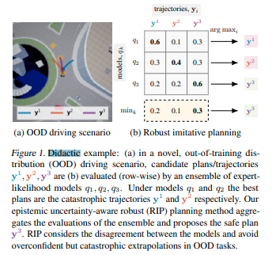
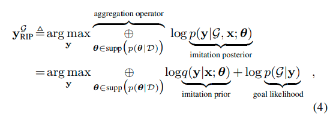
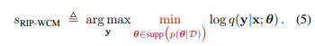
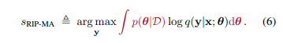
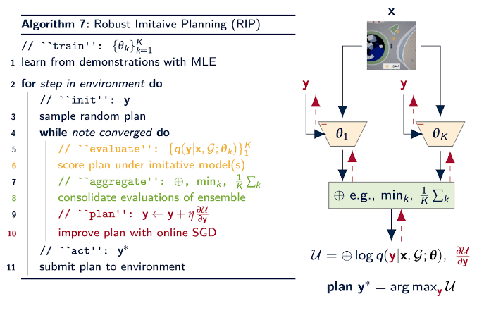
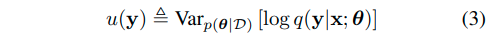
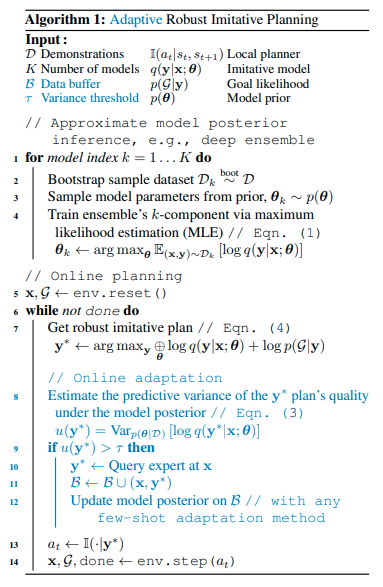
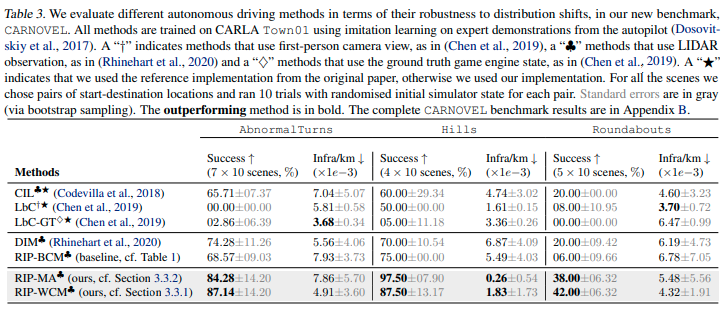
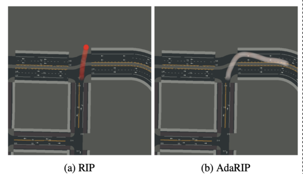

# Can Autonomous Vehicles Identify, Recover From, and Adapt to Distribution Shifts?

### [**Angelos Filos**](https://www.google.com/url?q=https%3A%2F%2Ffilangel.github.io%2Fwebsite%2F&sa=D&sntz=1&usg=AFQjCNEpRldXpFVLSuxASMAMfggGVZzTDw)***,** [**Panagiotis Tigas**](https://www.google.com/url?q=https%3A%2F%2Fptigas.com%2F&sa=D&sntz=1&usg=AFQjCNFaQ_oMey80fnB2fhzSdpWXzcJoqQ)***,** [**Rowan McAllister**](https://www.google.com/url?q=https%3A%2F%2Fpeople.eecs.berkeley.edu%2F~rmcallister%2F&sa=D&sntz=1&usg=AFQjCNEmxmIvabKpgXb9oBHN8bAT8lAJ6g)**,** [**Nicholas Rhinehart**](https://www.google.com/url?q=https%3A%2F%2Fpeople.eecs.berkeley.edu%2F~nrhinehart%2F&sa=D&sntz=1&usg=AFQjCNFlqLaQnyyyofeXIlelBfSWCmyAgw)**,** [**Sergey Levine**](https://www.google.com/url?q=https%3A%2F%2Fpeople.eecs.berkeley.edu%2F~svlevine%2F&sa=D&sntz=1&usg=AFQjCNHgPN9in8gN47cvORDE9LTiGxpF7w), [**Yarin Gal**](https://www.google.com/url?q=https%3A%2F%2Fwww.cs.ox.ac.uk%2Fpeople%2Fyarin.gal%2F&sa=D&sntz=1&usg=AFQjCNEGSJhbtELz_NiaNu3IARl6FEErKg)

* [In International Conference on Machine Learning (ICML 2020) ](https://www.google.com/url?q=https%3A%2F%2Ficml.cc%2F&sa=D&sntz=1&usg=AFQjCNH9D47a1jVjsba2KwrRd14UYZcTQw)
* [airxiv 2 Sep 2020](https://arxiv.org/pdf/2006.14911.pdf)
* [site](https://sites.google.com/view/av-detect-recover-adapt)
* [blog](https://oatml.cs.ox.ac.uk/blog/2020/07/09/can_autonomous_vehicles_recover_from_ood.html)
* [github](https://github.com/OATML/oatomobile)　openai gymのような感じで使える
* [日本語解説](https://www.slideshare.net/DeepLearningJP2016/dl3-247953056)

## どんなもの？

訓練データ分布外(Out-of-training-distribution, OOD)シナリオに対して、現在のアプローチの限界に焦点を当て、認識論的不確実性(epistemic uncertainty)を意識した経路計画方法（RIP＝Robust Imitative Planning)を提案する。安全な運転を目指してRIPはOODシナリオに対して、[Deep Ensembles](https://arxiv.org/abs/1612.01474)により訓練分布との分布シフトを検出し、自信過剰で壊滅的な十分な情報に基づいていない決定を軽減することができる。また不確実性が大きく、安全な行動を提示できない場合には、エキスパートドライバーにフィードバックを問い合わせ、ドライバーが取った行動からオンライン適応を可能にするAdaptive RIP(AdaRIP)を提案する。

## 先行研究と比べてどこがすごい？何を解決したか？

[Deep Imitative Models](../DEEP IMITATIVE MODELS FOR FLEXIBLE INFERENCE, PLANNING, AND CONTROL/summary.md)(以下、DIM)で結論に課題として述べられている認識論的不確実性について取り組んだ手法であり、OODシナリオを検出およびいくつかのOODシナリオに対して対応することができる。例えばトレーニングデータに含まれなかったRoundaboutのシーンに対して走行することができる。これはDIMや[Learning by Cheating](https://arxiv.org/abs/1912.12294)の方法ではできなかったことである。またAdaRIPはOODシナリオに対してエキスパートに操作を促すことによって安全性を損なうことなく現実世界にデプロイできる。

> この論文を読む前にDIMを読むとよく理解ができる。[Rhinehart, N., McAllister, R., and Levine, S. Deep imitative models for flexible inference, planning, and control. In International Conference on Learning Representations (ICLR), April 2020.](../DEEP IMITATIVE MODELS FOR FLEXIBLE INFERENCE, PLANNING, AND CONTROL/summary.md)

## 技術や手法の核はどこ？

認識論的不確実性について対処するために、不確実性の下での計画として模倣学習(Imitation Learning)によってエキスパートの軌跡を模倣する確率モデル$$q(y | x; \theta)$$を複数使い(Deep Ensembles)、集約された複数の尤度を最大化するような経路計画$$y_{RIP}^{\mathcal{G}}$$を求める。集約する方法として、最小の尤度をとるWorst Case Aggregationと重み付き平均をおこなうModel Averaging Aggregationを提案する。DIMと同様にこの問題はGradient Ascentで解く。

また複数のモデル尤度の分散を計算することで、分布シフトを検出する。訓練分布内であれば低く、分布外であれば大きくなる。

この検出方法を用いて、オンラインでエキスパートの協力を得るAdaRIPは次のアルゴリズムである。

## どうやって有効だと検証した？

[nuScenes](https://www.nuscenes.org/)およびOODの検出やリカバリに対する性能を示すため、OODシナリオを含むデータセットCARNOVEL（この論文内でCALRAを用いて作成）で、現在のstate-of-artの手法の性能を上回っていることから、分布シフトから回復するための明示的なRIPのメカニズムが自動運転の性能を改善することを示している。

またCARNOVELを用いて、成功率、OODシナリオに対する検出率、OODシナリオからの回復率を評価している。

> nuScenesにもおそらくOODシーンは含まれているが、CARNOVELにはOODシーンがラベルづけされている。

## 課題は？議論はある？

RIPは複数のモデルを使うので計算量が大きく、リアルタイムで使うには無理がある。偶発的および認識論的不確実性を捉えたモデルを使ったリアルタイムプランニングは、決定論的な対応方法にまだ遅れをとっている。またRIPはOODシナリオに対して十分な対応をできない場合がある。

AdaRIPは、多くのオンライン方法と同様に、壊滅的な忘却とサンプルの非効率性が発生する。

私自身の疑問であるが、AdaRIPはフィードバックを促すことはよいが、ドライバーにとってどのような告知を行うかについては、記述されていない。そこに余地があるのではと考える。例えば、数秒前にとか。検出した段階で少し速度を下げるとか。あと挙動ががたがたしている。

## 次に読むべき論文は？

[PILOT: Efficient Planning by Imitation Learning and Optimisation for Safe Autonomous Driving](../PILOT: Efficient Planning by Imitation Learning and Optimisation for Safe Autonomous Driving/summary.md)

## ちょっとした補足

### 問題設定における仮定

この論文は以下の仮定を置いている

1. x,yのエキスパートの経路および高次元の観測（LiDARなど）で構成されたデータセットにアクセスできる
2. 2点間の位置と逆ダイナミクスを用いて、行動が決定されるものとする。
3. 目的地に向かうまでのナビゲーション（右折、左折など）が得られるとする。
4. ゴールや事故位置などの位置情報は完璧である。

### RIP

ほぼ同じ著者で構成されるRobust Imitative Planning: Planning from Demonstrations Under Uncertaintyという論文をWeb上で見つけることができる。RIPのみが提案されている。

### 認識論的不確実性

認識論的不確実性とは、知識または情報が不足していることに起因する不確実性である。知識や情報を蓄積することでこの不確実性を小さくすることができる。一方で偶然的不確実性とは、時間または空間的な変動、個体間に存在するばらつきなどから生じる不確実性である。この不確実性は小さくすることはできない。認識論的不確実性に対して、ネットワークモデルはあまりにも脆弱である。訓練データ分布外のデータに対する推論は信用できるものではない。これに対して、[Simple and Scalable Predictive Uncertainty Estimation using Deep Ensembles](https://arxiv.org/abs/1612.01474)は、Bayesian Networkに代わって複数のモデルを用いたモデルの不確実性を定量化する方法を提供する。Deep Ensemblesの他に[Dropout as a Bayesian Approximation: Representing Model Uncertainty in Deep Learning](http://proceedings.mlr.press/v48/gal16.html)がある。

#### 参考

1. 緒方　裕光, リスク解析における不確実性, 日本リスク研究学会誌 19（2）：３－９（2009）
2. [Deep EnsemblesでDeep Learningの不確かさを評価する](https://st1990.hatenablog.com/entry/2019/08/15/200842)
3. [私たちが愛した3つのNIPS論文](https://magazine.techcareer.jp/instacart-blog/technology-instacart-blog/383/?doing_wp_cron=1564408832.5697760581970214843750)