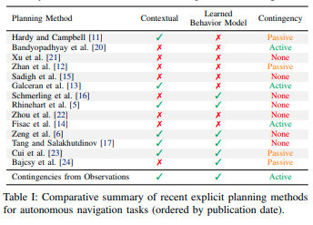
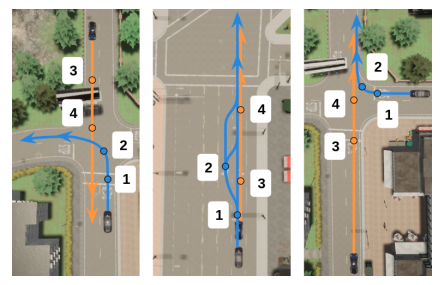
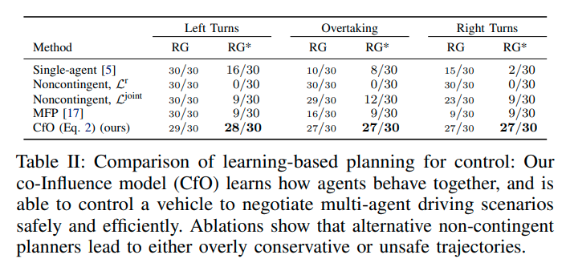
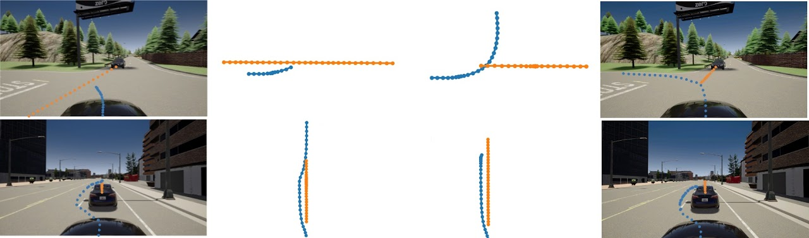
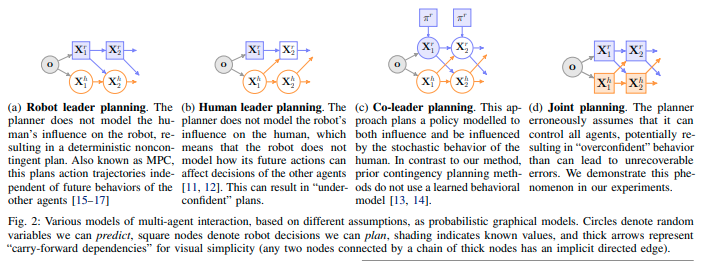

# [日本語まとめ] Contingencies from Observations: Tractable Contingency Planning with Learned Behavior Models

[Nicholas Rhinehart](https://arxiv.org/search/cs?searchtype=author&query=Rhinehart%2C+N), [Jeff He](https://arxiv.org/search/cs?searchtype=author&query=He%2C+J), [Charles Packer](https://arxiv.org/search/cs?searchtype=author&query=Packer%2C+C), [Matthew A. Wright](https://arxiv.org/search/cs?searchtype=author&query=Wright%2C+M+A), [Rowan McAllister](https://arxiv.org/search/cs?searchtype=author&query=McAllister%2C+R), [Joseph E. Gonzalez](https://arxiv.org/search/cs?searchtype=author&query=Gonzalez%2C+J+E), [Sergey Levine](https://arxiv.org/search/cs?searchtype=author&query=Levine%2C+S)

* International Conference on Robotics and Automation (ICRA), 2021
* [arxiv 21 Apr 2021](https://arxiv.org/abs/2104.10558)
* [project site](https://sites.google.com/view/contingency-planning/home)
* [github](https://github.com/JeffTheHacker/ContingenciesFromObservations)
* [youtube](https://www.youtube.com/watch?v=qa80c4x-DQk)

## どんなもの？

右折、左折、追い越しなどの車両が相互に協力するような運転シナリオに対応できる経路計画方法CfO (Contingencies from Observations)を提案する。CfOはディープニューラルネットワークからなる行動モデルを使ったContingency Planning([補足](#Contingency planning))である。CfOが使う行動モデルは生成モデルの一種であるAutoregressive flowモデルである。このflowモデルは環境中のすべてのエージェントの将来の経路を１つのシーンとして生成する。CfOは他車両の行動の不確実性に対処するため、自車両がある行動を行うときの複数の将来のシーンを行動モデルを使って生成し、その行動を評価する。これを繰り返すことで複数の将来シーンで対処可能な自車両の行動を探索し、最適な計画を計算する。行動の評価に用いる評価関数は自動運転車が目的地に向かうコストと衝突コストで構成される。

GIFに示すようにCfOは相手の車に応じて柔軟に動作する。合流先の車線上の車がアグレッシブであれば、自動運転車は道を譲って車が交差点を通過するのを待つ（図の左下）、合流先の車線上の車がパッシブであれば、先に交差点を通過する（図の右下）。

## 先行研究と比べてどこがすごい？何を解決したか？

* 行動モデルを使ってActive Contingency Planning([補足](#Active Contingency Planning))を行う初の経路計画方法である。
* 人間との協力が不可欠なシナリオで既存の機械学習の方法と比較して、最も良い性能が出た。

## 手法は？

### 前提条件

連続空間、離散時間、車両数$$A$$ が$$2$$個以上の環境を考える。時刻$$t$$における自動運転車両の２次元の位置を$$\mathbf{x}_{t}^r = \mathbf{x}_{t}^1 \in \mathbb{R}^{A \times d}$$、制御できないすべての車両の位置を$$\mathbf{x}_{t}^h = \mathbf{x}_{t}^{2:A} \in \mathbb{R}^{(A-1) \times d}$$で表す。小文字は実現値、大文字は確率変数とする。

### 行動モデル

CfOで用いる行動モデルは[PRECOG: PREdiction Conditioned On Goals in Visual Multi-Agent Settings](../PRECOG: PREdiction Conditioned On Goals in Visual Multi-Agent Settings/summary.md)で提案されたESPである。変更点はLIDARの点群の入力表現である。点群を上空から見た俯瞰図方式ではなくレンジイメージの形式で表現する。ESPのアーキテクチャ図を示す。ESPのアーキテクチャ図を示す。

ESPは観測を条件に潜在変数からすべての車両の将来の経路を出力する。また出力した経路が学習したエキスパートの経路にどれだけ近いかを示す尤度を計算する。経路の生成方法および尤度の計算方法は次に示すアルゴリズムのとおりである。

1. A個の車両の時刻Tまでの潜在変数$$\mathbf{z}_{1:T}^{1:A}$$を正規分布からサンプリングする

   $$z_{1:T}^{1:A} \overset{iid}{\sim} \mathcal{N}(0, I)$$

2. 潜在変数のサンプルを変換関数を使っって車両の将来の経路$$x_{1:T}^{1:A}$$に変換する

   $$x_{1:T}^{1:A} \leftarrow f_{\theta}(z_{1:T}^{1:A}, \phi) $$

3. 車両の将来の経路から尤度$$q$$を計算する

   $$q \leftarrow \log q_{\theta}(x_{1:T}^{1:A} \mid \mathbf{o})$$

$$f_{\theta}$$はFlowモデルである。$$\mathbf{o}$$は現在時刻までの車両の位置やLIDARやカメラなどのセンサー情報である。また$$q_{\theta}$$は次式で$$f_{\theta}$$を使って求めることができる。

$$q_{\theta}(\mathbf{X} \mid \mathbf{o}) = \mathcal{N}(f_{\theta}^{-1}(\mathbf{X} ; \mathbf{o};0, I))
\big| \det
\frac{\mathbf{d}f_{\theta}}{\mathbf{d} \mathbf{Z}}_{\mathbf{Z} = f_{\theta}^{-1}(\mathbf{X}; \mathbf{o})} \big| $$

### 経路計画における評価関数

CfOは自車両の経路計画$$x_{1:T}^{1}$$に対して次の期待値$$\mathcal{L}_{CfO}$$を計算する。

$$\mathcal{L}_{CfO}(x_{1:T}^{1})
= \displaystyle \mathbb{E}_{\mathbf{z}^{h} \sim \mathcal{N}(0, I)} \left[
\log q_{\theta}(\bar{x}_{\le T} \mid \mathbf{o}) +
\log \mathcal{N}(\bar{x}_{T}^{r} ; \mathbf{g}, I) +
\log \delta_{\mathbb{G}}(\bar{x}_{\le T}) \right]$$

第１項$$\log q_{\theta}(\bar{\mathbf{x}}_{\le T} \mid \mathbf{o})$$はエージェントの経路$$\bar{\mathbf{x}}_{\le T} $$が学習したエキスパートの軌道に近いかを示す対数尤度である。第２項$$\log \mathcal{N}(\bar{\mathbf{x}}_{T}^{r} ; \mathbf{g}, I)$$は自車両の計画の最後の位置がゴールにどれだけ近いかを示す尤度である。第３項$$\log \delta_{\mathbb{G}}(\bar{\mathbf{x}}_{\le T})$$はゴールへ向かうための移動可能領域に関するペナルティである。例えば道路外や他車両との衝突に関する尤度である。数値計算上$$\delta_{\mathbb{G}}(\bar{\mathbf{x}}_{\le T}) = 0$$のときには大きな負の値を使う。この期待値が大きいほどよい計画となる。

### 自車両の経路計画の探索

CfOは評価関数を最大化する経路計画$$\mathbf{x}_{1:T}^{1}$$を次のように探索する。

1. 自車両の潜在変数$$\mathbf{z}_{1:T}^{1}$$を正規分布からサンプリングする

2. サンプリングした自車両の潜在変数が収束するまで以下を繰り返す

   1. 他車両の潜在変数$$\mathbf{z}_{1:T}^{2:A}$$を正規分布からK回サンプリングする

   2. 自車両と他車両の潜在変数からK個の将来の経路$$\mathbf{x}_{1:T}^{1:A}$$を生成する

   3. 生成した経路をつかって評価関数$$\mathcal{L}_{CfO}$$の近似値を計算する

      $$\hat{\mathcal{L}}_{CfO}(x_{1:T}^{1})
      = \frac{1}{K}\sum_{k=1}^{K} \left[
      \log q_{\theta}(x_{1:T}^{1:A} \mid \mathbf{o}) +
      \log \mathcal{N}(x_{1:T}^{1} ; \mathbf{g}, I) +
      \log \delta_{\mathbb{G}}(x_{1:T}^{1:A}) \right]$$

   4. 評価関数$$\mathcal{L}_{CfO}$$の最大化を目指してGradient Ascentにより自車両の潜在変数を更新する

      $$\mathbf{z}_{1:T}^{1} \leftarrow \mathbf{z}_{1:T}^{1} + \Delta_{\mathbf{z}_{1:T}^{1}} \hat{\mathcal{L}}_{CfO}(x_{1:T}^{1})$$

## どうやって有効だと検証した？

人間にとっては簡単であるが、人間との協力が不可欠な（Contingent動作が求められる）タスクでの提案手法の有効性を確かめるため、CARLA上で左折、追い越し、右折時の合流の３つのシナリオを作成した。

シナリオ内で動く自車両および他車両はシナリオごとに特化されているハンドクラフトの行動ポリシーに従って行動する。ポリシーは以下に示す３つのうちの１つがエピソード生成ごとにランダムに選ばれる。

* 最適な行動を行うエキスパートなポリシー
* 他車両が交差点や反対車線にいる場合、他車両に必ず道を譲る保守的なポリシー
* 他車両が譲らない場合でも走行を続ける危険なポリシー

いずれのポリシーもシナリオに沿って以下の手順に従って動作する。

1. 車両は交差点に入るもしくはレーンチェンジを行うかどうか選択する
2. もし車両がこれらの行動を行った場合、他車両は道を譲るか、追い越しを許すかどうかを選択する。
3. 車両は行動を完了するかどうか選択する

図で示すように自車両および他車両の初期地点は２個ずつあり、自車両は１または２から、他車両は３または４の位置からスタートする。初期地点の組み合わせが４パターン存在することになる。４パターン中３パターンから生成したエピソードを行動モデルの訓練に、そして残る１パターンから生成したエピソードを検証に用いた。

CfOとの比較に用いた手法は以下の４つである。

| 方法                                            | 内容                                                         |
| ----------------------------------------------- | ------------------------------------------------------------ |
| Single-agent                                    | [Deep Imitative Models](../DEEP IMITATIVE MODELS FOR FLEXIBLE INFERENCE, PLANNING, AND CONTROL/summary.md)を用いた他車両の行動は陽に考えないプランナー |
| Noncontingent, $$\mathcal{L}^{\mathbf{r}}$$     | 目的関数に$$\mathcal{L}^{\mathbf{r}}$$を用いたunderconfidentプランナー （[補足](#Co-leader planning)参照） |
| Noncontingent, $$\mathcal{L}^{\mathbf{joint}}$$ | 目的関数に$$\mathcal{L}^{\mathbf{joint}}$$を用いたoverconfientプランナー（[補足](#Co-leader planning)参照） |
| MFP                                             | 学習済みの行動モデルを用いたnoncontingentプランナー          |

CfOおよび比較手法でゴールの到達率の比較結果を次に示す。RGは事故なしにゴールに到達したことを示す。RG\*は事故および事故に近い状況に遭遇することなく、エキスパートと同じくらい早く目標に到達したことを示す。

他手法に比べCfOはRGおよびRG\*の両方の成功率が高い結果となった。CfOがContingent動作が必要なシナリオに有効なことを示している。Noncontingent, $$\mathcal{L}^{\mathbf{r}}$$はRGの完璧な成功率を達成しているが、自信がない動作が走行時間を伸ばしているためRG\*の成功率は０である。Noncontingent, $$\mathcal{L}^{\mathbf{joint}}$$は他車両が譲らない場合には安全でない行動を行うことがあった。Single-agentのRG率は最も低かった。自車両の行動のみを考慮するプランナーでは不十分なことを示している。

またCfOによる左折及び追い越しのタスクにおける経路の予測結果を示す。状況に応じて異なる自車両および他車両の予測を行っていることがわかる。

## 課題は？議論はある？

なし

## 次に読むべき論文は？

* [Deep Structured Reactive Planning](../Deep Structured Reactive Planning/summary.md)
* [LookOut: Diverse Multi-Future Prediction and Planning for Self-Driving](../LookOut: Diverse Multi-Future Prediction and Planning for Self-Driving/summary.md)

## 補足

### Contingency planning

次に示す２つの有名な自動運転システムは他車両の経路の予測を行った後、予測した経路を利用して自車両の経路計画を行う方法を採用している。

* [Stanley: The robot that won the DARPA Grand Challenge](http://robots.stanford.edu/papers/thrun.stanley05.pdf)
* [Autonomous driving in urban environments: Boss and the urban challenge](https://onlinelibrary.wiley.com/doi/pdfdirect/10.1002/rob.20255)

予測と計画を分離する方法は大きな問題を分割でき、モジュール性を高めることができる利点をもつ。しかし、自車両の行動に対して他車両がどのように反応するかを無視しているため、"frozen robot problem"として知られる消極的な行動につながる可能性がある。この問題の解決法としてContingency Planningがある。Contingency Planningは予測と行動を同時に行う経路計画である。自車両の行動に対して他車両がどのように反応するか、他車両の行動によって自車両の行動がどう変化するかの共依存性を考慮することができる。Contingency Planningに関する研究は例えば以下のものがある。

* [11] J. Hardy and M. Campbell, “Contingency Planning Over Probabilistic Obstacle Predictions for Autonomous Road Vehicles,” IEEE Transactions on Robotics, vol. 29, no. 4, pp. 913–929, 2013.
* [12] W. Zhan, C. Liu, C.-Y. Chan, and M. Tomizuka, “A non-conservatively defensive strategy for urban autonomous driving,” in International Conference on Intelligent Transportation Systems (ITSC). IEEE, 2016, pp. 459–464.
* [13] E. Galceran, A. G. Cunningham, R. M. Eustice, and E. Olson, “Multipolicy decision-making for autonomous driving via changepoint-based behavior prediction: Theory and experiment,” Autonomous Robots, vol. 41, no. 6, pp. 1367–1382, 2017. 
* [14] J. F. Fisac, E. Bronstein, E. Stefansson, D. Sadigh, S. S. Sastry, and A. D. Dragan, “Hierarchical Game-Theoretic Planning for Autonomous Vehicles,” in International Conference on Robotics and Automation (ICRA), 2019, pp. 9590–9596.

### Active Contingency Planning

自車両から他車両の行動の不確実性を軽減するように行動することをActive Contingency Planning (前述の４つの論文の内の[13], [14])と呼ぶ。そして自車両が他車両に与える影響を無視した計画方法をPassive Contingency Planning ([11], [12])と呼ぶ。

### Co-leader planning

プランニングを以下の要素から論文中で４つに分類する。

* Contingencyの度合い：Noncontingent < Passively Contingent < Actively Contingent
* モデリング方法：決定論的（□で示す）もしくは確率論的（○でしめす）

図に示すHuman leader planningは自車両から他車両への影響を考慮しない計画方法である。Human leader planningは他車両の軌道$$\hat{\mathbf{x}}^h$$を予測し固定した後、自車両の軌道を計画を次の目的関数$$\mathcal{L}^{\mathbf{r}}$$を最大化することで経路を計算する。

$$\begin{equation}
\mathcal{L}^{\mathbf{r}}(\mathbf{x}_{\le T}^{r})=
\displaystyle \mathbb{E}_{\hat{\mathbf{x}} \sim q}
\log q_{\theta}([\mathbf{x}^r, \hat{\mathbf{x}}^h]_{\le T} \mid \mathbf{o}) +
\log \mathcal{N}(\bar{\mathbf{x}}_{T}^{r} ; \mathbf{g}, I) +
\log \delta_{\mathbb{G}}([\mathbf{x}^r, \hat{\mathbf{x}}^h]_{\le T})
\end{equation}$$

Human leader planningにより計画した経路は消極的な行動となる。Join plannerは自車両および他車両を同時に計画する方法である。自車両及び他車両の計画は互いが最適に動くように計画する。Join plannerは自車両の軌道を計画を次の目的関数$$\mathcal{L}^{\mathbf{joint}}$$を最大化することで経路を求める。

$$\begin{equation}
\mathcal{L}^{\mathbf{joint}}(\mathbf{x}_{\le T}^{r})=
\displaystyle
\log q_{\theta}(\mathbf{x}_{\le T} \mid \mathbf{o}) +
\log \mathcal{N}(\mathbf{x}_{T}^{r} ; \mathbf{g}, I) +
\log \delta_{\mathbb{G}}(\mathbf{x}_{\le T})
\end{equation}$$

Join plannerにより計画した経路は自信過剰な行動となる。

## 個人的メモ

* Appendixに離散化した最適化問題$$\mathcal{L}_{CfO}$$を解くことで実際にContingency Planningが行えることを示している。
* **マルチエージェントの相互作用を考慮した予測を行う[PRECOG](../PRECOG: PREdiction Conditioned On Goals in Visual Multi-Agent Settings/summary.md)を車両の計画に使用してみた論文。モデル、目的関数自体およびその最適化問題の解き方はこれらの論文で提案されている。**
* CfOが目的関数に$$\mathcal{L}^{\mathbf{r}}$$を用いたCfOに比べてRGの成功率が下がっているのが気になる。
* CfOのRG\*の成功率は高いが、実際どれくらいエキスパートと走行時間が近いのだろうか？
* 模倣モデルが実際にどれくらい妥当な尤度を出すのか興味がある。[PILOT](../PILOT: Efficient Planning by Imitation Learning and Optimisation for Safe Autonomous Driving/summary.md)で検証されたような自明の拘束条件を満たしているかどうか確認してみたい。
* 論文の検証でPPOがそこそこの結果を出しているのが気になった。使っているPPOはAppendix Cに詳細が記載されている。PPOは[Stable Baselines repository](https://github.com/hill-a/stable-baselines)に実装されているPPO2である。検証用のシナリオがOpenAI Gymライクに使える [OATomobile](https://github.com/OATML/oatomobile)にContingentタスクを追加したものを使っている。
* PRECOGで課題として述べられているように自車両以外のエージェントにもゴールを条件付けて計画してみたら面白いと思う。
* アグレッシブな行動を選択できるようにならないだろうか？どれくらいアグレッシブにするなど。