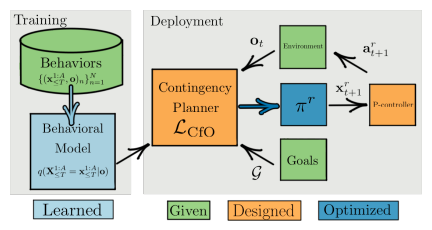

# Contingencies from Observations: Tractable Contingency Planning with Learned Behavior Models

[Nicholas Rhinehart](https://arxiv.org/search/cs?searchtype=author&query=Rhinehart%2C+N), [Jeff He](https://arxiv.org/search/cs?searchtype=author&query=He%2C+J), [Charles Packer](https://arxiv.org/search/cs?searchtype=author&query=Packer%2C+C), [Matthew A. Wright](https://arxiv.org/search/cs?searchtype=author&query=Wright%2C+M+A), [Rowan McAllister](https://arxiv.org/search/cs?searchtype=author&query=McAllister%2C+R), [Joseph E. Gonzalez](https://arxiv.org/search/cs?searchtype=author&query=Gonzalez%2C+J+E), [Sergey Levine](https://arxiv.org/search/cs?searchtype=author&query=Levine%2C+S)

* International Conference on Robotics and Automation (ICRA), 2021
* [arxiv 21 Apr 2021](https://arxiv.org/abs/2104.10558)
* [project site](https://sites.google.com/view/contingency-planning/home) まとめ。ここを見たほうが早い。有効性を示す様々な動画がある。
* [github](https://github.com/JeffTheHacker/ContingenciesFromObservations)

## どんなもの？

Contingency Planning([補足](#Contingency planningについて (Introductionから作成)))を行うCfO(Contingencies from Observations)を提案する。CfOはマルチエージェントの相互作用による行動を表す学習済み画像条件付きautoregressive flowモデル$$q(\mathbf{X} \mid \phi)$$を使う。このモデルはマルチエージェントの軌道を模倣するように訓練される。CfOはセンサーの観測からゴールに到達するように、訓練したモデルを使った観測とゴールの条件付き事後確率を最大化するような計画を最適化計算により求める。CfOはContingent(不測の事態が起きる)シナリオで様々なnon-contingentのプランニング方法の性能を凌駕した。

## 先行研究と比べてどこがすごい？何を解決したか？

* 提案手法Contingencies from Observations (CfO)は学習した行動(behavior)モデルを使ってActive Contingency Planning([補足](#Active Contingency Planning))を行う。自動運転の経路計画においてこの２つの要素を持った計画方法はCfOが初である。
* CfOは既存の機械学習の方法と比較して、最も良い性能が出た。

## 手法は？

連続空間、離散時間を扱う。時刻$$t$$のエージェント$$a$$の位置を$$\mathbf{x}_{t}^a \in \mathbb{R}^{d}$$とする。時刻$$t$$のすべての車両の位置を$$\mathbf{x}_{t} \in \mathbb{R}^{A \times d}$$とする。$$A$$はエージェント個数である。制御できる車両の位置を$$\mathbf{x}_{t}^r = \mathbf{x}_{t}^1 \in \mathbb{R}^{A \times d}$$、制御できないすべての車両の位置を$$\mathbf{x}_{t}^h = \mathbf{x}_{t}^{2:A} \in \mathbb{R}^{(A-1) \times d}$$とする。$$t=0$$を現在時刻とする。$$\mathbf{x}_{\le t}$$を時刻$$[1,...,t]$$の位置とする。小文字は実現値、大文字は確率変数とする。現在の時刻の観測を。$$\mathbf{o} \doteq \{\mathbf{x}_0, \mathbf{i}_0\}$$とする。$$\mathbf{i}_0$$は高次元の環境に関する情報である。

### 仮定

エージェントが２個以上のマルチエージェントシステムを考える。すべてのエージェントの位置は観測できるとする。ただしゴールなどの意図は伝わらないものとする。模倣モデルの訓練に用いるデータセットはゴールに到達するために有効な行動のモードを多く含んでいると仮定する。有効な行動としては右左折、受動的な走行、能動的な走行などである。例えば前方車両の速度が遅く追い越しをすることで快適になるシナリオの場合、データセットに積極的に追い越しをするデータを含んでいる必要がある。

### Behavioral Modeling

マルチエージェントの軌道を予測するモデルを設計する(基本的には[PRECOG](../PRECOG: PREdiction Conditioned On Goals in Visual Multi-Agent Settings/summary.md)のモデリングと同じ)。

Autoregressive normalizing flowに使われるような説明をしたい。

### Contingency planner

## どうやって有効だと検証した？

人間にとっては簡単であるが、学習ベースのナビゲーションシステムにとって難しい左折、追い越し、右折時の合流の３つのシナリオをCARLAを使い用意した。これらのシナリオを事故なくスムーズに走行することはContinent（人間の意図の不確実性のもとで人間との協力が不可欠な）タスクである。

各シナリオで自車両の初期地点および他車両の初期地点を２個ずつ用意した。初期地点の組み合わせが４パターンある。そのうちの１パターンを訓練に、残りの３パターンをテストに用いた。各パターンごとに10回のテストをおこなった。比較に用いた方法は以下の４つである。

| 方法                                            | 内容                                                         |
| ----------------------------------------------- | ------------------------------------------------------------ |
| Single-agent                                    | [Deep Imitative Models](../DEEP IMITATIVE MODELS FOR FLEXIBLE INFERENCE, PLANNING, AND CONTROL/summary.md)、obliviousプランナー |
| Noncontingent, $$\mathcal{L}^{\mathbf{r}}$$     | 目的関数に$$\mathcal{L}^{\mathbf{r}}$$を用いたCfO、 underconfidentプランナー |
| Noncontingent, $$\mathcal{L}^{\mathbf{joint}}$$ | 目的関数に$$\mathcal{L}^{\mathbf{joint}}$$を用いたCfO、overconfientプランナー |
| MFP                                             | 学習済みの行動モデルを用いたnoncontingentプランニング        |

CfOおよび比較手法はハンドクラフトしたポリシーを使って作成したデータで訓練された。このポリシーはエキスパートのパス、交差点や反対車線に入らない保守的なパス、もしくは他のエージェントが譲らない場合でも走行を続ける危険なパスのいずれかを出力する。このポリシーの動作例を示す。

1. ロボットは交差点に入るもしくはレーンチェンジを行うかどうか選択する
2. もしロボットがこれらの行動を行った場合、他車両は道を譲るか、追い越しを許すかどうかを選択する。
3. ロボットは行動を完了するかどうか選択する

CfOおよび比較手法でゴールの到達率の比較結果を次に示す。RGは事故なしにゴールに到達したことを示す。RG\*は事故および事故に近い状況に遭遇することなく、エキスパートと同じくらい早く目標に到達したことを示す。

CfOはRGおよびRG\*の両方の成功率が高い。これはCfOがContingent(不測の事態が起きる)シナリオに有効なことを示している。Noncontingent, $$\mathcal{L}^{\mathbf{r}}$$はRGの完璧な成功率を達成しているが、自信がない(underconfident)動作が走行時間を伸ばしているためRG\*の成功率は０である。Noncontingent, $$\mathcal{L}^{\mathbf{joint}}$$は他車両が譲らない場合には安全でない行動を行うことがあった。Single-agentはすべてのシナリオでその他のエージェントよりも低い成功率である。自車両の行動のみを考慮するプランナーでは不十分なことを示している。

## 課題は？議論はある？

データセットに含まれる行動の条件

個人的には

* CfOが目的関数に$$\mathcal{L}^{\mathbf{r}}$$を用いたCfOに比べてRGの成功率が下がっているのが気になる。

* CfOのRG\*の成功率は高いが、実際どれくらいエキスパートと走行時間が近いのだろうか？

## 次に読むべき論文は？

Coming soon

## 補足

### Contingency planningについて (Introductionから作成)

車を運転するには例えば次の３つが求められる。

1. どのように車が動くかの予測ダイナミクスモデル
2. ドライバーの反応の予測モデル
3. 他のドライバーの意図の不確実性を解決し、計画する能力

条件1〜３を満たす自律システムとして

* [Stanley: The robot that won the DARPA Grand Challenge](http://robots.stanford.edu/papers/thrun.stanley05.pdf)
* [Autonomous driving in urban environments: Boss and the urban challenge](https://onlinelibrary.wiley.com/doi/pdfdirect/10.1002/rob.20255)

がある。これらのシステムは予測と計画を異なるモジュールで行い、マルチエージェント環境で動作する。しかし、このモジュール構成は正確な認識に依存しており、未解決の課題となっている。

End-to-Endシステム(例えば[DIM](../DEEP IMITATIVE MODELS FOR FLEXIBLE INFERENCE, PLANNING, AND CONTROL/summary.md))が最近の研究で注目されている。これは生センサの情報からマルチエージェント環境下でナビゲーションを行う方法である。しかしながらこれらの方法はその他のエージェントの行動をモデル化しないため、条件３を満たさない。

可能性があるシステム構成のアプローチとして他のエージェントの行動を予測するモデルをつくり、このモデルをつかった"open-loop"アクションのプランを計画するアプローチがある。しかしこの方法はロボットの行動に対して他のエージェントがどのように反応するか、他のエージェントの行動によってロボットの行動がどう変化するか(共依存性)を無視している。このアプローチは"frozen robot problem"として知られる自信不足の行動につながる可能性があることから、条件３を満たさない

これらから予測と行動を切り離して考えるのはモデル化の前提として不適切である。条件３を満たす、つまりこの共依存性を考慮する方法がContingency Planning(不測の事態に備えた計画)である。Contingency Planningに関する研究は例えば以下のものがある。

* [11] J. Hardy and M. Campbell, “Contingency Planning Over Probabilistic Obstacle Predictions for Autonomous Road Vehicles,” IEEE Transactions on Robotics, vol. 29, no. 4, pp. 913–929, 2013.
* [12] W. Zhan, C. Liu, C.-Y. Chan, and M. Tomizuka, “A non-conservatively defensive strategy for urban autonomous driving,” in International Conference on Intelligent Transportation Systems (ITSC). IEEE, 2016, pp. 459–464.
* [13] E. Galceran, A. G. Cunningham, R. M. Eustice, and E. Olson, “Multipolicy decision-making for autonomous driving via changepoint-based behavior prediction: Theory and experiment,” Autonomous Robots, vol. 41, no. 6, pp. 1367–1382, 2017. 
* [14] J. F. Fisac, E. Bronstein, E. Stefansson, D. Sadigh, S. S. Sastry, and A. D. Dragan, “Hierarchical Game-Theoretic Planning for Autonomous Vehicles,” in International Conference on Robotics and Automation (ICRA), 2019, pp. 9590–9596.

### Active Contingency Planning

ロボットと人間の共依存性はロボットの行動に対して他のエージェントがどのように反応するか、他のエージェントの行動によってロボットの行動がどう変化するかの２つの依存がある。Contingency Planningでは例えば左折のシーンにおいて、自車両のウィンカーを点灯し、意思を対向車線から走行してくる車に伝えることでその車の意図を明らかにする可能性がある。その車は自車両を先に行かせるように減速するかもしれないし、そのまま通過や逆に加速する可能性もある。またウィンカーを付けて左折する意図を見せるかもしれない。すなわち、積極的にロボット自身から他のエージェントの意図の不確実性を軽減するように行動する。このような行動を計画することをActive Contingency Planning (前述の４つの論文の内の[13], [14])と呼ぶ。そしてロボットが他のエージェントに与える影響を無視した計画方法をPassive Contingency Planning ([11], [12])と呼ぶ。

### Co-leader planning

これまでのプランニングを以下の要素から４つに分類することができる。

* Contingencyの度合い (Noncontingent、Passively Contingent、Actively Contingent)
* モデル(決定論的もしくは確率論的)

このときロボット及びドライバーに確率論的な行動モデルを用いてActively Contingentプランニングを行う方法をCo-leader planningと呼ぶ。

