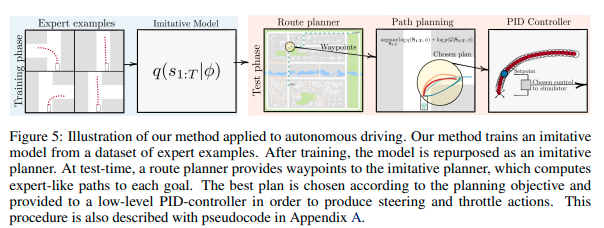
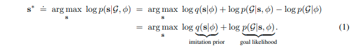
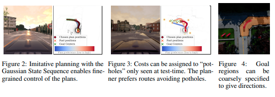
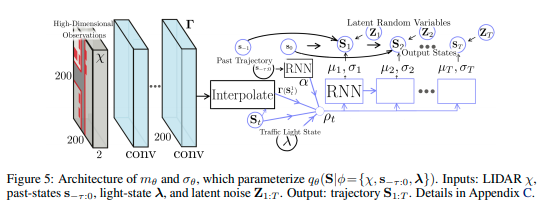
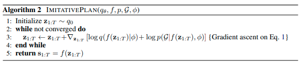
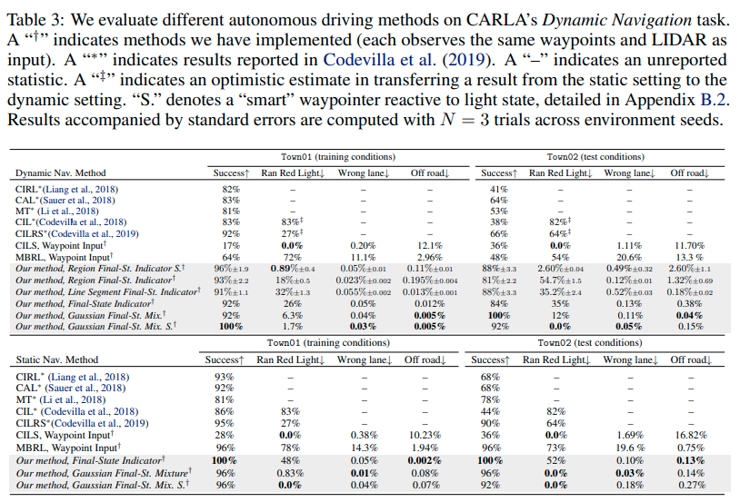
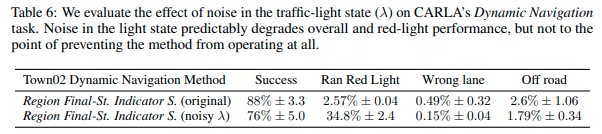

# [日本語まとめ] Deep Imitative Models for Flexible Inference, Planning, and Control

Nicholas Rhinehart, Rowan McAllister, Sergey Levine

* [Published as a conference paper at ICLR 2020](https://openreview.net/pdf?id=Skl4mRNYDr)
* [Arxiv 1st Oct. 2019](https://arxiv.org/pdf/1810.06544.pdf)
* [github](https://github.com/nrhine1/deep_imitative_models)
* [site](https://sites.google.com/view/imitative-models) [結果](https://sites.google.com/view/imitative-models)を動画で見ることができる

## どんなもの？

自動運転のための模倣学習(Imitation Learning)を用いた経路計画法Deep Imitative Models(DIM)を提案する。DIMは訓練済みのエキスパートの軌跡を模倣する確率モデル（Imitative Model）$$q(\mathbf{S} \mid \phi)$$ を使い、実行時に観測$$\phi$$からゴールに到達するエキスパートらしい経路計画を、軌跡の尤度とゴールの尤度を最大化することで求める。ゴールの尤度関数に車両が移動できる領域を設定することでpotholesなどの特定の物体を避けるような計画を行うことができる。

## 先行研究と比べてどこがすごい？何を解決したか？

* 今までの模倣学習による経路計画法は訓練時にゴールの設定を必要としていた。またゴールの設定は直進、右左折など簡単なものに限られていた。DIMはこの問題を解決し、模倣モデルは通常通り単純にエキスパートの軌跡との尤度を最大化することでネットワークを訓練することができる。すなわち実行時にゴールの設定を柔軟に行うことができる。
* DIMはCARLA上で６つのILとMBRL（モデルベース強化学習）の性能を上回った。

## 手法は？

連続空間、離散時間、POMDPの仮定をおく。時刻$$t$$におけるすべてのエージェントの状態（2次元位置）を$$\mathbf{s}_t \in \mathbb{R}^{D}$$とする。また観測を$$\phi$$とする。変数をボールド、実数値を小文字、確率変数を大文字とする。$$\mathbf{s}=\mathbf{s}_{1:T}$$とする。

DIMは実行時にゴール$$\mathcal{G}$$に到達するエキスパートらしい計画$$\mathbf{s}^{*}$$を次の最適化問題を解くことで求める。

$$q(\mathbf{S} \mid \phi)$$は訓練済みのエキスパートの計画$$\mathbf{S}$$を模倣する生成モデルである。第１項はエキスパートの尤度である。計画$$\mathbf{s}$$がエキスパートに近いほど高い値となる。第二項はゴールの尤度である。計画$$\mathbf{s}$$がゴール$$\mathcal{G}$$に近いほど高い値となる。

以下では

1. 生成モデルおよびその具体的なアーキテクチャ
2. ゴールの尤度関数
3. この最適化問題の具体的な解き方

について説明する。

### エキスパートの計画を模倣する生成モデル$$q(\mathbf{S} \mid \phi)$$ 

エキスパートの計画を模倣する生成モデルとして自己回帰生成モデルを用いる。すなわち$$q(\mathbf{S} \mid \phi)$$ は遷移確率の積として表す。

$$ q(\mathbf{S}_{1:T} \mid \phi) = \prod_{t=1}^T q(\mathbf{S}_t \mid \mathbf{S}_{1:t-1}, \phi) $$

遷移確率$$q(\mathbf{S}_t \mid \mathbf{S}_{1:t-1}, \phi)$$に正規分布を仮定する。この仮定より状態$$\mathbf{S}_{t}$$はReparametrization trickにより次式で表せる。

$$\mathbf{S}_{t} = f_{\theta}(\mathbf{Z}_t) = \mu_{\theta}(\mathbf{S}_{1:t-1}, \phi) + \sigma_{\theta}(\mathbf{S}_{1:t-1}, \phi) \cdot \mathbf{Z}_t$$

ここで

* $$f_{\theta}(\cdot)$$は観測$$\phi$$および正規分布に従う潜在変数$$\mathbf{Z}_t$$から計画$$\mathbf{S}$$にワープする可逆かつ微分可能な関数
* $$\theta$$は関数$$f$$のパラメータ
* $$\mathbf{Z}_t$$ : 正規分布に従う潜在変数$$\mathbf{Z} \sim q_0 = \mathcal{N}(0, I)$$
* $$\mu_{\theta}(\cdot)$$および$$\sigma_{\theta}(\cdot)$$は状態$$\mathbf{S}_{t}$$の平均および標準偏差を出力するネットワーク関数(パラメータ$$\theta$$はエキスパートの軌道からなるデータセットを用いてエキスパートの軌跡を模倣する確率モデル$$q(S \mid \phi)$$ の尤度を最大化して求める）

である。したがって次のように計画を計算(生成)することができる。

1. 潜在変数$$\mathbf{z}$$をサンプリングする

   $$\mathbf{z} \overset{iid}{\sim} q_0 = \mathcal{N}(0, I)$$

2. 潜在空間から状態へワープする

   $$\mathbf{s} \leftarrow f(\mathbf{z}; \phi) $$

逆に計画から潜在変数は次のように計算することができる。

$$ \mathbf{z}_t =  f^{-1}(\mathbf{s}_t) = \sigma_{\theta}(\mathbf{s}_{1:t-1}, \phi) ^{-1} (\mathbf{s}_{t} - \mu_{\theta}(\mathbf{s}_{1:t-1}, \phi))$$

以上より$$q(\mathbf{S} \mid \phi)$$は正規分布$$q_0$$と関数$$f$$を用いて表せる。すなわち$$q(\mathbf{S} \mid \phi)$$ の尤度を最大化することでパラメータ$$\theta$$を求めることができる。

$$q(\mathbf{S} \mid \phi) = q_0(f^{-1}(z; \phi)) |\det J_{f}(f^{-1}(z; \phi))|^{-1}$$

### 生成モデル$$q(\mathbf{S} \mid \phi)$$ のネットワークアーキテクチャ

具体的な$$f_{\theta}(\cdot)$$のアーキテクチャを示す。

処理の流れは次のとおりである。

観測$$\phi \doteq \{\mathbf{s}_{-\tau:0}, \chi , \lambda\}$$は

* $$\mathbf{s}_{-\tau:0}$$は過去から現在までの位置
* $$\chi = \mathbb{R}^{200 \times 200 \times 2}$$はLiDARの情報を俯瞰図で表現したもの(各グリッドの面積は$$0.5 m^2$$であり、地面の上と下にあるポイントの2ビンのヒストグラムである)
* $$\lambda$$は低次元の信号機の情報

である。時刻$$t$$に得られた観測から特徴量$$\alpha$$と$$\Gamma$$を計算する。

* 過去位置をエンコードするRNN(GRU)：$$\mathbf{s}_{-\tau:0} \rightarrow \alpha$$
* 空間特徴を抽出するCNN：$$\chi \rightarrow \Gamma \in \mathbb{R}^{200 \times 200 \times S}$$

その後以下の手順によって時刻$$1:T$$の計画$$\mathbf{s}_{1:T}$$もしくは$$\mathbf{z}_{1:T}$$を計算する。

1. 位置$$\mathbf{s}_{t-1}$$に対応した空間特徴量$$\Gamma$$のサブピクセル$$\Gamma(\mathbf{s}_{t-1})$$をbilinear補間により取り出す

2. $$\alpha$$、$$\mathbf{s}_t$$、$$\Gamma(\mathbf{s}_{t-1})$$および$$\lambda$$はConcatenationし、特徴$$p_{t-1}$$を構成する

3. 予測用のRNN(GRU)は特徴$$p_{t-1}$$から位置の平均を直接出力する代わりにベレの方法([wiki](https://en.wikipedia.org/wiki/Verlet_integration))のステップ$$m_{\theta}(\mathbf{s}_{1:t-1}, \phi)$$と位置の標準偏差$$\sigma_{\theta}(\mathbf{s}_{1:t-1}, \phi)$$を出力する

4. ベレの方法から位置の平均を計算する

   $$\mu_{\theta}(\mathbf{s}_{1:t-1}, \phi) = 2 \mathbf{s}_{t-1} - \mathbf{s}_{t-2} + m_{\theta}(\mathbf{s}_{1:t-1}, \phi)$$

5. (潜在変数$$\mathbf{z}_t$$から計画$$\mathbf{s}$$を求めるとき)状態$$\mathbf{s}_{t}$$を計算する

   $$\mathbf{s}_{t} = \mu_{\theta}(\mathbf{s}_{1:t-1}, \phi) + \sigma_{\theta}(\mathbf{s}_{1:t-1}, \phi) \cdot \mathbf{z}_t$$

6. (計画$$\mathbf{s}$$から潜在変数$$\mathbf{z}_t$$を求めるときのとき)潜在変数$$\mathbf{z}_t$$を計算する

   $$ \mathbf{z}_t = \sigma_{\theta}(\mathbf{s}_{1:t-1}, \phi) ^{-1} (\mathbf{s}_{t} - \mu_{\theta}(\mathbf{s}_{1:t-1}, \phi))$$

7. ステップ$$T$$まで1から6を繰り返す

### ゴール尤度関数の設計

ゴール尤度関数は自由に設計することができる。例えば移動可能領域内ならば１，移動可能領域外ならば０を返すという簡単な関数を尤度関数とすることができる。

その他にも以下のような関数を用いることが可能である。

* ゴールへ向かうルートとして与えられた各waypointの半径以内にいる場合は１，そうでない場合は０
* 移動可能領域をポリゴンで表現し、ポリゴン内ならば１、そうでない場合は０
* ガウシアン関数
* エネルギー関数

### 最適化問題の具体的な解き方

最適化問題は潜在変数を使い次のようにGradient ascentで最適解を求める。

## どうやって有効だと検証した？

CARLAを使い以下を検証した。

1. 最低限の報酬関数の設計とオフライン学習によって解釈可能なエキスパートのような計画を生成できるか？この手法が有効であるか？
2. 実際の車両の設定のもとでstate-of-the-artの性能を達成できるか？
3. 新しいタスクに対してどれだけ柔軟であるか？
4. ゴール設定へのロバスト性はどれだけあるか？

### 検証1  性能

様々なゴール尤度の設定のImitative PlanningをCALRA上で実行した。StaticおよびDynamicな環境のいずれも、いくつかの手法の性能を上回った。この結果からの質問1,2に対して肯定的な回答(affirmative answers)を示している。

### 検証2  ゴールノイズに対するロバスト性

ゴールにノイズを混ぜた状況でナビゲーションするテストを行った。

1. waypointsからなるゴールの半分を、大きく変動
2. ゴールを対向車線に設定

以上のいずれの場合も高い確率でナビゲーションを成功させることができた。このことから質問４に対する回答はYesである。

### 検証3  potholeの回避

potholeに対する回避実験を行った。Gaussian Final-State Mixtureおよび) Energy-based likelihoodを組み合わせたゴール尤度を使用することでランダムに設置されたpotholeをセンターラインに近づいたり、時には反対レーンに行くなどして避けることができた。

### 検証4  経路計画の信頼度推定

モデルが陽に計画の尤度を計算することができるのでモデルが計画を安全でない計画を正しく判断できるかの実験を行った。エキスパートが実際に行った良好なwaypointと道路外にある悪いwaypointが含まれる1650のテストケースに対してリコール97.5％、精度90.2%を示した。

またあるウェイポイントが計算した計画の信頼区間に含まれる確率、すなわち信頼度を検証した。信頼区間は、計画の基準の平均値から1標準偏差を引いた値を計画の基準の閾値とした区間である。

1. エキスパートが時間Tに実際に到着したウェイポイントは89.4%
2. 提供されたルートに沿って20m進んだ先のウェイポイントは73.8%
3. 2)のウェイポイントから2.5mずれたウェイポイントは2.5%

この結果から有効なウェイポイントを正しく判定する傾向があることがわかる。

### 検証5(課題) 信号のノイズに対するロバスト性

20％の確率で緑を赤に、赤を緑に変更するノイズを加えた状態で実験を行った。概ね成功しているものの、赤信号に対してより違反を行うという傾向が見られた。また交差点付近で停止と発進を繰り返し行う挙動が見られた。ノイズを加えた状態で訓練することによりよりロバストになる可能性がある。

## 課題は？議論はある？

ゴールノイズに対する実験でノイズとして入れたwaypointが交差点内の有効な場所ではあるが、目的地へ向かう方向ではない場所に設定されたときに、プランナが一時的に最適なルートを生成できないことがある。

観測のノイズおよび分布外の観測に対するロバスト性に対していくつかの課題がある。

1. 観測ノイズに関するロバスト性である。提案モデルは現在の観測のみを予測に使っているため、ベイジアンフィルタリングを使うことで観測ノイズを軽減できるかもしれない。しかしながら高次元のフィルタリングは多くの場合手に負えないので、ディープラーニングをつかった近似ベイジアンフィルタリングを行う必要がある。
2. 訓練データ分布外の観測に関するロバスト性である。これに対応するためにはDeep Ensemble Networkを使う方法が考えられる。

> Balaji Lakshminarayanan, Alexander Pritzel, and Charles Blundell. Simple and scalable predictive uncertainty estimation using deep ensembles. In Neural Information Processing Systems (NeurIPS), pp. 6402–6413, 2017.

## 次に読むべき論文は？

[A. Filos, P. Tigas, R. McAllister, N. Rhinehart, S. Levine, and Y. Gal, “Can autonomous vehicles identify, recover from, and adapt to distribution shifts?” arXiv preprint arXiv:2006.14911, 2020.](../Can autonomous vehicles identify, recover from, and adapt to distribution shifts/summary.md)

[N. Rhinehart, R. McAllister, K. Kitani, and S. Levine, “PRECOG: prediction conditioned on goals in visual multi-agent settings,” in Proceedings of the IEEE International Conference on Computer Vision, 2019, pp. 2821–2830.](../PRECOG: PREdiction Conditioned On Goals in Visual Multi-Agent Settings/summary.md)

## 補足

DIMで述べられている生成モデルおよびアーキテクチャはR2P2([link](https://people.eecs.berkeley.edu/~nrhinehart/papers/r2p2_cvf.pdf), [summary](../R2P2: A reparameterized pushforward policy for diverse, precise generative path forecasting/summary.md))と同じである。R2P2にこのようなモデリングをする理由が述べられている。R2P2以外にも例えば以下のようなgenerative autoregressive flowを適用することもできる。

* Danilo Rezende and Shakir Mohamed. Variational inference with normalizing flows. In International
  Conference on Machine Learning (ICML), pp. 1530–1538, 2015.
* Aaron van den Oord, Yazhe Li, Igor Babuschkin, Karen Simonyan, Oriol Vinyals, Koray Kavukcuoglu,
  George van den Driessche, Edward Lockhart, Luis C Cobo, Florian Stimberg, et al. Parallel
  WaveNet: Fast high-fidelity speech synthesis. arXiv preprint arXiv:1711.10433, 2017.

## 個人的メモ

* 論文中にいくつかのゴール尤度関数が提案されている。
* ゴール内の尤度とエキスパートの尤度のバランスはどうしたらいいだろうか？