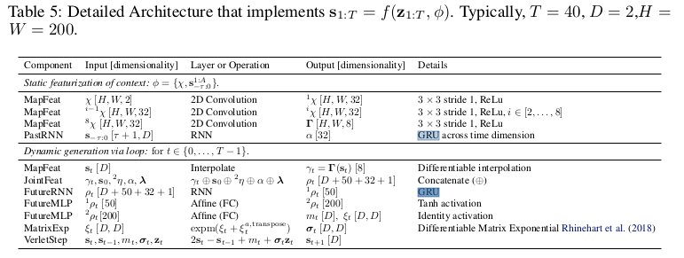

# DEEP IMITATIVE MODELS FOR FLEXIBLE INFERENCE, PLANNING, AND CONTROL

Nicholas Rhinehart, Rowan McAllister, Sergey Levine

* [Published as a conference paper at ICLR 2020](https://openreview.net/pdf?id=Skl4mRNYDr)
* [Arxiv 1st Oct. 2019](https://arxiv.org/pdf/1810.06544.pdf)
* [github](https://github.com/nrhine1/deep_imitative_models)
* [site](https://sites.google.com/view/imitative-models)

## どんなもの？

自動運転のための模倣学習(Imitation Learning)を用いたPath Planningを提案する。訓練済みのエキスパートの軌跡を模倣する確率モデル（Imitative Model）$$q(\mathbf{S} \mid \phi)$$ を使い、実行時に観測$$\phi$$からゴールに到達するエキスパートらしい経路計画$$s^*$$をエキスパート軌跡との尤度とゴールとの尤度を最大化することで求める(Imitative Planning)。ゴールの尤度関数に有効な移動間領域を使うことで、potholesのようなものを避けるように計画する(Costed planning)ことも可能である。

## 先行研究と比べてどこがすごい？何を解決したか？

* Imitation Planningという推論フレームワークを行うことで、柔軟にゴールへ到達することができる。
* 訓練時にゴールの設定を必要せず、エキスパートの軌跡との尤度を最大化することでネットワークを訓練する。
* 実行時に複雑なゴールの設定を行うことができる。今までのImitation Learning（IL)の方法は訓練時にゴールの設定を必要とする。またこれらはゴールの設定は簡単なものに限られる（右左折など）。
* モデルベース強化学習(MBRL)のような複雑な報酬関数の設計を必要としない。
* CARLA上で６つのILとMBRLの性能を上回った。
* ゴール設定にノイズが入った場合でもロバストである。

## 手法は？

単一エージェントの行動を予測するR2P2([link](https://people.eecs.berkeley.edu/~nrhinehart/papers/r2p2_cvf.pdf), [summary](../R2P2: A reparameterized pushforward policy for diverse, precise generative path forecasting/summary.md))と確率モデルおよびネットワークアーキテクチャは同じである。新しいところはImitative Planningとゴール尤度関数の設計である。

### エキスパートの軌跡を模倣する確率モデル$$q(\mathbf{S} \mid \phi)$$ のモデリング

連続空間、離散時間、POMDPの仮定の下モデル化を行う。時刻$$t$$におけるすべてのエージェントの状態（位置）を$$\mathbf{s}_t \in \mathbb{R}^{D}$$とする。また観測を$$\phi$$とする。変数をボールド、確率変数を大文字とする。添え付き文字の省略はすべての未来の時刻を含む。$$\mathbf{S}=\mathbf{S}_{1:T}$$とする。エキスパートの軌跡$$\mathbf{S}$$を模倣する確率モデル$$q(\mathbf{S} \mid \phi)$$ は遷移確率の積として表すことができる。

$$ q(\mathbf{S}_{1:T} \mid \phi) = \prod_{t=1}^T q(\mathbf{S}_t \mid \mathbf{S}_{1:t-1}, \phi) $$

遷移確率$$q(\mathbf{S}_t \mid \mathbf{S}_{1:t-1}, \phi)$$は正規分布を仮定し、状態の遷移が次式で表せるとする。

$$\mathbf{S}_{t} = f(\mathbf{Z}_t) = \mu_{\theta}(\mathbf{S}_{1:t-1}, \phi) + \sigma_{\theta}(\mathbf{S}_{1:t-1}, \phi) \cdot \mathbf{Z}_t$$

ここで

* $$f(\cdot)$$は観測$$\phi$$および正規分布に従う潜在変数$$\mathbf{Z}_t$$から計画$$\mathbf{S}$$にワープする可逆かつ微分可能な関数
* $$\mathbf{Z}_t$$ : 正規分布に従う潜在変数$$\mathbf{Z} \sim q_0 = \mathcal{N}(0, I)$$
* $$\mu_{\theta}(\cdot)$$および$$\sigma_{\theta}(\cdot)$$は状態$$\mathbf{S}_{t}$$の平均および分散を出力するネットワーク関数(パラメータ$$\theta$$はエキスパートの軌道からなるデータセットを用いてエキスパートの軌跡を模倣する確率モデル$$q(S \mid \phi)$$ の尤度を最大化して求める）

である。

### ネットワークアーキテクチャ

観測$$\phi \doteq \{\mathbf{s}_{-\tau:0}, \chi , \lambda\}$$は

* $$\mathbf{s}_{-\tau:0}$$は過去から現在までの位置
* $$\chi = \mathbb{R}^{200 \times 200 \times 2}$$はLiDARの情報を俯瞰図で表現したもの(各グリッドの面積は$$0.5 m^2$$であり、地面の上と下にあるポイントの2ビンのヒストグラムである)
* $$\lambda$$は低次元の信号機の情報

である。観測$$\mathbf{s}_{-\tau:0}$$と$$\chi$$はそれぞれ空間特徴を抽出するCNNと過去位置をエンコードするRNN(GRU)で処理され、$$\alpha$$と$$\Gamma$$が計算される。その後以下の手順によって時刻$$1:T$$の計画$$\mathbf{S}_{1:T}$$を行う。

1. 位置$$\mathbf{S}_{t-1}$$に対応した$$\Gamma$$サブピクセルにもどづいてbilinear補間された特徴ベクトル$$\Gamma(\mathbf{S}_{t-1})$$を取り出す

2. $$\alpha$$、$$\mathbf{s}_t$$、$$\Gamma(\mathbf{S}_{t-1})$$および$$\lambda$$はConcatenationし、特徴$$p_{t-1}$$を作る

3. 予測用のRNN(GRU)は特徴$$p_{t-1}$$から位置の平均を直接出力する代わりにベレの方法([wiki](https://en.wikipedia.org/wiki/Verlet_integration))のステップ$$m_{\theta}(\mathbf{S}_{1:t-1}, \phi)$$と位置の分散$$\sigma_{\theta}(\mathbf{S}_{1:t-1}, \phi)$$を出力する

4. ベレの方法から位置の平均を計算する

   $$\mu_{\theta}(\mathbf{S}_{1:t-1}, \phi) = 2 \mathbf{S}_{t-1} - \mathbf{S}_{t-2} + m_{\theta}(\mathbf{S}_{1:t-1}, \phi)$$

5. 状態$$\mathbf{S}_{t}$$を計算する

   $$\mathbf{S}_{t} = \mu_{\theta}(\mathbf{S}_{1:t-1}, \phi) + \sigma_{\theta}(\mathbf{S}_{1:t-1}, \phi) \cdot \mathbf{Z}_t$$

6. ステップ$$T$$まで1から5を繰り返す

### Imitative Planning

DIMは実行時にGradient ascentによって式(1)を最適化することでゴールに到達するエキスパートらしい計画を計算する。Algorithm 2で示すように潜在空間$$z$$を通して最適化計算を行う。

### ゴール尤度関数の設計

ゴール尤度関数の設計は自由度が高く、ゴール内ならば１，ゴール外ならば０を返すという簡単な関数を尤度関数とすることができる。

例えば以下のような尤度関数である。

* ゴールへ向かうルートとして与えられた各waypointの半径以内にいる場合は１，そうでない場合は０
* 移動可能領域をポリゴンで表現し、ポリゴン内ならば１、そうでない場合は０

その他にも１，０のバイナリの代わりにゴール内のより良い場所を目指すようにガウシアン関数を用いたりできる。論文中にいくつかのゴール尤度関数が提案されている。

## どうやって有効だと検証した？

CARLAを使い以下を検証した。[結果](https://sites.google.com/view/imitative-models)を動画で見ることができる。

1. 最低限の報酬関数の設計とオフライン学習によって解釈可能なエキスパートのような計画を生成できるか？この手法が有効であるか？
2. 実際の車両の設定のもとでstate-of-the-artの性能を達成できるか？
3. 新しいタスクに対してどれだけ柔軟であるか？
4. ゴール設定へのロバスト性はどれだけあるか？

### 検証1  性能

様々なゴール尤度の設定のImitative PlanningをCALRA上で実行した。StaticおよびDynamicな環境のいずれも、いくつかの手法の性能を上回った。この結果からの質問1,2に対して肯定的な回答(affirmative answers)を示している。

### 検証2  ゴールノイズに対するロバスト性

ゴールにノイズを混ぜた状況でナビゲーションするテストを行った。以下のいずれの場合も高い確率でナビゲーションを成功させることができた。このことから質問４に対する回答はYesである。

1. waypointsからなるゴールの半分を、大きく変動
2. ゴールを対向車線に設定

### 検証3  potholeの回避

potholeに対する回避実験を行った。Gaussian Final-State Mixtureおよび) Energy-based likelihoodを組み合わせたゴール尤度を使用することで、ランダムに設置されたpotholeをセンターラインに近づいたり、時には反対レーンに行くなどして避けることができた。

### 検証4  経路計画の信頼度推定

モデルが陽に計画の尤度を計算することができるので、計画が安全であるか安全でないかの分類問題の実験を行った。エキスパートが実際に行った良好なwaypointとオフロードである悪いwaypointが含まれる1650のテストケースに対してリコール97.5％、精度90.2%を示している。

また各検証データのエキスパートの最終位置に対する経路計画を行った。そして、あるウェイポイントが計算した計画の信頼区間に含まれる確率、すなわち信頼度を計算した。信頼区間は、計画の基準の平均値から1標準偏差を引いた値を計画の基準の閾値とした区間である。

1. エキスパートが時間Tに実際に到着したウェイポイントに対して89.4%の信頼度を示した
2. 提供されたルートに沿って20m進んだ先のウェイポイントに対して73.8%の信頼度を示した
3. 2)のウェイポイントから2.5mずれたウェイポイントに対して2.5%の信頼度を示した

この結果から、有効なウェイポイントを正しく判定する傾向があることがわかる。

### 検証5(課題) 信号のノイズに対するロバスト性

20％の確率で緑を赤に、赤を緑に変更するノイズを加えた状態で実験を行った。概ね成功しているものの、赤信号に対してより違反を行うという傾向が見られた。また交差点付近で停止と発進を繰り返し行う挙動が見られた。ノイズを加えた状態で訓練することによりよりロバストになる可能性がある。

## 課題は？議論はある？

ゴールノイズに対する実験で、decoy waypointが交差点内の有効な場所ではあるが、目的地へ向かう方向ではない場所に設定されたときに、プランナが一時的に最適なルートを生成できないことがある。

観測のノイズおよび分布外の観測に対するロバスト性に対していくつかの課題がある。観測ノイズに関しては、例えば提案モデルは現在の観測しか使っていないが、ベイジアンフィルタリングを使うことで観測ノイズを軽減できるかもしれない。しかしながら高次元のフィルタリングは多くの場合手に負えないので、ディープラーニングをつかった近似ベイジアンフィルタリングを行う必要がある。分布外の観測に対しては、Deep Ensemble Networkを使う方法が考えられる。

> Balaji Lakshminarayanan, Alexander Pritzel, and Charles Blundell. Simple and scalable predictive uncertainty estimation using deep ensembles. In Neural Information Processing Systems (NeurIPS), pp. 6402–6413, 2017.

## 次に読むべき論文は？

[A. Filos, P. Tigas, R. McAllister, N. Rhinehart, S. Levine, and Y. Gal, “Can autonomous vehicles identify, recover from, and adapt to distribution shifts?” arXiv preprint arXiv:2006.14911, 2020.](../Can autonomous vehicles identify, recover from, and adapt to distribution shifts/summary.md)

[N. Rhinehart, R. McAllister, K. Kitani, and S. Levine, “PRECOG: prediction conditioned on goals in visual multi-agent settings,” in Proceedings of the IEEE International Conference on Computer Vision, 2019, pp. 2821–2830.](../PRECOG: PREdiction Conditioned On Goals in Visual Multi-Agent Settings/summary.md)

## 個人的メモ

ゴール内の尤度とエキスパートの尤度のバランスはどうしたらいいだろうか？