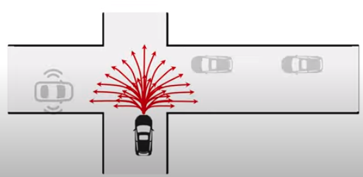

# [日本語まとめ] DSDNet: Deep Structured self-Driving Network

Wenyuan Zeng, Shenlong, Renjie Liao, Yun Chen, Bin Yang, and Raquel Urtasun

* [ECCV 2020](https://www.ecva.net/papers/eccv_2020/papers_ECCV/papers/123660154.pdf)
* [Arxiv 13 Aug](https://arxiv.org/pdf/2008.06041.pdf?utm_source)
* [ECCV 2020 short talk](https://www.youtube.com/watch?v=YQQBVCnCCn8)
* [ECCV 2020 long talk](https://www.youtube.com/watch?v=hop6FBJnM-c)

## どんなもの？

自動運転を行うためには他車両の不確実な将来の位置、つまり行動を事前に予測することが必要となる。この課題を解決するため、他車両の物体検出および運動予測、そして自車両の運動計画をひとつのネットワークで行うDeep Structured self-Driving Network(DSDNet)を提案する。ひとつのネットワークで複数のタスクを行うことで、センサー信号から運動計画までのの遅延を削減する。

DSDNetは一つのバックボーンと３つのモジュール（物体検出、予測、計画）で構成される。HDマップとLIDARの点群を入力としてバックボーンは入力から特徴量を計算する。計算された特徴量は後段の３つのモジュールで使われる。検出モジュールはシーンにいる車両や歩行者などの道路上のアクターを出力する。予測モジュールは各アクターに対して複数の予測経路を出力する。それと共に各予測経路がどれだけ実際に起こりやすいかを示す周辺分布を計算する。計画モジュールは予測した経路および分布を使って他車両との衝突が最も起こりにくい予測軌跡を選ぶことで安全な運動計画を出力する。

## 先行研究と比べてどこがすごい？何を解決したか？

* 計画モジュールは起こり得る複数の可能性に対して考慮する。交通ルールを尊重し、他のアクターに準拠した安全計画を出力する。シミュレーションを行い、DSDNetの運動計画モジュールが最も安全な結果を示した。比較手法と比べて衝突やレーン侵入率を大きく軽減することができた。
* DSDNetの予測モジュールを公開ベンチマークで評価を行い、state-of-artの性能を凌駕することを確認した。このことからアクター間の相互作用をDeep Structured Modelsで陽にモデル化する利点を示した。
* DSDNetのバックボーンは運動計画の推論の速度を加速させるが、検出の性能が犠牲にならないことを示した。

## 手法は？

### バックボーン

バックボーンは「PIXOR: Real-time 3D Object Detection from Point Clouds([arxiv](https://arxiv.org/abs/1902.06326))」で提案されたCNN層で構成されるネットワークである。まず最初に入力であるHDマップとLIDARの点群をラスタライズしてテンソルに変換する。この変換により、HDマップは道路の構造物ごとにM個に分類されたテンソル$$\in \mathbb{R}^{H' \times W' \times M}$$、LIDARのデータは過去１秒間（１０回分）の点群を俯瞰変化して連結したテンソル$$\in \mathbb{R}^{H' \times W' \times T}$$で表される。HDマップとLIDARのデータをテンソルに変換後、バックボーンに入力し、特徴マップ$$\mathbf{F} \in \mathbb{R}^{H \times W \times C}$$を計算する。

### 検出モジュール

検出モジュールは分類と回帰の２つのヘッダーとNMS（non maximum suppression）で構成される。２つのヘッダーはSSD（single shot detector）と同じである。つまり分類ヘッダーはアクターでアンカーが占有されているかどうかを示す信頼マップを出力し、回帰ヘッダーは各アンカーに対してアクターの位置のオフセット、サイズ、方向、速度を出力する。NMSを信頼する検出結果をフィルタするために使われる。

### 予測モジュール

#### Deep Structured Model

Deep Structured Modelsはディープニューラルネットワークで計算されたエネルギーを使ったマルコフ確率場である。このDeep Structured Modelsを使って車両や歩行者などの道路上のアクターの間の相互作用を捉えるため、現在時刻から数秒後までのすべてのアクターの行動$$\{ \mathbf{s}_1, \ldots , \mathbf{s}_N \}$$の同時分布をモデリングする。本論文では同時確率分布を次のようにエネルギーで表す。

$$p(\mathbf{s}_i, \ldots , \mathbf{s}_N \mid \mathbf{X}, \mathbf{w}) = \frac{1}{Z} \exp (-E(\mathbf{s}_1, \ldots , \mathbf{s}_N \mid \mathbf{X}, \mathbf{w}))$$

ただし$$\mathbf{X}$$はセンサーデータ、$$\mathbf{w}$$はパラメータ、$$E$$はすべてのエージェントの行動の結合エネルギー、$$Z$$は分配関数である。そして人は道路を走るとき、道路に沿って滑らかに走ったり、衝突を避けるなどの人の運転の仕方から着想を得て結合エネルギーがアクターの経路の良さを表すエネルギー$$E_{traj}$$とアクター同士の衝突エネルギー$$E_{coll}$$で構成されると定義し、アクターの経路をグラフのノードとする無向グラフで表現する。

$$E(\mathbf{s}_1, \ldots , \mathbf{s}_N \mid \mathbf{X}, \mathbf{w}) =
\sum_{i=1}^{N} E_{traj}(\mathbf{s}_i \mid \mathbf{X}, \mathbf{w_{traj}}) +
\sum_{i=1}^{N} \sum_{i \ne j}^{N} E_{coll}(\mathbf{s}_i, \mathbf{s}_j \mid \mathbf{X}, \mathbf{w_{coll}}) $$

#### 予測モジュールの処理

予測モジュールは次の３ステップの処理を行い、予測経路とアクターが経路$$s_i$$を実際に行う周辺確率$$p(\mathbf{s}_i \mid \mathbf{X}, \mathbf{w})$$を計算する。

1. Trajectory Samplerを使って各アクター$$i$$の将来の$$T$$秒後までの行動（２次元位置で構成される経路）$$\mathbf{s}_i \in \mathbb{R}^{T \times 2}$$を複数サンプルする

   $$\{ \hat{s}_i^1, \ldots , \hat{s}_i^k \}$$ 

2. 経路の良さを表すエネルギー$$E_{traj}(\mathbf{s}_i \mid \mathbf{X}, \mathbf{w})$$をニューラルネットワークにより計算する

   $$\{ E_{traj}(\mathbf{s}_i=\hat{s}_i^1 \mid \mathbf{X}, \mathbf{w}), \ldots , E_{traj}(\mathbf{s}_i=\hat{s}_i^k \mid \mathbf{X}, \mathbf{w}) \}$$

3. 確率伝播法、詳しく言えばsum-productアルゴリズムによるメッセージ伝達により各アクターの周辺分布$$p(\mathbf{s}_i \mid \mathbf{X}, \mathbf{w})$$を計算する

   $$\{ p(\mathbf{s}_i=\hat{s}_i^1 \mid \mathbf{X}, \mathbf{w}), \ldots , p(\mathbf{s}_i=\hat{s}_i^k \mid \mathbf{X}, \mathbf{w}) \}$$ 
   

#### Trajectory Sampler

「End-to-end Interpretable Neural Motion Planner([arxiv](https://arxiv.org/abs/2101.06679))」で提案されたTrajectory Samplerを使う。Trajectory Samplerはアクターの位置、角度、速度に基づき３秒後までの経路をK個生成する。生成したK個の経路は直進、円弧、クロソイド曲線が30%, 20%, 50%の割合で構成される。円弧の半径、クロソイド曲線の曲率、車両の加速度などのパラメータは空間を密かつ多様にサンプリングできるよう、ある範囲から一様に選ばれる。Trajectory Samplerにより生成される経路はbicycle dynamic modelを使うことで物理的に走行可能な経路である。

#### 経路の良さを表すエネルギー$$E_{traj}$$

次の手順で経路の良さを表すエネルギー$$E_{traj}$$を計算する。

2. 検出したアクターのボックスの位置に対応する特徴量を特徴マップからROIAlignで抽出し、その特徴量をCNNで処理してActor Featureを作成する。
2. 予測した経路の各ポイントに対応する特徴ベクトルを双線形補間法で特徴マップから抽出してIndexing Featureを作成する。そして各点の物理的な要素を含む特徴ベクトル$$(x, y, \cos \theta, \sin \theta, \text{distance})$$をIndexing Featureと連結し、Trajectory Featureを作成する。$$x, y$$： 位置、$$\theta$$：アクターの角度、$$\text{distance}$$は現在時刻のアクターの位置から予測経路に沿った予測位置までの距離である。
3. 計算したActor FeatureとTrajectory Featureを連結し、MLPヘッダーで処理する。

#### Message Passing

次の手順でDeep Structured Modelsを使い、周辺分布$$p(\mathbf{s}_i \mid \mathbf{X}, \mathbf{w})$$を求める。

1. アクター$$i$$からアクター$$j$$へのメッセージ$$m_{ij}$$を適当な値で初期化した後、次の更新式を収束するまで繰り返す。

   $$m_{ij}(\mathbf{s}_j) \propto
   \sum_{\mathbf{s}_i \in {\mathbf{s}_i^k}}
   \text{e}^{-E_{traj}(\mathbf{s}_i)-E_{coll}(\mathbf{s}_i, \mathbf{s}_j)}
   \prod_{n \ne i,j} m_{ni}(\mathbf{s}_i)$$

   $$E_{coll}$$は衝突エネルギーである。

   $$E_{coll}(\mathbf{s}_i, \mathbf{s}_j)= 
   \begin{cases}
       \gamma,& \text{if } \mathbf{s}_i \text{ collides with } \mathbf{s}_j\\
       0,              & \text{otherwise}
   \end{cases}$$

3. 収束後、メッセージから近似周辺分布を計算する。

   $$p(\mathbf{s}_i=\hat{s}_i^k \mid \mathbf{X}, \mathbf{w}) \propto
   \text{e}^{-E_{traj}(\hat{s}_i^k)} \prod_{j \ne i} m_{ji} (\hat{s}_i^k) $$

### 計画モジュール

計画モジュールは予測モジュールと同じTrajectory Samplerを使い、自動運転車両の経路$$\tau$$を複数サンプルする。そして次のコストが最小になるサンプルを選ぶ。

$$C(\tau \mid p(\mathbf{s}_i, \dots, \mathbf{s}_N), \mathbf{X}, \mathbf{w})
= C_{traj}(\tau \mid \mathbf{X}, \mathbf{w}) + 
\sum_{i=1}^N \mathbb{E}_{p(\mathbf{s}_i \mid \mathbf{X}, \mathbf{w})} C_{coll}(\tau, \mathbf{s}_i \mid \mathbf{X}, \mathbf{w})$$

$$C_{traj}$$は$$E_{traj}$$と同様の構造を持つが、重みの異なるニューラルネットワークによって計算されたコストである。

### 学習

DSDNetを次の結合損失関数で訓練する。

$$\mathcal{L} =
\mathcal{L}_{\text{planning}} +
\alpha \mathcal{L}_{\text{prediction}} +
\beta \mathcal{L}_{\text{detection}}$$

$$\mathcal{L}_{\text{planning}}$$はエキスパートの行動$$\tau^{gt}$$をpositive、ランダムに生成した行動をnegativeとして、max-margin損失関数である。計画の良さを表すコストを作る代わりに衝突など危険な行動にペナルティをかけることで良い計画を学習するようにする。

$$\mathcal{L}_{\text{planning}} =
\sum_{data} \max_k
( \left[
C(\tau^{gt} \mid \mathbf{X}) - C(\hat{\tau}^{k} \mid \mathbf{X}) + d^k + \gamma^k
\right]_{+})$$

* $$[\cdot]_{+}$$ Relu関数
* $$d^k$$ エキスパートの行動$$\tau^{gt}$$とサンプル$$\hat{\tau}^{k}$$とのL2距離
* $$\gamma^k$$ サンプルが危険なときに正の値、そうでない場合０

$$\mathcal{L}_{\text{predicttion}}$$はクロスエントロピー損失である。Trajectory Samplerで生成するサンプルの内、実際の経路と最も距離が近いサンプルをターゲットとする。

$$\mathcal{L}_{\text{detection}}$$は分類と回帰の合計による標準的な損失関数である。分類損失はクロスエントロピーである。回帰損失はsmooth $$l_1$$である。「End-to-end Interpretable Neural Motion Planner([arxiv](https://arxiv.org/abs/2101.06679))」と同じ損失関数である。

ちなみに$$\mathcal{L}_{\text{planning}}$$のみ使用してDSDNetを訓練すると、検出と計画が学習できないことがわかっている。

## どうやって有効だと検証した？

### 予測性能の検証

nuScenesとATG4Dのデータセットを使ってL2 ErrorとCollision Rateの２つのメトリックでDSDNetを評価した。L2 Errorは真の経路と最も可能性が高い経路との距離である。Collision Rateは自動運転車両が衝突した割合である。図に示すとおり、DSDNetはnuScenesとATG4Dのデータセットの両方で最も良い結果を示した。

またCALRAのデータセットを使ってminMSDのメトリックで評価した。CARLAデータセット上では検出モジュールで検出したアクターではなく、他の比較手法と同様に真の値を用いた。図に示すとおり、CARLAのデータセットでも最も良い結果を示した。

予測性能の検証に使った比較手法の内、いくつかの手法は評価メトリックであるL2損失を訓練に使う。一般的に評価する項目を直接最適化することができれば、最も良い結果が得られるといわれている。また「Multipath: Multiple probabilistic anchor trajectory hypotheses for behavior prediction（[arxiv](https://arxiv.org/abs/1910.05449)）」でもクロスエントロピーを使うことはL2 Errorを抑えることができないことが述べられている。しかし、図を見るとクロスエントロピーを用いるDSDNetのL2 Errorが最も低く、またCollision Rateも低い。この結果は低いL2 Errorとマルチモダリティの共存が実現できること、マルチエージェントの相互作用をモデリングする有用性を示している。

### 計画性能の検証

ATG4Dを使ってDSDNetを評価した結果が次の図である。

図より次のことがわかる。

1. DSDNetが最も低いCollision RateおよびLane Violation Rateであり、最も安全な計画をおこなえることを示している。
2. Ego-motionおよびILによる方法が最もL2が低くエキスパートのパスに近いが、Collision RateおよびLane Violation Rateは高い。エキスパートを模倣するだけでは安全な計画の実行を学習するのに不十分なことを示している。
3. Manual-CostおよびLearnable-PLTは陽に物体回避および交通ルールを考慮に入れる。しかし、DSDNetよりCollision RateおよびLane Violation Rateが高い。Manual-CostおよびLearnable-PLTは最も可能性が高い予測のみを計画に使うことから、複数の経路を考慮することの有効性を示している。

### 検出性能の検証

検出の性能をnuSceneおよびATG4Dで検証した。一つのバックボーンをすべてのタスクに用いているが、DSDNetの検出モジュールはほぼ同様もしくは良い結果である。マルチタスク学習による弊害がないことを検出の性能が落ちていないことを示している。

### Ablation Study

予測モジュールに対してアブレーションテストを行った。結果よりMulti-modalやInteractionを導入することで性能が向上していることがわかる。また計画モジュールのアブレーションテストを行った。計画時に予測を行うことで性能が向上することが確認できる。

## 課題は？議論はある？

$$E_{traj}$$や$$E_{coll}$$だけでなく他のエネルギーやコストを検討する必要がある。

## 次に読むべき論文は？

* [Deep Structured Reactive Planning](../Deep Structured Reactive Planning/summary.md)
* [PRECOG: PREdiction Conditioned On Goals in Visual Multi-Agent Settings](../PRECOG: PREdiction Conditioned On Goals in Visual Multi-Agent Settings/summary.md)
* [Contingencies from Observations: Tractable Contingency Planning with Learned Behavior Models](../Contingencies from Observations: Tractable Contingency Planning with Learned Behavior Models/summary.md)

## 個人的メモ

なし
