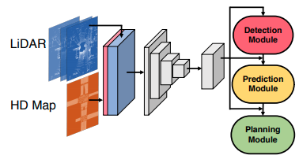
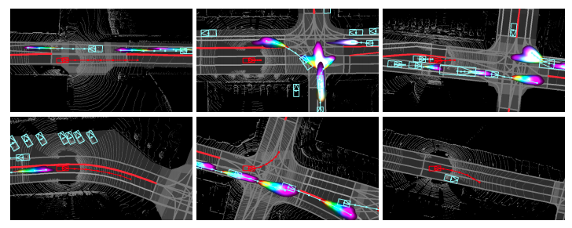
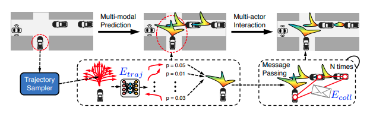
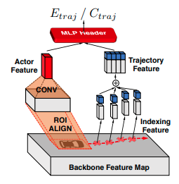
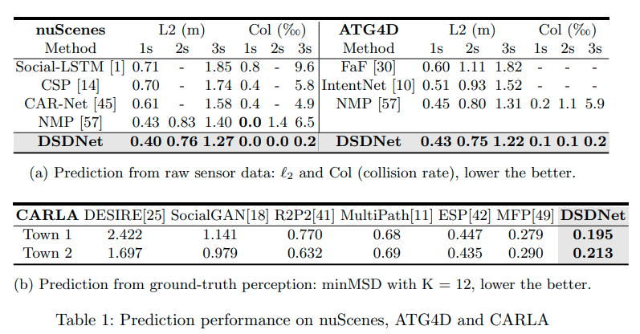
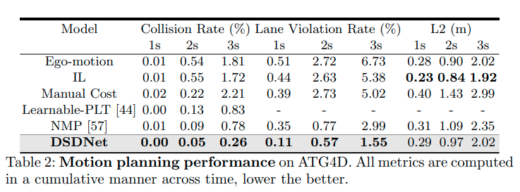
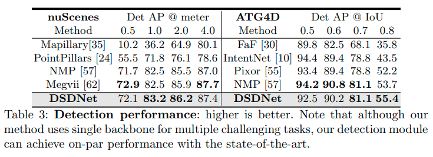
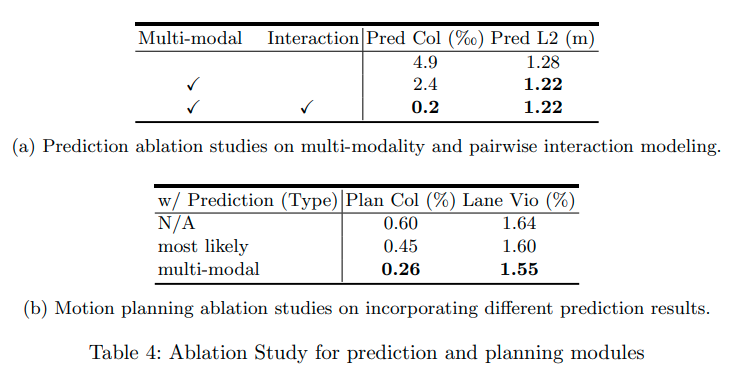

# DSDNet: Deep Structured self-Driving Network

Wenyuan Zeng, Shenlong, Renjie Liao, Yun Chen, Bin Yang, and Raquel Urtasun

* [ECCV 2020](https://www.ecva.net/papers/eccv_2020/papers_ECCV/papers/123660154.pdf)
* [Arxiv 13 Aug](https://arxiv.org/pdf/2008.06041.pdf?utm_source)
* [ECCV 2020 short talk](https://www.youtube.com/watch?v=YQQBVCnCCn8)
* [ECCV 2020 long talk](https://www.youtube.com/watch?v=hop6FBJnM-c)

## どんなもの？

自動運転を行うためには他車両の不確実な将来の位置、つまり行動を事前に予測することが必要となる。この課題を解決するため、他車両の物体検出および運動予測、そして自車両の運動計画をひとつのネットワークで行うDeep Structured self-Driving Network(DSDNet)を提案する。ひとつのネットワークで複数のタスクを行うことで、センサー信号から運動計画までのの遅延を削減する。

DSDNetは一つのバックボーンと３つのモジュール（物体検出、予測、計画）で構成される。入力はHDマップとLIDARの点群である。バックボーンは入力から特徴量を計算する。計算された特徴量は３つのモジュールで使われる。検出モジュールはシーンにいる車両や歩行者などの道路上のアクターを出力する。予測モジュールは各アクターに対して複数の予測経路を出力する。また各予測経路がどれだけ実際に起こりやすいかを周辺分布として計算する。計画モジュールは予測した経路および分布を使って他車両との衝突が最も起こりにくい予測軌跡を選ぶことで安全な運動計画を出力する。

## 先行研究と比べてどこがすごい？何を解決したか？

* 車両や歩行者などの道路上のアクターの間の相互作用を捉えるため、Deep Structured Modelsとしてモデリングする。Deep Structured Modelsはディープニューラルネットワークで計算されたエネルギーを使ったマルコフ確率場モデルである。
* 計画モジュールは起こり得る複数の可能性に対して考慮する。つまり、マルチモーダルな計画を行う。交通ルールを尊重し、他のアクターに準拠した安全計画を出力する。
* 検出、予測、計画の３つのタスクでDSDNetを評価した。
  * DSDNetの予測モジュールが公開ベンチマークのstate-of-artの性能を凌駕した。
  * アクター間の相互作用をDeep Structured Modelsで陽にモデル化する利点を示した。
  * DSDNetの運動計画モジュールが最も安全な結果を示した。そして衝突やレーン侵入率を大きく軽減した。
  * DSDNetのバックボーンは運動計画の推論の速度を加速させるが、検出の性能が犠牲にならないことを示した。

## 手法は？

### バックボーン

バックボーンはCNN層で構成されるネットワークである。バックボーンはHDマップとLIDARのデータから特徴マップ$$\mathbf{F} \in \mathbb{R}^{H \times W \times C}$$を計算する。HDマップとLIDARの点群をCNNで計算するためにラスタライズして俯瞰図に変換する。HDマップは道路の構造物ごとにM個に分類されたテンソル$$\in \mathbb{R}^{H' \times W' \times M}$$で表される。LIDARのデータは過去１秒間（１０回分）の点群を俯瞰変化して連結したテンソル$$\in \mathbb{R}^{H' \times W' \times T}$$で表される。入力するデータを現在時刻の点群だけでなく過去の点群と連結した俯瞰図を使う。点群が空間に対して疎であることをカバーして、検出と予測の精度向上を測る。バックボーンのアーキテクチャは「PIXOR: Real-time 3D Object Detection from Point Clouds([arxiv](https://arxiv.org/abs/1902.06326))」と同じものを使う。

### 検出モジュール

検出モジュールは分類と回帰の２つのSSD（single shot detector）ヘッダーを持つ。分類ヘッダーは物体でアンカーが占有されているかどうかを出力する。回帰ヘッダーは各アンカーに対して位置のオフセット、サイズ、方向、速度を出力する。検出モジュールはNMS（non maximum suppression）を使用して最終的なアクターをバウンディングボックスとして出力する。

### 予測モジュール

#### モデリング

すべてのアクターの可能な将来の行動$$\{ \mathbf{s}_i, \ldots , \mathbf{s}_N \}$$ の分布を表すDeep Structured Modelを次のように定める。

$$p(\mathbf{s}_i, \ldots , \mathbf{s}_N \mid \mathbf{X}, \mathbf{w}) = \frac{1}{Z} \exp (-E(\mathbf{s}_i, \ldots , \mathbf{s}_N \mid \mathbf{X}, \mathbf{w}))$$

$$\mathbf{X}$$はセンサーデータ、$$\mathbf{w}$$はパラメータ、$$E$$はすべてのエージェントの行動の結合エネルギー、$$Z$$は分配関数である。人は道路を走るとき、道路に沿って滑らかに走ったり、衝突を避ける。人の運転の仕方から着想を得て、結合エネルギーを次の２項に分解する。

$$E(\mathbf{s}_i, \ldots , \mathbf{s}_N \mid \mathbf{X}, \mathbf{w}) =
\Sigma_{i=1}^{N} E_{traj}(\mathbf{s}_i \mid \mathbf{X}, \mathbf{w_{traj}}) +
\Sigma_{i=1}^{N} \Sigma_{i \ne j}^{N} E_{coll}(\mathbf{s}_i, \mathbf{s}_j \mid \mathbf{X}, \mathbf{w_{coll}}) $$

$$E_{traj}$$は経路の良さを表すエネルギー、$$E_{coll}$$は衝突エネルギーである。

#### 予測モジュールの処理

予測モジュールは次の処理を行う。

1. Trajectory Samplerにより各アクター$$i$$の将来の$$T$$秒後までの行動（２次元位置で構成される経路）$$\mathbf{s}_i \in \mathbb{R}^{T \times 2}$$を複数サンプルする

   $$\{ \hat{s}_i^1, \ldots , \hat{s}_i^k \}$$ 

2. 経路の良さを表すエネルギー$$E_{traj}(\mathbf{s}_i \mid \mathbf{X}, \mathbf{w})$$をニューラルネットワークにより計算する

   $$\{ E_{traj}(\mathbf{s}_i=\hat{s}_i^1 \mid \mathbf{X}, \mathbf{w}), \ldots , E_{traj}(\mathbf{s}_i=\hat{s}_i^k \mid \mathbf{X}, \mathbf{w}) \}$$

3. 確率伝播法（Belief Propagation, BP）詳しく言えばsum-productアルゴリズムによるメッセージ伝達により各アクターの周辺分布$$p(\mathbf{s}_i \mid \mathbf{X}, \mathbf{w})$$を計算する

   $$\{ p(\mathbf{s}_i=\hat{s}_i^1 \mid \mathbf{X}, \mathbf{w}), \ldots , p(\mathbf{s}_i=\hat{s}_i^k \mid \mathbf{X}, \mathbf{w}) \}$$ 

#### Trajectory Sampler

「End-to-end Interpretable Neural Motion Planner([arxiv](https://arxiv.org/abs/2101.06679))」と同様のTrajectory Samplerを使う。Trajectory Samplerはbicycle dynamic modelを使って、アクターの位置、角度、速度に基づき３秒後までの経路を１セット（K個のサンプルを）生成する。１セットの中に直進、円弧、クロソイド曲線が30%, 20%, 50%の割合で含まれる。

#### 経路の良さを表すエネルギー$$E_{traj}$$

経路の良さ$$E_{traj}$$をネットワークにより計算する。ネットワークはActor FeatureとTrajectory Featureを次のように作成する。

* Actor Feature： 検出したアクターのボックスの位置に対応する特徴マップをROIAlignで抽出する。抽出した特徴マップをCNNで処理してActor Featureを作成する。
* Trajectory Feature：予測した経路の各位置に対応する特徴ベクトルを双線形補間法で抽出してIndexing Featureを作成する。そして各点の物理的な要素を含む特徴ベクトル$$(x, y, \cos \theta, \sin \theta, \text{distance})$$をIndexing Featureと連結し、Trajectory Featureを作成する。$$x, y$$： 位置、$$\theta$$：アクターの角度、$$\text{distance}$$は現在時刻のアクターの位置から予測経路に沿った予測位置までの距離である。

そしてActor FeatureとTrajectory Featureを連結し、MLPヘッダーで$$E_{traj}$$を計算する。

#### Message Passing

アクター$$i$$からアクター$$j$$へのメッセージ$$m_{ij}$$を適当な値で初期化した後、次の更新式を収束するまで繰り返す。

$$m_{ij}(\mathbf{s}_j) \propto
\Sigma_{\mathbf{s}_i \in {\mathbf{s}_i^k}}
\text{e}^{-E_{traj}(\mathbf{s}_i)-E_{traj}(\mathbf{s}_i, \mathbf{s}_j)}
\prod_{n \ne i,j} m_{ni}(\mathbf{s}_i)$$

$$E_{coll}$$は衝突エネルギーである。

$$E_{coll}(\mathbf{s}_i, \mathbf{s}_j)= 
\begin{cases}
    \gamma,& \text{if } \mathbf{s}_i \text{ collides with } \mathbf{s}_j \text{ or touches/crosses a lane boundary}\\
    0,              & \text{otherwise}
\end{cases}$$

収束後、メッセージから近似周辺分布を計算する。

$$p(\mathbf{s}_i=\hat{s}_i^k \mid \mathbf{X}, \mathbf{w}) \propto
\text{e}^{-E_{traj}(\hat{s}_i^k)} \prod_{j \ne i} m_{ji} (\hat{s}_i^k) $$

### 計画モジュール

計画モジュールは予測モジュールと同じTrajectory Samplerを使って自車両の経路$$\tau$$を複数サンプルする。そして次のコストが最小になるサンプルを出力する。

$$C(\tau \mid p(\mathbf{s}_i, \dots, \mathbf{s}_N), \mathbf{X}, \mathbf{w})
= C_{traj}(\tau \mid \mathbf{X}, \mathbf{w}) + 
\Sigma_{i=1}^N \mathbb{E}_{p(\mathbf{s}_i \mid \mathbf{X}, \mathbf{w})} C_{coll}(\tau, \mathbf{s}_i \mid \mathbf{X}, \mathbf{w})$$

$$C_{traj}$$は$$E_{traj}$$と同様の構造を持つニューラルネットワークによって計算されたコストである。$$C_{traj}$$を計算するネットワークは$$E_{traj}$$を計算するネットワークのMLPヘッダーと違う重みを持つ。

### 学習

DSDNetを結合損失関数で訓練する。

$$\mathcal{L} =
\mathcal{L}_{\text{planning}} +
\alpha \mathcal{L}_{\text{prediction}} +
\beta \mathcal{L}_{\text{detection}}$$

 $$\mathcal{L}_{\text{planning}}$$のみ使用してDSDNetを訓練すると、検出と計画が学習できなくなる。

#### Detection Loss

Detection Lossは分類と回帰の合計による標準的な損失関数である。分類損失はクロスエントロピーである。回帰損失はsmooth $$l_1$$である。「End-to-end Interpretable Neural Motion Planner([arxiv](https://arxiv.org/abs/2101.06679))」と同様の損失関数である。

#### Prediction Loss

Prediction Lossはクロスエントロピー損失である。Trajectory Samplerで生成するサンプルの内、実際の経路と最も距離が違いサンプルをターゲットとする。

#### Planning Loss

計画の良さを表すコストを作ることはできない。エキスパートの行動$$\tau^{gt}$$をpositive、ランダムに生成した行動をnegativeとして、max-margin損失関数を使う。max-margin損失関数を使うことで、衝突など危険な行動にペナルティをかけることができる。

$$\mathcal{L}_{\text{planning}} =
\Sigma_{data} \max_k
( \left[
C(\tau^{gt} \mid \mathbf{X}) - C(\hat{\tau}^{k} \mid \mathbf{X}) + d^k + \gamma^k
\right]_{+})$$

* $$[\cdot]_{+}$$ Relu関数
* $$d^k$$ エキスパートの行動$$\tau^{gt}$$とサンプル$$\hat{\tau}^{k}$$とのL2距離
* $$\gamma^k$$ サンプルが危険なときに正の値、そうでない場合０

## どうやって有効だと検証した？

### 予測性能の検証

nuScenesとATG4Dのデータセットを使ってL2 ErrorとCollision Rateの２つのメトリックでDSDNetを評価した。L2 Errorは真の経路と最も可能性が高い経路との距離である。Collision Rateは衝突が起きた割合である。DSDNetはnuScenesとATG4Dのデータセットの両方で最も良い結果となった。

またCALRAのデータセットを使ってminMSDのメトリックで評価した。CARLAデータセット上では検出は他の比較手法と同様に真の値を用いた。CARLAのデータセットでも最も良い結果となった。

いくつかの比較手法は評価メトリックであるL2損失を訓練に使う。一方でDSDNetの予測モジュールはマルチモーダル分布を学習するため、クロスエントロピーを使う。クロスエントロピーを使うことは、「Multipath: Multiple probabilistic anchor trajectory hypotheses for behavior prediction（[arxiv](https://arxiv.org/abs/1910.05449)）」で言われているように、L2 Errorを抑えることができないと考えられていた。しかし、表に示すようにマルチモダリティと低いL2 Errorの共存が実現できることを示している。またDSDNetは他の手法に比べてCollision Rateが低いことから、マルチエージェントの相互作用をモデリングする有用性を示している。

### 計画性能の検証

ATG4Dを使ってDSDNetを評価した。

1. DSDNetが最も低いCollision RateおよびLane Violation Rateであり、最も安全な計画をお超えることを示している。
2. Ego-motionおよびILによる方法が最もL2が低い。つまりエキスパートのパスに近いが、Collision RateおよびLane Violation Rateは高い。エキスパートを模倣するだけでは安全な計画の実行を学習するのに不十分なことがわかる。
3. Manual-CostおよびLearnable-PLTは陽に物体回避および交通ルールを考慮に入れる。しかし、最も可能性が高い予測飲みを計画に使うため、DSDNetよりCollision RateおよびLane Violation Rateが高い。

### 検出性能の検証

検出の性能をnuSceneおよびATG4Dで検証した。一つのバックボーンをすべてのタスクに用いているが、DSDNetの検出モジュールはほぼ同様もしくは良い結果である。マルチタスク学習により検出の性能が落ちていないことを示す。

### アブレーション

予測モジュールのアブレーションテストを行った。Multi-modalやInteractionを導入することで性能が向上していることがわかる。また計画モジュールのアブレーションテストを行った。計画時に予測を行うことで性能が向上することが確認できる。

## 課題は？議論はある？

$$E_{traj}$$や$$E_{coll}$$の他のエネルギーやコストを検討する必要がある。

## 次に読むべき論文は？

Coming soon

## 個人的メモ

なし
