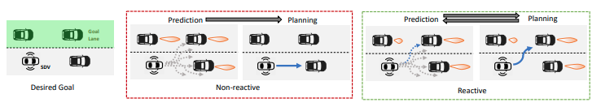
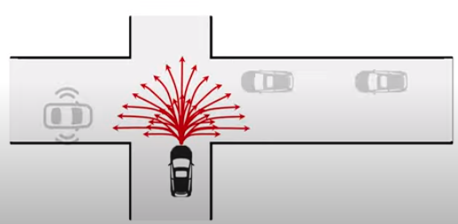
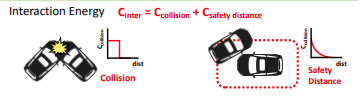
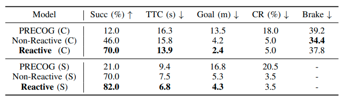
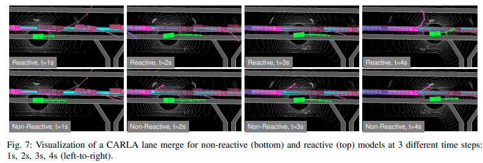
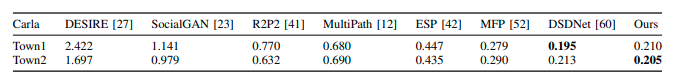
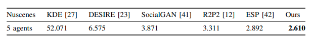
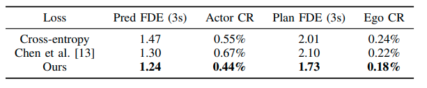
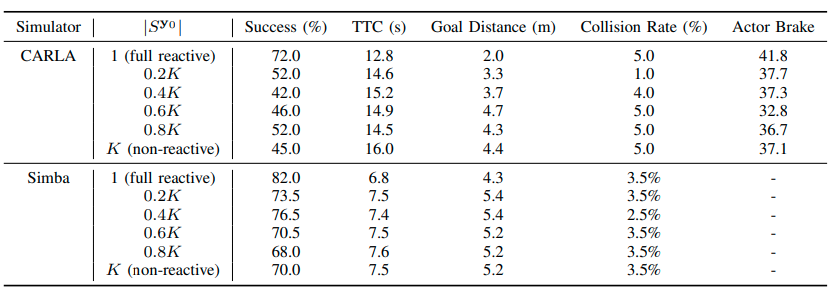

# [日本語まとめ] Deep Structured Reactive Planning

[Jerry Liu](https://arxiv.org/search/cs?searchtype=author&query=Liu%2C+J), [Wenyuan Zeng](https://arxiv.org/search/cs?searchtype=author&query=Zeng%2C+W), [Raquel Urtasun](https://arxiv.org/search/cs?searchtype=author&query=Urtasun%2C+R), [Ersin Yumer](https://arxiv.org/search/cs?searchtype=author&query=Yumer%2C+E)

* [arxiv](https://arxiv.org/pdf/2101.06832.pdf)

## どんなもの？

自動運転を実現するためには他の車の行動の理解が求められる。人間は例えば次のような一般的なシナリオを問題なく運転する。

* 自動運転車が他の車に道を譲った場合、他の車がその道を先に走行する
* 自動運転車が道を譲らず走行した場合、他の車はその道を譲る

しかし従来の自動運転に多く採用されているNon-reactive Plannerはこのようなシナリオに対して快適な走行を行うことはできない。予測を元に運動計画を行う構成であるため、自動運転車両の行動を決定するときに他車両の行動がすでに決まっている。自動運転車両がどんな行動を計画しても他車両の行動は不変であるという事実がある。この事実よりNon-reactive Plannerで計画した行動は非常に消極的な行動となる。この問題を解決する方法として予測と計画を同時に行うReactive planningがある。自車両と他車両の行動を同時に決めることで自動運転車の行動が他の車の行動に及ぼす影響を考慮することができる。

この論文はディープニューラルネットワークをつかったReactive PlanningであるDeep Structured Reactive Planningを提案する。Deep Structured Reactive Planningはサンプルベースのプランニングである。複数生成したアクターの経路のサンプルに対してDeep Structured Modelsを使って生成した経路の評価を行う。そして評価した経路の中から最も良い経路を選んで実行する。経路評価に使うDeep Structured Modelは深層モデルを使ったMRF (マルコフ確率場)である。Deep Structured Modelは自動運転車両がある行動を行うとき他のアクターのどのような行動を行うかの確率を効率的に計算することができる。

## 先行研究と比べてどこがすごい？何を解決したか？

* Deep Structured Reactive Planningは他のアクターの反応と安全を本質的に考慮していることを示した。

* 性能の検証を行い、Deep Structured Reactive PlanningはNon-reactive plannerの性能を凌駕することを示した。

## 手法は？

Deep Structured Reactive Planningは次の手順で最適な経路を計算する。

1. 走行空間を効率よくサンプリングするジオメトリックなサンプラーを使って、自動運転車両を含むすべてのアクターに対してK個ずつの経路サンプルを生成する
2. 自動運転車両の各サンプルをDeep Structured Modelsを使って評価する
3. 自動運転車両のK個のサンプルの内、もっともコストが低いものを最適解として選ぶ

### Trajectory Sampler

複数のアクターの経路のエネルギーの推論を簡単にするためにDSDNet ([summary](../DSDNet: Deep Structured self-Driving Network/summary.md))と同様に、走行空間を効率よくサンプルするTrajectory Samplerを用いて直線や円弧、クロソイド曲線をさまざまなパラメータで出力する。Trajectory Samplerからは常に決まった経路群が出力される。

(*)この図はDSDNetのECCV 2020 long talks([link](https://www.youtube.com/watch?v=hop6FBJnM-c))のものである。

### Deep Structured Model

N個のアクターが走行している環境ですべてのアクターの現在時刻から数秒後までの行動を$$\mathcal{Y} = (\mathbf{y}_0, \mathbf{y}_1, \dots, \mathbf{y}_N)$$で表す。$$\mathbf{y}_0$$は自動運転車両、$$\mathcal{Y}_r = (\mathbf{y}_1, \dots, \mathbf{y}_N)$$は他のアクターの行動である。

LIDARの点群とHDマップなどの情報$$\mathcal{X}$$を条件とするすべてのアクターの将来の経路$$\mathcal{Y}$$の同時分布$$p(\mathcal{Y} \mid \mathcal{X}; \mathbf{w})$$のモデル化にDeep Structured Modelを使う。Deep Structured Modelは深層モデルを使ったMRF (マルコフ確率場)である。本論文では無向グラフのノードとして各アクターの経路を選ぶ。これより同時分布を表すDeep Structured Modelは次の式で表せる。

$$p(\mathcal{Y} \mid \mathcal{X}; \mathbf{w}) = \frac{1}{Z} \exp (-C(\mathcal{Y}, \mathcal{X}; \mathbf{w}))$$

$$C(\mathcal{Y}, \mathcal{X}; \mathbf{w}) =
\sum_{i=0}^{N} C_{\text{traj}}(\mathbf{y}_i \mid \mathcal{X}; \mathbf{w_{traj}}) +
\sum_{i,j} C_{\text{inter}}(\mathbf{y}_i, \mathbf{y}_j)$$

$$C$$はすべてのアクターの経路の結合エネルギー、$$C_{\text{traj}}$$はアクターの経路の良さを示す固有エネルギー、$$C_{\text{inter}}$$はアクター間の相互作用のエネルギーである。アクターの固有のエネルギー$$C_{\text{traj}}$$はDSDNet ([summary](../DSDNet: Deep Structured self-Driving Network/summary.md))と同じネットワークを使って計算されるエネルギーである。アクター間の相互作用のエネルギー$$C_{\text{inter}}$$は衝突によるエネルギー$$C_{\text{collision}}$$と安全な距離を確保するエネルギー$$C_{\text{safety distance}}$$で定義する。$$C_{\text{safety distance}}$$はアクター間の距離が4m以下になると増加するエネルギーである。いずれのエネルギーも低い値ほど良いことを示す。

Deep Structured ModelはMRFの一種であるので、Loopy Belief Propagation (LBP)によりグラフを伝播することで様々な周辺確率を計算することができる。例えば$$p(\mathbf{y}_i \mid \mathbf{y}_0, \mathcal{X}; \mathbf{w}) $$や$$p(\mathbf{y}_i, \mathcal{X}; \mathbf{w})$$、$$p(\mathbf{y}_i,\mathbf{y}_j, \mathcal{X}; \mathbf{w})$$である。またLBPによる操作は微分可能であり、勾配は計算することができる。

### Reactive Inference objective

現在時刻から数秒間先までの経路$$\mathbf{y}_0^{*}$$を計画する最適化問題を次のように定義する。

$$\DeclareMathOperator*{\argmin}{arg\,min}
\mathbf{y}_0^{*} = \argmin_{\mathbf{y}_0} f (\mathcal{Y}, \mathcal{X}; \mathbf{w})$$

目的関数$$f (\mathcal{Y}, \mathcal{X}; \mathbf{w})$$は自動運転車両の経路$$\mathbf{y}_0$$を条件とする他のアクターの経路の分布全体にわたる結合エネルギーの期待値である。

$$\begin{align}
f(\mathcal{Y}, \mathcal{X}; \mathbf{w}) &=
\mathbb{E}_{\mathcal{Y}_r \sim p(\mathcal{Y}_r \mid \mathbf{y}_0, \mathcal{X}; \mathbf{w})} [C(\mathcal{Y}, \mathcal{X}; \mathbf{w})]
\end{align} $$

$$p(\mathcal{Y}_r \mid \mathbf{y}_0, \mathcal{X}; \mathbf{w})$$は自動運転車両がある経路$$\mathbf{y}_0$$を選択するとき、他のすべてのアクターが経路$$\mathcal{Y}_r$$を選択する周辺確率、$$C$$は結合エネルギーである。

Deep Structured Reactive PlanningはDeep Structured Modelで周辺確率と結合エネルギーを計算し、目的関数$$f (\mathcal{Y}, \mathcal{X}; \mathbf{w})$$を計算する。ただし結合エネルギーの計算量は非常に大きいため、他のアクター同士の相互作用のエネルギー$$C_{\text{inter}}(\mathbf{y}_i, \mathbf{y}_j)$$を無視する。またTrajectory Samplerのサンプルがあるので、このサンプルをつかって直接期待値を計算する。したがって自動運転車両の経路サンプルの評価に使う関数は次の式である。

$$C_{\text{traj}}(\mathbf{y}_0, \mathcal{X}; \mathbf{w}) +
\sum_{i=1}^{N} p(\mathbf{y}_i \mid \mathbf{y}_0, \mathcal{X}; \mathbf{w}) C_{\text{traj}} (\mathbf{y}_i \mid \mathcal{X}; \mathbf{w}) +
\sum_{i=1}^{N} p(\mathbf{y}_i \mid \mathbf{y}_0, \mathcal{X}; \mathbf{w}) C_{\text{inter}} (\mathbf{y}_0, \mathbf{y}_i)$$

> 自動運転車の固有エネルギーと他のアクターの固有エネルギーの計算は異なるネットワークの重みを使う。

### Goal Energy

DIM ([summary](../DEEP IMITATIVE MODELS FOR FLEXIBLE INFERENCE, PLANNING, AND CONTROL/summary.md))やPRECOG ([summary](../PRECOG: PREdiction Conditioned On Goals in Visual Multi-Agent Settings/summary.md))で提案された運動計画方法と同様にゴールエネルギーを計画の目的関数に加える。ゴールエネルギーを加えることで自動運転車の目的を達成するように経路計画を行うことが可能となる。ゴールエネルギーは自動運転車が走行するシナリオに応じて変更する。交差点の右左折では目的の道路を2次元点で表し、経路の最終地点とL2距離をエネルギーとする。レーンチェンジでは目的のレーンをPolylineで表し、経路の各点とpolylineの距離の平均をエネルギーとする。

### 学習

訓練データのアクターの経路に対してTrajectory Samplerでサンプルを生成し、LBPを使って観測を条件とする自動運転車両を含むすべてアクターの経路の周辺確率$$p(\mathbf{y}_i, \mathcal{X}; \mathbf{w})$$および同時確率$$p(\mathbf{y}_i,\mathbf{y}_j, \mathcal{X}; \mathbf{w})$$を計算する。各アクターの真の経路に最も近いサンプルを正解とすることでクロスエントロピーを計算し、真の経路と予測経路の分布を近づけるように学習させる。ただし真の経路の形状によっては複数のサンプルと非常に近くなる場合がある。このことから、すべての予測経路をクロスエントロピーの計算に使うと、真の経路に距離が近い経路が間違いと誤判断することになる。そこで真の経路に近いk個の経路$$\Delta (\mathbf{y}_i^{*})$$の損失を計算から除くことで不当な評価を避ける。以上より、Deep Structured Modelを学習するために使う損失関数は次の式である。

$$\mathcal{L} = \sum_{i} \mathcal{L}_i +  \sum_{i,j} \mathcal{L}_{i,j}$$

$$\mathcal{L}_i = \frac{1}{K}
\sum_{\mathbf{y} \notin  \Delta (\mathbf{y}_i^{*})}
p_{\text{g.t.}}(\mathbf{y}_i) \log p(\mathbf{y}_i, \mathcal{X}; \mathbf{w})$$

$$\mathcal{L}_{i, j} = \frac{1}{K^2}
\sum_{\mathbf{y}_i \notin  \Delta (\mathbf{y}_i^{*}), \mathbf{y}_j \notin  \Delta (\mathbf{y}_j^{*})}
p_{\text{g.t.}}(\mathbf{y}_i, \mathbf{y}_j) \log p(\mathbf{y}_i,\mathbf{y}_j, \mathcal{X}; \mathbf{w})$$

$$\Delta (\mathbf{y}_i^{*})$$は正解の経路と距離が近いが正解でない経路群である。

## どうやって有効だと検証した？

CARLAおよびUber ATGのSimbaのシミュレーターで走行性能、予測性能、Ablation Studyの検証を行った。テストするシミュレーターごとのデータセットで検証に使われるモデルをそれぞれ訓練した。訓練に使用したCARLAのデータセットはPRECOGで使われたオープンなデータセットと同じものである。CARLAのデータセットは60000個の6秒間のシークエンスを含む。LIDARの点群をラスタライズした俯瞰図と最初の2秒間の経路をモデルへの入力データ、2~4秒の経路を予測する経路とした。Simbaのデータセットは1000回以上の自動運転車の走行からなる6500個のシークエンスを含む。各シークエンスの長さは25秒である。

### 走行テスト

Deep structured reactive planningの走行性能を検証するため、CARLAおよびSimbaのシミュレーターで次の２つのシナリオをテストした。

* レーンチェンジ
* 信号のない交差点で左折を行う

いずれのシナリオも次の条件で終了する。

* 自動運転車がゴールに到達した
* シミュレーションの制限時間になった
* 自動運転車が衝突した

#### Simbaの具体的な設定

レーンチェンジおよび左折のシナリオをさらに細かく分類して12個のテンプレートシナリオを用意した。12個のテンプレートシナリオはアクター間の相互作用が高いシナリオである。シナリオ内のアクターはヒューリスティックによるカーフォロイングモデルに従い行動する。シミュレーションは10Hzで動作する。シミュレーション内のLIDARにより自動運転車の周囲の点群を記録する。初期位置や速度を変化させ、各テンプレートシナリオごとに25回シミュレーションを行った。作成された計300個のエピソードのうち、50個をValidationデータに、250個をテストデータとした。

#### CARLAの具体的な設定

Simbaと異なりテンプレートシナリオの数を6個とした。またシナリオ内のアクターはCARLAのAPIで提供されているBasicAgentクラスを元にしたモデルに従い動作する。初期位置や速度を変化させ、各テンプレートシナリオごとに25回シミュレーションを行った。作成された計150個のエピソードのうち、50個をValidationデータに、100個をテストデータとした。

#### 比較手法

比較手法としてReactive PlannerであるPRECOG ([summary](../PRECOG: PREdiction Conditioned On Goals in Visual Multi-Agent Settings/summary.md))とReactive planningすることの重要性を明確にするため、Non−Reactive Plannerを用意した。Non−Reactive Plannerは自動運転車の経路に条件付けられない次のコストを使った運動計画方法である。

$$\begin{align}
f_{\text{nonreactive}} &=
\mathbb{E}_{\mathcal{Y}_r \sim
p(\mathcal{Y}_r \mid \mathcal{X}; \mathbf{w})}
[C(\mathcal{Y}, \mathcal{X}; \mathbf{w})] \\
&= C_{\text{traj}}(\mathbf{y}_0, \mathcal{X}; \mathbf{w}) +
\mathbb{E}_{\mathcal{Y}_r \sim
p(\mathcal{Y}_r \mid \mathcal{X}; \mathbf{w})
} \left[
\sum_{i=1}^{N} C_{\text{inter}}(\mathbf{y}_0, \mathbf{y}_i)
\right]
\end{align}$$

#### 走行テスト結果

CARLAおよびSimbaのシミュレーターでテストした結果は次のとおりである。

Succ (%)はSucess Rateである。自動運転車がレーンチェンジもしくは左折のシナリオを成功させた割合である。TTC (s)はtime to completionである。シナリオの完走にかかった時間である。Goalはシナリオで設定したゴールまでの距離である。CR (%)はCollision Rateである。Brakeはブレーキした回数である。CARLAのみ有効である。

提案手法であるReactive PlannerがSuccess Rate、TTC、Goalのメトリックで他の手法より良い結果となった。またCollision RateはReactive Planner、Non−Reactive Plannerともに同等の値である。TTCが減っているのでReactive Plannerが目的関数通り、他のアクターの反応を考慮していることを示している。事故する割合が上がるようなアグレッシブな動作をすることなく、他のアクターがいる中でより効果的にゴールへのナビゲーションが行えている。

#### レーンチェンジの走行結果の可視化

次の図はターゲットのレーンへ合流するシナリオを走行した結果である。Reactive Plannerは制限時間内ターゲットレーンに合流することができた。Non−Reactive Plannerはできなかった。Reactive Plannerはターゲットレーンにいる車が自動運転車を入れさせるために減速している一方で、Non−Reactive Plannerは時間の経過とともにレーンの左側にゆっくりとよっている。

### 予測テスト

PRECOGのデータセットおよびNuScenesで予測性能をテストした。使用した評価メトリックはminMSDである。提案手法は比較手法比べて同等もしくは上回っていることがわかる。DSDNet ([summary](../DSDNet: Deep Structured self-Driving Network/summary.md))と同様に、アクターごとの離散経路のサンプルをエネルギーベースのモデルで評価することが効果的であることを示している。

### Ablation Study

訓練に用いる損失関数を変えたときの性能をテストした。Cross-entropyはグランドトルースと近い経路も損失に加える純粋なCross-entorpyを使った結果である。提案手法が最も良い結果である。

## 課題は？議論はある？

計画時に他のアクター同士の相互作用のエネルギー$$C_{\text{inter}}(\mathbf{y}_i, \mathbf{y}_j)$$を無視することで、自動運転車の行動が原因となって隣接する他のアクター同士が衝突するシチュエーションを考慮できない。完全に無視するのではなく、近くのアクターに関しては相互作用のエネルギーを計算するなどの工夫が考えられる。

## 補足

### Reactive plannerの定義

自動運転車の行動$$\mathbf{y}_0$$を条件に他のアクターの行動の予測を考えるプランナーをReactive plannerと定義する。また自動運転車の行動$$\mathbf{y}_0$$と独立した予測モデルを使って他のアクターの行動を考えるプランナーをNon-reactive plannerと定義する。

### Reactive plannerとNon Reactive plannerの補間

Reactive planningはひとつの自動運転車の計画経路を条件にアクターの行動の予測するプランナーである。ひとつだけでなく、複数の自動運転車の計画を条件にアクターの行動を予測する場合、計画の目的関数は次式で表せる。

$$C_{\text{traj}}(\mathbf{y}_0, \mathcal{X}; \mathbf{w}) +
\sum_{i=1}^{N} p(\mathbf{y}_i \mid S^{\mathbf{y}_0}, \mathcal{X}; \mathbf{w}) C_{\text{traj}} (\mathbf{y}_i \mid \mathcal{X}; \mathbf{w}) +
\sum_{i=1}^{N} p(\mathbf{y}_i \mid S^{\mathbf{y}_0}, \mathcal{X}; \mathbf{w}) C_{\text{inter}} (\mathbf{y}_0, \mathbf{y}_i)$$

$$S^{\mathbf{y}_0}$$は自動運転車の計画$$\mathbf{y}_0$$と距離が近い上位k個の経路である。目的関数は$$k=1$$のときReactive planning、$$k=K$$のときNon−Reactive planningとなることがわかる。kを変化させることでReactivityを補間することができる。kが1より大きいとき、他のアクターは自動運転車の計画を正確に知らないこと仮定している。kが大きくなればなるほど、自動運転車の意図が不明確であることを仮定している。次の表は異なる$$k$$で自動運転車を走行したときの検証結果である。

$$k$$の数が増えるほど（Non-reactiveになるほど）、ほぼ一定のCollision Rateに対して次の傾向が見られる。

* Success Rateが下がる
* TTCが増える

シミュレーション結果から示せないが、どちらの極端な場合よりも、補間された計画目標が安全に計画を立てながら、高い成功率を達成できると考える。

### PRECOGの走行テストの結果が悪い原因の考察

実験ではReactiveおよびNon−Reactive PlannerがPRECOGよりも良い結果を示した。PRECOGは生成モデルであるESPを使って観測を条件としてアクターの経路を生成する。そして生成した経路を使ってReactive Planningを行う。PRECOGの検証結果が悪い原因としてout-of-distributionが考えられる。訓練データにない状況で経路を効果的に予測できないことが起因していると思われる。また生成モデルであるため、経路の生成を潜在変数を通して行う。自動運転車両の目的に沿った経路の生成に試行回数を必要とする。限られた実行時間で目的の経路の生成を保証しないことが原因である可能性がある。

## 次に読むべき論文は？

* [Contingencies from Observations: Tractable Contingency Planning with Learned Behavior Models](../Contingencies from Observations: Tractable Contingency Planning with Learned Behavior Models/summary.md)
* [DSDNet: Deep Structured self-Driving Network](../DSDNet: Deep Structured self-Driving Network/summary.md)
* [PRECOG: PREdiction Conditioned On Goals in Visual Multi-Agent Settings](../PRECOG: PREdiction Conditioned On Goals in Visual Multi-Agent Settings/summary.md)

## 個人的メモ

なし
