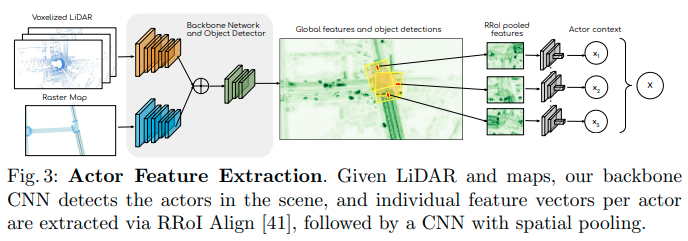

# [日本語まとめ] Implicit Latent Variable Model for Scene-Consistent Motion Forecasting

[Sergio Casas](https://arxiv.org/search/cs?searchtype=author&query=Casas%2C+S), [Cole Gulino](https://arxiv.org/search/cs?searchtype=author&query=Gulino%2C+C), [Simon Suo](https://arxiv.org/search/cs?searchtype=author&query=Suo%2C+S), [Katie Luo](https://arxiv.org/search/cs?searchtype=author&query=Luo%2C+K), [Renjie Liao](https://arxiv.org/search/cs?searchtype=author&query=Liao%2C+R), [Raquel Urtasun](https://arxiv.org/search/cs?searchtype=author&query=Urtasun%2C+R)

* [Arxiv](https://arxiv.org/abs/2007.12036)
* [ICCV_2021](https://openaccess.thecvf.com/content/ICCV2021/html/Cui_LookOut_Diverse_Multi-Future_Prediction_and_Planning_for_Self-Driving_ICCV_2021_paper.html)
* [Youtube](https://www.youtube.com/watch?v=9V20N3A1YDw)
* [Qiita](https://qiita.com/msk_nrc/items/9b8514840f6e95bf86c6)

## どんなもの？

センサー情報から市街地での車両などのアクターの運動予測の学習を目的とし、将来の経路の同時分布を推定するImplicit latent variable model（ILVM）を提案する。ILVMは経路の生成過程においてすべての確率的なプロセスを潜在変数で捉えることを目的としたImplicitな潜在変数モデル(latent variable model)である。将来の経路の同時分布のパラメータではなく、その分布のサンプルを直接出力する。ILVMはセンサー情報をアクターごとに分散された潜在空間に変換するエンコーダーと潜在空間のサンプルを将来の経路のサンプルに変換する決定論的デコーダーで構成される。

## 先行研究と比べてどこがすごい？何を解決したか？

N個のアクターの過去の経路$$x$$を条件としたときの将来の経路$$y$$の同時分布

$$p(Y \mid X) = p(y_1, y_2, \dots y_N \mid x_1, x_2, \dots x_N)$$

をモデル化するため、これまで確率的なアプローチとして次の２つの分解方法が提案されている。

* 各アクターと時間ステップを独立に予測する方法

  $$p(Y \mid X) = \prod_n \prod_t p(y_n^t, \mid X)$$

* １時刻前の状態を条件として自己回帰する方法

  $$p(Y \mid X) = \prod_n \prod_t p(y_n^t, \mid Y^{0:t-1} X)$$

前者はサンプリングが効率的であるものの、表現が乏しい。後者はサンプリングが非効率で、また自己回帰を行うことによるcompounding errorが無視できない。

提案方法ILVMはImplicit modelsとして経路の生成プロセスをモデル化する。これにより、$$\log P$$の計算のためになんらかの独立を仮定して同時分布を分解する必要性がなくなる。この制限の解除により一貫性のある軌道サンプルを効率的に高い表現度で生成できる。その一方でエントロピーの少ない同時分布を生成し、グラウンドトゥルースをより適切にカバーできる。ILVMはATG4DとnuScenesの運動予測タスクで最先端のモーション予測を大幅に上回った。また分布のパラメーターを出力するExplicitな形式と比較し、Implicitなアプローチの有効性を示した。

## 手法は？

提案手法のシステムはセンサー情報からアクターを検出するActor Feature Extractorと検出したアクターの将来の経路を出力するILVMで構成される。

### Actor Feature Extractor

Actor Feature ExtractorはCNNベースのネットワークであり、アクターの検出と特徴量の計算を次の手順で行う。

1. 道路データと過去10回分のLIDARの点群をラスタライズしたテンソルを入力として、シーン全体の特徴マップを計算する
2. 特徴マップに対して２つのCNNヘッダーを使い背景もしくはアクターを分類する信頼マップとアクターのバウンディングボックスをそれぞれ計算する
3. No maximum suppressionを適用して信頼できるボックスをアクターとして検出する
4. 検出したアクターとシーン全体の特徴マップからRotated ROI Alignを適用し80m×40mの領域に相当する40x40x256の特徴マップを取り出す
5. 受容領域を増やすため、dilation factorが2のCNNを使ってアクターごとに運動予測のための512次元の特徴量を計算する

### ILVM

ILVMはN個のアクターの将来経路で構成されるシーンの生成プロセスを示す潜在変数モデルである。

$$P(Y \mid X) = \int_z P(Y \mid X, Z) P(Z \mid X) dZ$$

$$Z$$はアクターのゴール、スタイル、アクターの相互作用、将来の信号の状態などシーンの観測できないダイナミクスを捉えた潜在変数である。ILVMでは潜在変数を$$Z=\{ z_1, z_2, \dots, z_N \}$$のようにアクターごとの潜在変数に分割して表現する。またアクターの潜在変数$$z_n$$は対角多変量ガウス分布として表す。この分割表現によってアクター数の増減に対応し、またアクターごとの潜在表現の獲得を容易にすることができる。ただし各アクターの潜在変数$$z_n$$はすべてのアクターの特徴量を使って計算されるため完全には独立とはならないことに注意する。

ILVMのエンコーダーおよびデコーダーはScene Interaction Module (SIM)を使って実現される。SIMは[Spatially-Aware Graph Neural Networks for Relational Behavior Forecasting from Sensor Data](../SPAGNN Spatially-Aware Graph Neural Networks for Relational Behavior Forecasting from Sensor Data/summary.md)で提案されたSpAGNNに習ったグラフニューラルネットワークである。SIMがSpAGNNと異なる点は次のとおりである。

* SpAGNNがノードに予測経路を陽に持つのに対して、SIMのノードは隠れ状態のみ持つ
* ノードの予測経路を持たないので、SIMはメッセージの計算時に予測経路は使わない
* SpAGNNのメッセージ伝播回数は3回であるが、SIMの伝播回数は１回のみである

SIMは道路が複雑な形状とトポロジー、ルールを示すこと、センサーから環境を部分的にしか観測できないこと、シーン内のアクターの数が変化することの３つの技術的課題に対応することができる。

SIMは各アクターをグラフのノードして、特徴量を計算する。その計算は図に示すとおりノード初期化、メッセージ計算、メッセージ伝達の３ステップで構成される。SpAGNNと同様にアクター間の空間関係を認識するため、メッセージの計算にメッセージ間のノードであるアクターの相対位置$$\mathcal{T}(c_u, c_v)$$を直接MLPの入力として使うことで空間的関係を陽に考慮する（3、4行目）。そしてそのメッセージを使ってノードの状態を更新し、予測経路を計算する（5~8行目）。計算された予測経路はそれぞれのアクターの座標系で表現される。

#### エンコーダーとPrior

潜在空間$$Z$$を計算するPrior$$p_{\gamma}(Z \mid X)$$とPosteriorエンコーダー$$q_{\phi}(Z \mid X, Y)$$はそれぞれ潜在変数の事前分布、真の事後分布$$P(Z \mid X, Y)$$を近似するネットワークである。PosteriorはPriorがPosteriorの示す分布に近づけるために訓練時のみ使用される。Priorの各ノードの初期状態$$h_n$$はActor Feature Extractorで抽出した特徴量$$x_n$$からMLPを使って計算する。

$$h_n = \text{MLP}(x_n)$$

一方、Posteriorの各ノードの初期状態はActor Feature Extractorで抽出した特徴量と真の将来の経路からMLPとGRUを使って計算する。$$\oplus$$は連結操作である。

$$h_n = \text{MLP}(x_n \oplus \text{GRU}(y_n))$$

#### デコーダー

デコーダーの各ノードの初期値はActor Feature Extractorで抽出した特徴量$$x_n$$とエンコーダーもしくはPriorで計算した潜在空間のサンプル$$z_n$$をつかって計算する。

$$h_n = \text{MLP}(x_n \oplus z_n)$$

この初期値を用いてSIMで伝播を行った後、更新された隠れ状態をMLPで処理することで予測経路を計算する。

$$y_n = \text{MLP}(ｈ_n)$$

計算した予測経路$$y_n$$はアクターの現在位置とヘディングによって定義された座標系で表現される2次元のウェイポイントで構成される。

### 学習

Actor Feature ExtractorとILVMで構成される一連のモデルをend-to-endで学習するため、物体検出損失$$\mathcal{L}_{\text{det}}$$と経路予測損失$$\mathcal{L}_{\text{forecast}}$$で構成されるマルチタスク損失を使う。

$$\mathcal{L} = \mathcal{L}_{\text{det}}+ \lambda \cdot \mathcal{L}_{\text{forecast}}$$

物体検出損失はハードネガティブマイニングによる分類損失$$\mathcal{L}_{\text{cla}}$$と回帰損失$$\mathcal{L}_{\text{reg}}$$で構成される。

$$\mathcal{L}_{\text{det}} = \mathcal{L}_{\text{cla}}+ \alpha \cdot \mathcal{L}_{\text{reg}}$$

経路予測損失は再構成誤差としてHuber損失を使用したCVAEのELBOを使う。

$$\mathcal{L}_{\text{forecast}} =
\overset{N}{\underset{n}{\sum}}
\overset{T}{\underset{t}{\sum}} 
l_{\delta}(y_n^t -y_{n, GT}^t) + 
\beta \cdot \text{KL}(q_{\phi}(Z \mid X, Y_{GT}) \mid \mid p_{\gamma}(Z \mid X))$$

## どうやって有効だと検証した？

### シーンレベルでの運動予測の評価方法

運動予測の評価方法としてminADEやmeanFDEなどのアクター単位での評価が使われてきた。しかしながらこれらのメトリックによって評価できるのは同時分布ではなく周辺分布のサンプルの質である。たとえば各エージェントごとに空間を網羅するようなエントロピーの高い経路を出力することでアクター単位の評価はいくらでもあげることができるが、シーン単位でみると衝突の多い予測である可能性がある。正しく同時分布の質を評価するためには、N個のアクターが環境中にいるとき、各アクターにひとつの経路経路を割り当てたN個の経路を1つの集まり（シーン）として、シーン単位で評価を行う必要がある。

本論文では同時分布のサンプルの質を測る評価としてminSADE、meanSADE、minSFDE、meanSFDE、Scene Collision Rate(SCR)を提案し、使用する。いずれの評価方法も予測アルゴリズムが出力する複数の予測シーン$$s \in 1, \dots, S$$をつかって計算される。

$$\text{minSADE} = \underset{s \in 1 \dots S}{\min} \frac{1}{NT}
\overset{N}{\underset{n=1}{\sum}}
\overset{T}{\underset{t=1}{\sum}}
\Vert
y_{n, s}^t -y_{n, GT}^t
\Vert^2$$

$$\text{minSADE} = \frac{1}{NTS}
\overset{S}{\underset{s=1}{\sum}}
\overset{N}{\underset{n=1}{\sum}}
\overset{T}{\underset{t=1}{\sum}}
\Vert
y_{n, s}^t -y_{n, GT}^t
\Vert^2$$

$$\text{minSFDE} = \underset{s \in 1 \dots S}{\min} \frac{1}{NT}
\overset{N}{\underset{n=1}{\sum}}
\Vert
y_{n, s}^{T} -y_{n, GT}^{T}
\Vert^2$$

$$\text{minSFDE} = \frac{1}{NTS}
\overset{S}{\underset{s=1}{\sum}}
\overset{N}{\underset{n=1}{\sum}}
\Vert
y_{n, s}^{T} -y_{n, GT}^{T}
\Vert^2$$

$$\text{SCR}_T = \frac{1}{NS}
\overset{S}{\underset{s=1}{\sum}}
\overset{N}{\underset{n=1}{\sum}}
\min\left(
1,
\overset{N}{\underset{j>i}{\sum}}
\overset{T}{\underset{t=1}{\sum}}
\mathbb{1} \left[
IOU(b_{i,s}^t, b_{j,s}^t)
\right]
\right)$$

minSADEとmeanSADEはシーン中のすべてアクターのAverage Displacement Errorの和をつかった評価、minSFDEとmeanSFDEはシーン中のすべてのアクターのFinal Displacement Errorの和を使った評価である。SCRは1シーンにおける予測経路の衝突率を示す。いずれかのタイムステップで2つのバウンディングボックスのIOUが閾値よりも高い場合、その２つの経路は衝突しているとみなす。

### 予測性能の定量的な結果

センサデータから環境中にいるアクターの検出を行い、検出したアクターの経路を予測するタスクで、次に示すベースラインと比較することでILVMの性能を検証した。

* 各アクターと時間ステップを独立に予測する方法：SpAGNN、MTP、MultiPath、RULESROAD、R2P2-MA
* １時刻前の状態を条件として自己回帰する方法：SOCIALLSTM、ESP、MFP、NRI

各アクターと時間ステップを独立に予測する方法はアクターごとに予測のサンプリングプロセスが独立している。シーンレベルで評価するために、シーン内のアクターごとに1つのサンプルを取り出しシーンを作成した。また比較手法の内、検出器を持たない手法に関してはILVMと同じ検出器を使用し、End-to-Endで訓練した。

ATG4Dデータセットを使い、S=15のときの性能を比較した結果は次の表である。ILVMがすべての評価項目でベースラインを上回った。ベースラインのなかで最も良い[ESP]((../PRECOG: PREdiction Conditioned On Goals in Visual Multi-Agent Settings/summary.md))と比較してSCRを75％、meanSFDEを20％、minSFDEを19%削減することができた。

### ILVMの定性的な結果

ILVMが生成したサンプルのうち、もっとも異なる２つのシーンサンプルを人為的に選んで可視化した結果が次の図である。比較手法に対して提案手法であるILVMは交差点での譲り合いを捉えていることがわかる。このサンプルが定量的な結果から得られた結論を裏付けている。

### Ablation Study

提案手法の有効性を確かめるため、次のモデルと比較した。

* Implicitデコーダーを予測経路のウェイポイントごとに2変量のガウス分布のパラメーターを出力するExplicitデコーダーに変えたモデル$$\mathcal{M}_1$$
* Priorネットワークの代わりに等方性ガウス分布を使用してサンプルを生成するモデル$$\mathcal{M}_2$$
* エンコーダーやデコーダーに使われるSIMの代わりにMLPを使用したモデル$$\mathcal{M}_3$$、$$\mathcal{M}_4$$、$$\mathcal{M}_5$$

比較結果は次のとおりである。

* Explicitデコーダーを使うモデル$$\mathcal{M}_1$$がImplicitデコーダーを使うモデルと比較して性能が急激に落ちている。Implicit modelsによるアプローチの有効性を示している。
* Fixed Priorを使うモデル$$\mathcal{M}_2$$より提案手法の学習可能なPrior$$\mathcal{M}_0$$を使うほうが性能が良い。学習可能なPriorを使う利点を示している。
* MLPを使うモデル$$\mathcal{M}_3$$、$$\mathcal{M}_4$$、$$\mathcal{M}_5$$より提案手法$$\mathcal{M}_0$$が性能が良い。SIMの有効性を示している。

## 課題は？議論はある？

Coming soon

## 次に読むべき論文は？

[LookOut: Diverse Multi-Future Prediction and Planning for Self-Driving](../LookOut: Diverse Multi-Future Prediction and Planning for Self-Driving/summary.md)

## 補足

Implicit modelsについて[Lecture 5 Implicit Models -- GANs Part I --- UC Berkeley, Spring 2020](https://www.youtube.com/watch?v=1CT-kxjYbFU)を参考にしました。

論文の結果にILVMを運動計画に組み込んだ結果があるが、記述が少ないので、このまとめからは省きました。文章の把握のためには以下の論文を読んで、補足する必要を感じます。

Sadat, A., Ren, M., Pokrovsky, A., Lin, Y.C., Yumer, E., Urtasun, R.: Jointly learnable behavior and trajectory planning for self-driving vehicles. arXiv preprint arXiv:1910.04586 (2019)