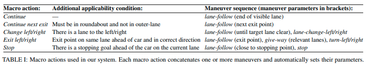
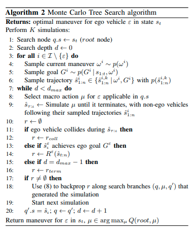
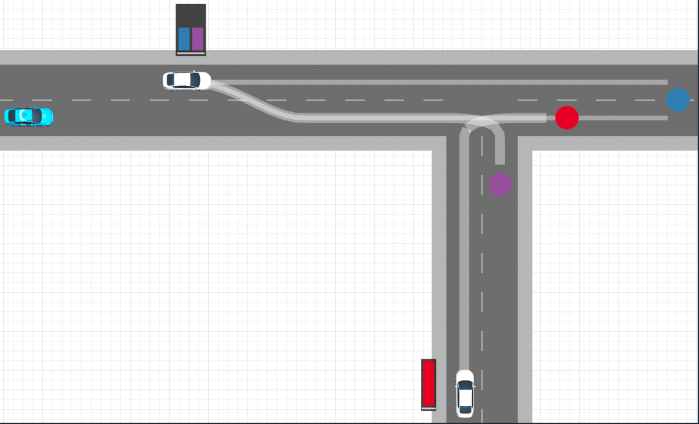
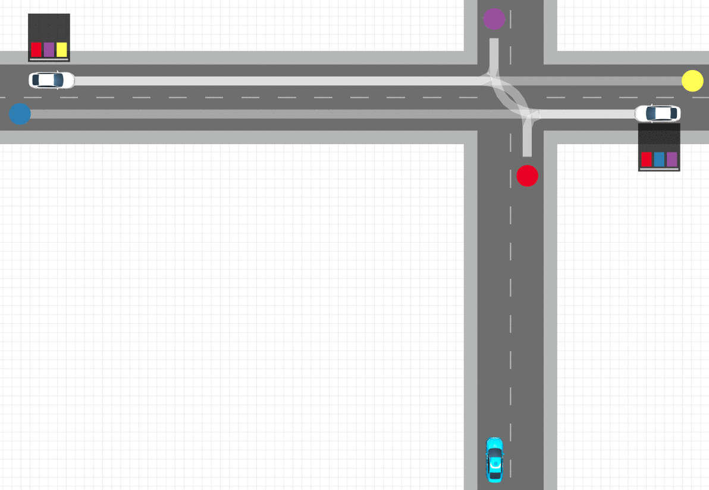
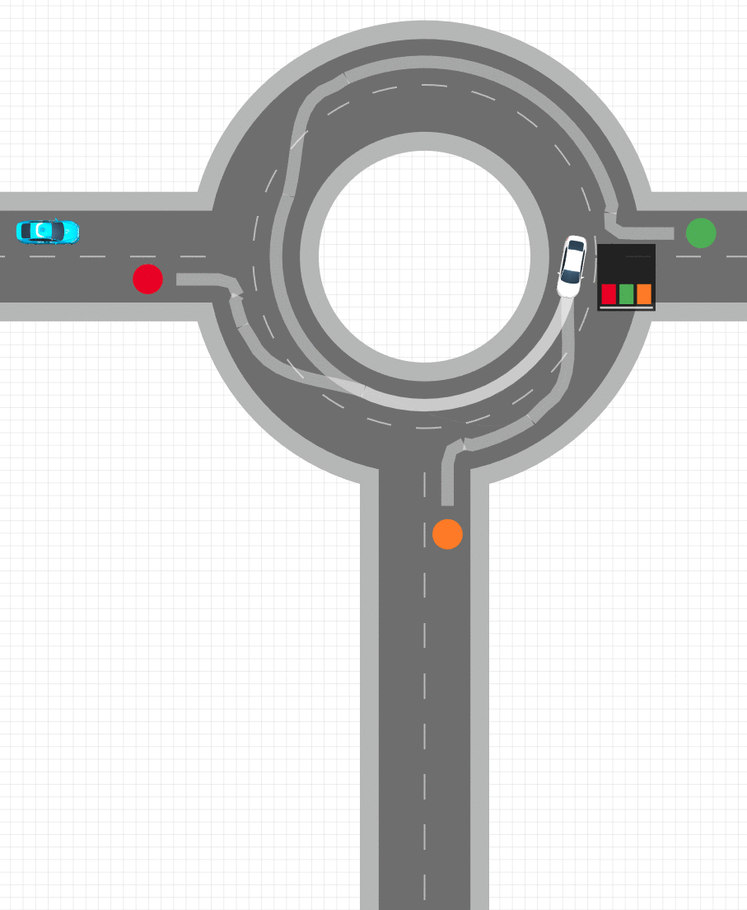
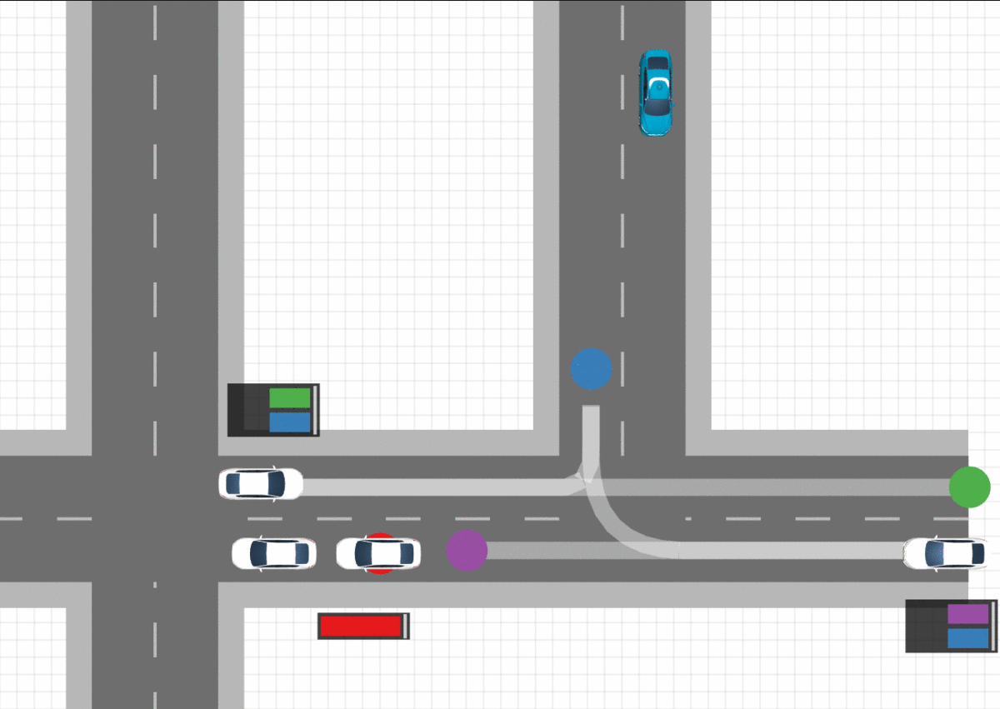
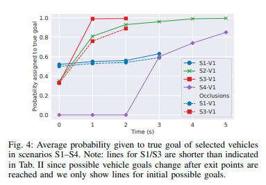
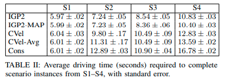

# Interpretable Goal-based Prediction and Planning for Autonomous Driving

Stefano V. Albrecht, Cillian Brewitt, John Wilhelm, Balint Gyevnar, Francisco Eiras, Mihai Dobre, Subramanian Ramamoorthy

* IEEE International Conference on Robotics and Automation (ICRA), 2021, Xi'an, China
* [Arxiv 15 Mar 2021](https://arxiv.org/abs/2002.02277)
* [site](https://www.five.ai/igp2)
* [Youtube](https://www.youtube.com/watch?v=c-2PuFlwTrM)
* [github](https://github.com/uoe-agents/IGP2)
* [blog 2020-11-27](https://agents.inf.ed.ac.uk/blog/interpretable-prediction-planning-autonomous-driving/)

## どんなもの？

自動運転のための車両の行動の長期予測と自車両の経路計画を行うIGP2(Interpretable Goal-based Prediction and Planning )を提案する。IGP2は合理的な逆計画(rational inverse planning)を行うことで、他車両のゴールを認識し、そのゴールの予測に基づいてモンテカルロ木探索（MCTS)することで自車両の最適な行動を計画する。他車両の説明可能かつ長期間の予測および自車両の計画を行うことができる。IGP2には、比較的標準的な計画法が使われており、POMDP-based planner[34]などの他のテクニックに置き換えることで、IGP2のアプローチの根底にある一般原則は、自動運転だけでなく、ロボットと人、ロボットとロボットが相互に関わる領域に活用することができる。

## 先行研究と比べてどこがすごい？何を解決したか？

* 他車両の説明可能かつ長期間を行うことができる。
* これにより交差点やレーンチェンジなど消極的でない速やかな走行が行える。

これらの利点は以下の関連研究に対して利点がある。

* 車両がレーン追従、レーンチェンジ、右左折、停止など有限数からなる高レベルの行動セットから一つを使うという仮定を置いて予測を行う方法（[2], [3], [4], [5], [6], [7]）がある。観測された軌跡を下に車両の行動を検出する。この方法の問題は現在の行動のみを検出するという点であり、検出された高レベル行動が有効な期間だけに制限される。
* 各車両の可能性のあるゴールを特定し、観測された位置からゴールに至るまでの軌道を予測する方法（[8], [9], [10]）がある。???長期間の予測が行えるものの、車両が生成された予測軌道に比較的近くにマッチしている必要がある???（欠点の部分の翻訳ができない。)
* 車両の予測を行う最近の深層学習を用いた方法（[11], [12], [13], [14], [15], [16], [17]）は非常に有望な結果を示している。深層学習を使う最新の成果[19]を見るに、この方法の最も重大な問題は、多次元かつ階層的な運転タスクを行う経路計画との統合に適した形で結果から説明可能な予測の抽出が難しい。

## 技術や手法の核はどこ？(Work in progress)

すべての車両は各時刻でlane-follow, lane-change-left/right, turn-left/right, give-way, stopのいずれかのManeuver$$w$$を実行すると仮定する。また道路の情報にもどついた動作macro actionsを設定する。

IGP2アルゴリズムは次の手順で自車両のmacro actionを計算する。

* *Non-ego goal generator* 観測から各車両が到達しうるすべてのゴールを検出する。
* *Maneuver detector* 観測から各車両のManuver$$w_i$$の確率分布$$p(w_i)$$を求める
* *Inverse planning* ゴールおよび$$p(w_i)$$を用いて、Inverse Planning(A* アルゴリズム)により各車両から可能性があるゴールへの軌道$$\hat{s}_{1:n}^{i}$$を求める
* *Goal probabilities* 各車両のどのゴールに到達するかの確率分布$$p(G^i \mid s_{1:n}^i, w^i)$$を求める
* *Trajectory predictions* 各車両がその軌道を選択する確率分布$$p(s_{1:n}^{i, k})$$を求める
* *MCTS Planner* $$p(w_i)$$ 、$$p(G^i \mid s_{1:n}^i, w^i)$$、$$p(\hat{s}_{1:n}^{i, k})$$および自車両の状態$$s_t$$からMCTSアルゴリズムにより最適なmacro actionを求める

## どうやって有効だと検証した？

microscopicな都市の交通シミュレーションによりIGP2を評価した。オクルージョンがある場合でも他車両のゴールをロバストに認識した。また重要な機会を逃すことなく、走行することで、消極的な方法と比べて走行時間の短縮が行えていることを示した。

### IGP2のシミュレーション上での動作

車両の動作が決められたシナリオは４つで用意した。シナリオの全てで他車両はマニュアルのヒューリスティックに基づいてゴールに向かって走行する。各車両の加速度およびステアリングのためのコントローラは独立であり、車間維持のためにIDM(Intelligent Driver Model)が使われている。自車両は青色。他車両の予測経路を確率の高い順から２個表示している。各経路の色の濃さは、その道を進む確率である。各車両の縦位置を±10m、速度を[5, 10]msの範囲で変更して、100個のシナリオを作成した。

各シナリオでIGP2は以下のように行動した。

* (a) S1　自車両のゴールは東側に位置する青色の円である。車両$$V_1$$は自車両と同じ道路を走行している。車両$$V_1$$は左車線から右車線へレーンジェンを行ったところである。交差点から侵入する車両$$V_{2}$$がいるため、車両$$V_1$$が自車両が向かう東に行く場合、レーンチェンジをすることは不合理である。このことから車両$$V_1$$が交差点を右折するという信念にむかって自己の予測にバイアスをかける。自車両はこのまま進むと速度を落とすことになるので、レーンチェンジを決断する。

  

* (b) S2　自車両のゴールは西側に位置する青色の円である。車両$$V_1$$は東から、車両$$V_2$$は西から交差点へ侵入しようとしている。車両$$V_1$$は交差点で曲がるために速度を落とし、右折するために待つ。もし車両$$V_1$$が直進や左折をする場合、速度を落とすことは不合理なので、車両$$V_1$$が右折する信念は大幅に高まる。車両$$V_1$$は車両$$V_{2}$$が交差点をすぎるまで待つと予測します。このことから自車両は交差点に侵入し左折を行える機会がある。

  

* (c) S3　自車両のゴールは緑色の円である。車両$$V_1$$は内側から外側へレーンチェンジをし、速度を落とすところである。車両$$V_1$$が南の出口に向かう信念は増加する。このことから自車両は車両$$V_1$$が交差点を出る前にラウンドアバウトに侵入することができる。

  

* (d) S4　自車両のゴールは紫色である。左の交差点の信号が赤のため、交差点前に車が2台止まっている。車両$$V_1$$はその2台の後ろを走行している。車両$$V_{2}$$は反対車線を走行している。車両$$V_1$$が右の交差点前で止まるとする。このとき、車両$$V_1$$のゴールが北や西のゴールであることは合理的ではないので、新しいゴールを車両$$V_1$$を止まった場所に生成し、ゴール分布をその新しいゴールに向かってシフトさせる。車両$$V_1$$は、自車両を先に入れることを望んでいると解釈できる。

  

４つシナリオにおいて正しいゴールに割り当てられた平均確率を次に示す。図より、証拠が増えるに連れて、正しいゴールへの確率が増加していることがわかる。殆どの場合に置いて車両がゴールに到達するまでに、正しいゴールへの確率が１に近づく結果となった。

### 走行時間比較

IGP2および次に示すアルゴリズムでシナリオS1~S4を走行させ、走行時間の比較を行った。表2より、IGP2-MAPが一番、IGP2が2番目に走行時間が短いことがわかる。

| Algorithm | Description                                                  |
| :-------- | :----------------------------------------------------------- |
| IGP2MAP   | IGP2のMCTSにおいて、最も有望なゴールとそれに基づく予測のみを使うアルゴリズム |
| CVel      | ゴール認識による予測の代わりに現在の速度を使って定速およびレーン追従の予測を使うアルゴリズム |
| CVel-Avg  | CVelと似ているが、過去2秒間の速度の平均を定速およびレーン追従の予測を使うアルゴリズム |
| Cons      | CVelと似ているが、優先道路にいるすべての対向車両がすぎるまで待機する消極的なアルゴリズム |

### 想定外の状況におけるIGP2とIGP2-MAPの比較

シナリオS3およびS4の車両$$V_1$$の行動を想定外の状況が起きるように変更した。

* S3 車両$$V_1$$は速度を落とした後、南の出口から出ずに直進する。
* S4 車両$$V_1$$は速度を落とした後、急に加速する

改変したシナリオで実験を行ったところ、IGP2が無事故であったが、IGP2-MAPは衝突した。

## 課題は？議論はある？

重要な課題として以下のケースが考えられる。

* 異常検出をつかって、認識できない目標もしくは行動があるかどうか検出する
* マルチエージェントMCTSを使用して、車両間の相互作用をより正確にモデル化する
* 自車両からは見ることができないが、他車両から見ることのできる車両のゴール認識
* 人間の不合理なバイアスの考慮する[35], [36]

> [35] [M. Kwon, E. Biyik, A. Talati, K. Bhasin, D. P. Losey, and D. Sadigh, “When humans aren’t optimal: Robots that collaborate with risk-aware humans,” in Proceedings of the ACM/IEEE International Conference on Human-Robot Interaction, 2020.](https://arxiv.org/abs/2001.04377)
>
> [36] [Y. Hu, L. Sun, and M. Tomizuka, “Generic prediction architecture considering both rational and irrational driving behaviors,” in 2019 IEEE Intelligent Transportation Systems Conference (ITSC). IEEE, 2019, pp. 3539–3546](https://arxiv.org/abs/1907.10170).

## 次に読むべき論文は？

未定
