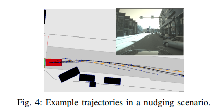
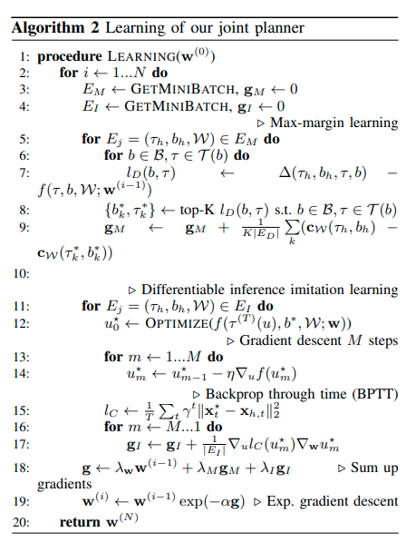

# [日本語まとめ] Jointly learnable behavior and trajectory planning for self-driving vehicles

[Abbas Sadat](https://arxiv.org/search/cs?searchtype=author&query=Sadat%2C+A), [Mengye Ren](https://arxiv.org/search/cs?searchtype=author&query=Ren%2C+M), [Andrei Pokrovsky](https://arxiv.org/search/cs?searchtype=author&query=Pokrovsky%2C+A), [Yen-Chen Lin](https://arxiv.org/search/cs?searchtype=author&query=Lin%2C+Y), [Ersin Yumer](https://arxiv.org/search/cs?searchtype=author&query=Yumer%2C+E), [Raquel Urtasun](https://arxiv.org/search/cs?searchtype=author&query=Urtasun%2C+R)

* [Arxiv](https://arxiv.org/abs/1910.04586)
* [vimeo](https://vimeo.com/366618769)

## どんなもの？

現代の自動運転車のモーションプランナーは認識と予測から目的を達成するためにcoarse trajectoryを計画するbehavior planningとcoarse trajectoryをキネマティクスや環境の拘束条件に従って滑らかな軌道に変えるtrajectory planningの２つのモジュールで構成される。自動運転はこの２つのモジュールが協調して動くことでその性能を発揮するが、behavior planningとtrajectory planningは個別に設計され、ほとんど手動で時間をかけてそのパラメーターが最適化されてきた。したがって一方の変更が他方のプランナーに悪影響を与える可能性がある。この悪影響を防ぐため、behavior planningとtrajectory planningが同じ目的関数を共有するモーションプランナーを提案する。用いる目的関数は解釈可能かつ学習可能なパラメーターをもち、End-to-endで学習することができる。

## 先行研究と比べてどこがすごい？何を解決したか？

* 提案する目的関数は解釈可能かつ学習可能であるため、プランナーのパラメーターのチューニング時間をなくすことができる。
* 提案手法が人間の運転との類似性およびその他の安全性指標を大幅に改善することを示した。

## 手法は？

提案するモーションプランナーは次の目的関数$$f(\cdot)$$をを使って安全かつ快適に目的地へ向かうbehavior$$b^{*}$$とtrajectory$$\tau^{*}$$を計算する。

$$b^{*}, \tau^{*} = \underset{b \in \mathcal{B}(\mathcal{W}), \tau \in \mathcal{T}(b)}{f(\tau, b, \mathcal{W}; \mathbf{w})}$$

$$f(\tau, b, \mathcal{W}; \mathbf{w}) = \mathbf{w}^{\top} \mathbf{c}(\tau, b, \mathcal{W})$$

behavior$$b$$は左と右のレーン境界線、走行する経路、各時刻で自動運転車両の前後左右で障害物が存在するかどうかを示す値で構成される。trajectory$$\tau$$は車両の状態$$\mathbf{X}$$で構成されるシークエンスである。車両の状態は車両の位置$$\mathbf{x}$$、ヘディング$$\theta$$、速度$$v$$、加速度$$a$$、曲率$$\kappa$$、曲率の微分$$\dot{\kappa}$$で構成される。その他、$$\mathcal{W}$$はモーションプランナーの上流のモジュールからの入力であり、自動運転車両の状態、マップ、検出した物体、そしてその物体の予測経路とその経路をとる確率で構成される。$$\mathcal{B}(\mathcal{W})$$は$$\mathcal{W}$$を条件に現在実行できるbehaviorの集合、$$\mathcal{T}(b)$$はbehaviorを実現できる自動運転車両の詳細なtrajectoryの集合、$$\mathbf{w}$$は学習可能なパラメータである。

$$\mathbf{c}(\tau, b, \mathcal{W})$$は７分類、合計30個のサブコストで構成されるコストである。

* **Obstacle**

  衝突を避けるためのコストである。このコストは$$c_{\text{obstacle}}$$と$$c_{\text{overlap}}$$の２つで構成される。$$c_{\text{obstacle}}$$は安全距離$$d_{\text{safe}}$$より内側に入ってくる障害物に安全距離からの二乗距離でペナルティを科すコストである。また安全距離$$d_{\text{safe}}$$は自動運転車両の速度によって増減し、速度が高いほど安全距離が大きくなる。$$c_{\text{overlap}}$$は同じ時刻だけでなく、異なる時刻にいる障害物の衝突にもペナルティを科すコストである。予測経路のとる確率によって重みが適用される。

* **Driving-path and lane boundary**

  自動運転車両が道路に従うようにするためのコストである。レーンの境界線や自動運転車両がその目的以外の道路に行くのを抑制する。

  

* **Headway**

  自動運転車両の前を走っている車両が急ブレーキをかけた場合に自動運転車両が快適な減速度でぶつからないような距離を保つようにするためのコストである。複数存在する車両の中から最も道路の中心線に近い車両を前走車両とすると保守的すぎる動作になるため、本論文では一度すべての車両に対してコストを計算し、計画ホライゾンの各タイムステップで自動運転車両の計画軌道に対する横方向の距離に基づく重みを適用することで最終的なHeadwayコストを計算する。このように計算することでレーンチェンジのシーンにも適用できる。

* **Yield**

  交差しようとする歩行者や自動車に対して適切な距離を保つためのコストである。歩行者が自動運転車両の走る道路の端に近づいた場合やその道路を交差する場合に道路上に安全な距離を保つためのstopping pointを設置する。そしてそのstopping pointを超える軌道にペナルティを科す。使用するペナルティにはstopping pointを迂回するなどのグリッチを避けるため、単なる２次元距離ではなく、歩行者の予測確率で重み付けされた縦方向の距離を使用する。また自動車に対しても交差点で安全な距離を保つため、安全マージンが異なる同形式のコストを使う。

  

* **Route**

  自動運転車両が適切にゴールに向かうためのコストである。レーンチェンジの数にペナルティを科す。また行き止まりの道路を走行している場合、続行できる道路に強制的にレーンチェンジを行うためのペナルティを科す。

* **Cost-to-go**

  自動運転車両が計画ホライゾン内に望ましい最終状態に向かうためのコストである。向かおうとしている道路の制限速度が現在の速度よりも低い場合、快適な減速度で到達するように、快適な減速度と必要な減速度の差の二乗をCost-to-goに使う。

* **Speed limit, travel distance and dynamics**

  道路の制限速度に従うように制限速度より高い速度が設定されている軌道にペナルティを科す。その一方でより早く目的地に到着するために、走行距離が長い軌道に報酬をかける。また計画された軌道が車両のダイナミクスモデルに違反したり、急激な加速を行う場合、ペナルティをかける。

### Behavioral PlannerとTrajectory Planner

提案手法のbehavioral plannerはサンプルベースのプランナーである。このbehavioral plannerは次の図に示すように複数の経路を生成し、目的関数$$f(\cdot)$$で評価し、最も低い値を示すbehavior$$b^{*}$$とtrajectory$$\tau^{*}$$を出力する。

提案手法のtrajectory Plannerは最適化ベースのプランナーである。このtrajectory Plannerはbehavioral plannerで計算されたbehavior$$b^{*}$$とcoarse trajectory$$\tau^{*}$$に従うようにダイナミクスモデルを使い滑らかな軌道$$\tau^{(T)}(u)$$を計算する。$$u$$はダイナミクスモデルの制御変数、$$\tau^{(T)}(u)$$はその制御変数とダイナミクスモデルによって実現された軌道である。具体的なTrajectory Plannerのアルゴリズムを次に示す。

1. カーブフィッティングでcoarse trajectoryを実現する軌道を求める

   $$\hat{u} =
   \overset{N}{\underset{i=1}\sum} c_{\mathbf{x}(u)}+
   \lambda_{\theta}\overset{N}{\underset{i=1}\sum}c_{\theta}(u)_t+\lambda_{\text{dyn}}c_{\text{dyn}}$$

   $$c_{\mathbf{x}}$$はcoarse trajectoryと滑らかな軌道の各点の距離、$$c_{\theta}$$はcoarse trajectoryと滑らかな軌道の各点のヘディング誤差である。

2. ステップ１で求めた軌道を初期値として目的関数$$f(\cdot)$$を最小化するように軌道を修正する

   $$u^* = \underset{u}{\text{argmin}}f(\tau^{(T)}(u), b^*, \mathcal{W}; \mathbf{w})$$

### 学習

次に示すmax-margin損失$$\mathcal{L}_M$$と模倣学習による損失$$\mathcal{L}_I$$からなる損失関数$$\mathcal{L}$$を使って目的関数のパラメータ$$\mathbf{w}$$を訓練する。

$$\mathcal{L}(\mathbf{w}) = \frac{\lambda_{\mathbf{w}}}{2} ||\mathbf{w}||_2^2+
\lambda_M\mathcal{L}_M + \lambda_I\mathcal{L}_I$$

$$\lambda_M$$と$$\lambda_I$$は２つの損失のバランスを取るハイパーパラメーターである。max-margin損失$$\mathcal{L}_M$$はコスト自体は低いが人間の行動$$\tau_h$$および走行軌道$$b_h$$と異なる行動と軌道にペナルティをかけるコストである。Behavioral plannerの出力を使って計算する。この損失を使うことで人間の行動$$\tau_h$$および走行軌道$$b_h$$がその他の軌道に対して最も低くするようにパラメータ$$\mathbf{w}$$を学習する。

$$\mathcal{L}_M(\mathbf{w}) =
\frac{1}{N}\overset{N}{\underset{i=1}\sum}
\{
f(\tau_{h,i}, b_{h,i}, \mathcal{W}_i; \mathbf{w})+
\underset{b \in \mathcal{B}(\mathcal{W}), \tau \in \mathcal{T}(b)}{\max}\{
\Delta(\tau_{h,i}, b_{h,i}, \tau, b) - f(\tau, b, \mathcal{W}; \mathbf{w})
\}
\}$$

ただし$$\Delta(\tau_{h,i}, b_{h,i}, \tau, b)$$は$$\tau, b$$のペアの非類似度を測定するタスク損失である。走行軌道のL1誤差と行動の誤差で構成される。

模倣学習による損失$$\mathcal{L}_I$$は位置の誤差を減衰するためのファクター$$\gamma$$を使って次式で表される。Trajectory plannerの出力を使って計算する。

$$\mathcal{L}_I(\mathbf{w}) = \frac{1}{2N}
\overset{N}{\underset{i=1}\sum}
\overset{T}{\underset{t=1}\sum}
\gamma^t ||x_t^* - x_{h,t}||_2^2$$

次に示す図が学習のアルゴリズムである。

Behavioral plannerとtrajectory plannerはその計算に目的関数$$f(\cdot)$$を使うが、それぞれサンプルベースと最適化ベースの異なる方法により出力が計算される。したがってアルゴリズムに示すように損失の勾配の計算を分けて行う。また勾配の更新にexponentiated gradient descentを使う。

## どうやって有効だと検証した？

現実世界で人間の運転を記録したデータセットManual Driveを使って提案手法の有効性を確かめた。評価方法として次のメトリックを用いた。

1. 軌道のL2誤差の平均：人間の運転との類似度を測る
2. 平均Jerkと横方向の加速度：運転の快適性を測る
3. Spatiotemporal overlap：障害物との時空間的な重なりを測定することで良い運転の指標を測る
4. その他、走行速度やルートの進捗度、人間と比較して異なる行動を選択するシナリオの割合

ベースラインとして次の２つを用意した。

* 人間の軌道をそのまま追従し、走行経路上の対象にACCを行う**Oracle ACC**
* 横方向の次元をなくした提案手法の簡略バージョン**PT**

また提案手法として次の３つを用意した。

* $$\mathbf{w}$$：すべてのシナリオでひとつの重みを用いたモデル
* $$\mathbf{w}_b$$：レーンキープ、左へレーンチェンジ、右へレーンチェンジなど各行動ごとに異なる重みを用いたモデル
* $$\mathbf{w}_b^t$$：$$\mathbf{w}_b$$のように各行動に加えて計画ホライゾンの各タイムステップごとにも異なる重みを用いたモデル

次の表が比較結果である。

モデル$$\mathbf{w}_b^t$$が最も良い結果を示した。

### Ablation Study

提案手法の有効性を確かめるため、Ablation Studyを行った。

* B+M：Behavioral Plannerのみに提案する目的関数を使用し、またその目的関数の訓練にMax Margin損失のみを用いたモデル
* B+M+J：Behavioral PlannerとTrajectory Plannerの療養に提案する目的関数を使用し、その目的関数の訓練にMax Margin損失のみを用いたモデル
* B+M+J+I：提案手法

次の表が比較結果である。

表３より、提案手法がL2メトリックで最も良いことから、模倣損失を使うことによる有効性を示している。またB+Mと比べてB＋M+JもしくはB+M+J+Iがjerkと横加速度の観点で良い結果であることから、同じ目的関数を共有する有効性を示している。表４よりB+M+J+Iがもっとも低いSpatiotemporal overlapである。以上より提案手法が人間の行動を模倣し、安全かつスムーズな軌道を作成していることがわかる。

## 課題は？議論はある？

さらなる性能向上のため、提案手法のモーションプランナーに認識モジュールを加えてEnd-to−Endで訓練する方法を考えている。

## 次に読むべき論文は？

[LookOut: Diverse Multi-Future Prediction and Planning for Self-Driving](../LookOut: Diverse Multi-Future Prediction and Planning for Self-Driving/summary.md)

## 個人的メモ

