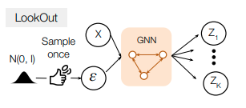

# [日本語まとめ] LookOut: Diverse Multi-Future Prediction and Planning for Self-Driving

[Alexander Cui](https://arxiv.org/search/cs?searchtype=author&query=Cui%2C+A), [Sergio Casas](https://arxiv.org/search/cs?searchtype=author&query=Casas%2C+S), [Abbas Sadat](https://arxiv.org/search/cs?searchtype=author&query=Sadat%2C+A), [Renjie Liao](https://arxiv.org/search/cs?searchtype=author&query=Liao%2C+R), [Raquel Urtasun](https://arxiv.org/search/cs?searchtype=author&query=Urtasun%2C+R)

* [Arxiv](https://arxiv.org/abs/2101.06547)
* [oral paper+video](https://linktr.ee/alexcdot)
* [Tweet](https://mobile.twitter.com/alexcdot/status/1448006973295841282)（LookOutの動画があります）

## どんなもの？

この論文はセンサー信号から自動車の運動を計画するEnd-to-Endの自律システムLookOutを提案する。LookOutは最初にセンサーで取得した情報から車や人などのアクターを検出する。そして生成モデルを使って確率の高いシーンだけではなく、低いものも含めて自動運転車に関連する多様なシーンを複製生成する。次に生成したシーンすべてに対応できる共通の短期のアクションと、予測シーンごとに対応する長期の軌道を計画する。LookOutは多くの情報が得られるまで快適性と安全性を保ちながら、過度に消極的な行動を避けることができる。

## 先行研究と比べてどこがすごい？何を解決したか？

提案手法LookOutは予測シーンのサンプリングの効率化と新しいContingentな運動計画を組み合わせた方法である。

### 予測シーンのサンプリングの効率化

Joint Predictionは環境中のアクター間の相互作用を考慮して複数アクターの将来の行動を予測する方法である。生成モデルを使ってJoint Predictionを行う方法として次の２つの方法が提案されている。

* [N. Rhinehart, R. McAllister, K. Kitani, and S. Levine, “PRECOG: prediction conditioned on goals in visual multi-agent settings,” in Proceedings of the IEEE International Conference on Computer Vision, 2019, pp. 2821–2830.](../PRECOG: PREdiction Conditioned On Goals in Visual Multi-Agent Settings/summary.md)
* [Sergio Casas, Cole Gulino, Simon Suo, Katie Luo, Renjie Liao, and Raquel Urtasun. Implicit latent variable model for scene-consistent motion forecasting. ECCV 2020, 2020. 1, 2, 3, 4, 7](../Implicit Latent Variable Model for Scene-Consistent Motion Forecasting/summary.md)

しかし事故につながる可能性のある将来など、確率は低いが自動運転の計画に必要な将来をサンプルするために、非常に大きな試行回数を必要とするため、サンプリング効率が低いという問題がある。

この問題に対して、提案手法は訓練で使用したpriorの代わりに、Planning-Centric Diverse Samplerを使って潜在変数をサンプルする。そしてこのサンプルから生成モデルにより将来の行動を生成する。Planning-Centric Diverse Samplerは次に示す論文のように環境中のすべてのアクターに関するユークリッド空間上の多様性に加えて、自動運転車両の行動に関してもユークリッド空間上の多様性を向上させるように訓練されたグラフニューラルネットワークである。Planning-Centric Diverse Samplerを使うことにより自動運転車両が関連する将来を優先的にサンプルすることができる。

* Ye Yuan and Kris Kitani. Diverse trajectory forecasting with determinantal point processes. arXiv preprint arXiv:1907.04967, 2019. 1, 2, 7
* Ye Yuan and Kris Kitani. Dlow: Diversifying latent flows for diverse human motion prediction. arXiv preprint arXiv:2003.08386, 2020. 1, 2, 4, 7

### 新しいContingentな運動計画

予測されたアクターの経路を使って自動運転車両の運動を計画するシステムに次に示す２つの最適化を行う方法が提案されている。

* $$\tau_{0:T}^{*} =
  \underset{\tau_{0:T} \in \mathcal{T}_{0:T}(\mathbf{x}_0)}{\text{argmin}}
  \underset{p(Y)}{\mathbb{E}}
  c(\tau_{0:T}, Y)$$
* $$\tau_{0:T}^{*} =
  \underset{\tau_{0:T} \in \mathcal{T}_{0:T}(\mathbf{x}_0)}{\text{argmin}}
  \max
  c(\tau_{0:T}, Y)$$

しかし、それぞれ以下の問題がある。

* 予測した将来のシーンのすべてに対して一つの経路を求めることを目的とするため、予測されたシーンの内ひとつだけが実際に起こるという事実を無視している。
* 最悪の事態を考えた計画であるため、自動運転車両が他車両にぶつかるような確率の非常に低いシーンに反応して強いブレーキをかけてしまう非常に消極的な行動となる。

これに対して本論文は、長期的に各予測シーンに個別に対応しつつ、短期的には安全性を確保する運動計画方法を提案している。この提案手法が以前の最先端のアプローチよりも安全かつ保守的でないことを実験により示した。

## 手法は？

次に示す図がセンサーデータから実行可能なアクションを計算するLookOutの推論パイプラインである。Backbone CNN、Object Detector、ActorCNN、Diverse sampler、Prediction decoder、Scenario Scorer、Contingency Plannerで構成される。

### 検出と運動予測

Backbone CNNはCNNで構成されるネットワークである。バードアイビューで表現された過去１秒間分のLiDARの点群とHDマップを入力として、物体検出と検出したアクターの運動予測を行うための特徴マップを計算する。

Object Detectorは多クラス分類ヘッダーと回帰ヘッダーからなるネットワークである。Backbone CNNで計算した特徴マップから多クラスの物体分類と検出したアクターの位置とヘディング、サイズを出力する。そして検出したアクターの情報を元にBackboneで計算した特徴マップからRotated RoI Alignを行い、アクターの特徴マップを抽出する。

Actor CNNはCNNとMax poolingで構成されるネットワークである。アクターの特徴マップを処理し、その次元を削減して、新たな特徴量$$x_n^{local}$$を計算する。計算後、大域的なアクターの情報$$x_n^{global} = \{c_{x,n}, c_{y,n}, a_n \}$$を追加して最終的なアクターのコンテキスト$$x_n = [x_n^{local}, x_n^{global}] \in \mathbb{R}^D$$を作成する。

Prediction decoderは「Implicit latent variable model for scene-consistent motion forecasting」([summary](../Implicit Latent Variable Model for Scene-Consistent Motion Forecasting/summary.md))と同じImplicit潜在変数モデルのデコーダー$$f_{\theta}$$である。検出したN個のアクターのコンテキスト$$X = \{x_1, x_2, \dots, x_N\}$$から将来のシーン、つまりscene consistentな将来の軌道$$Y = \{y_1, y_2, \dots, y_N\}$$を計算する。計算された将来の軌道$$y_n$$は現在時刻から時刻Tまでアクターの２次元の重心位置で構成される。そしてその位置はそのアクター$$n$$を検出した位置およびヘディングを中心とする相対座標系で表現される。

$$Y=f_{\theta}(X, Z)$$

$$Z$$はアクターごとに分散表現した潜在変数$$\{z_1, z_2, \dots, z_N\}$$である。正規分布をつかってサンプルする。

$$p(Z \mid X) \approx P(Z) = \overset{N}{\underset{n=1}\sum}p(z_n), z_n \sim \mathcal{N}(0, I)$$

これらの４つのネットワークの訓練は物体検出損失と運動予測損失からなるマルチタスク損失を使ってEnd-to−Endで行う。物体検出損失はクラスごとにハードネガティブマイニングを使用したバイナリークロスエントロピー損失とHuber損失で構成される損失である。運動予測損失はHuber損失による再構成誤差とKLダイバージェンスからなる損失である。

$$\mathcal{L}_{\text{forecast}}=
\frac{1}{NT}
\overset{N}{\underset{n}\sum}
\overset{T}{\underset{t}\sum}
l_{\delta} (y_{n}^t - y_{n, GT}^t) +
\beta * \text{KL}(q_{\theta}(Z \mid X, Y = Y_{GT}) || p(Z))$$

$$q_{\theta}$$は真の事後分布$$p(Z \mid X, Y)$$を近似するネットワークである。訓練時のみ使用する。

### Planning-Centric Diverse Sampler

Planning-Centric Diverse Samplerは有望な将来のシーンを効率よくサンプリングすることを目的としたネットワークである。推論時にPriorの代わりに使う。Planning-Centric Diverse Samplerはノイズ$$\varepsilon \sim \mathcal{N}(0, I) \in \mathbb{R}^{NL}$$からシーンごとに自動運転車両が異なる判断を行うような潜在変数$$\mathbf{Z}$$のサンプル$$\{Z_1, Z_2, \dots, Z_K\}$$を生成する。

ただし、そのサンプルの分布がPrediction decoderの訓練に使われたPriorからかけ離れている場合、Distribution Shiftが発生し、Prediction decoderで生成する将来の質が低下する。この質の低下を軽減するため、Planning-Centric Diverse Samplerの出力サンプルがPriorと同じガウス分布に従うように、Planning-Centric Diverse Samplerを潜在変数$$\mathbf{Z}$$の平均を示すネットワーク$$b_{\eta_k}(X)$$と標準偏差を示すネットワーク$$A_{\eta_k}(X)$$で構成する。

$$Z_k = \mathcal{M}_{\eta_k}(X, \varepsilon) = b_{\eta_k}(X) + A_{\eta_k}(X) \varepsilon$$

> 自動運転など安全性および検証における再現性が必要な場合、$$\varepsilon=0$$とすることで決定論的なサンプリングが行うことができる。

Planning-Centric Diverse Samplerの学習には次に示す損失関数を使う。

$$\underset{\eta}{\min} 
E(\mathbf{Y}, \mathbf{Y}_{\text{gt}}) +
\beta \overset{K}{\underset{k=1}\sum}
\text{KL} (p(Z_k \mid X) || p(Z))$$

第１項は多様性ためのエネルギー関数$$E(\mathbf{Y}, \mathbf{Y}_{\text{gt}})$$、第２項は出力する潜在分布がpriorに近くなるようにするためのKLダイバージェンス$$\text{KL} (p(Z_k \mid X) || p(Z))$$である。多様性ためのエネルギー関数$$E(\mathbf{Y}, \mathbf{Y}_{\text{gt}})$$は３つのエネルギーで構成される。

$$E(\mathbf{Y}, \mathbf{Y}_{\text{gt}})=
w_r E_r(\mathbf{Y}, \mathbf{Y}_{\text{gt}}) + w_p E_p(\mathbf{Y}) + w_d  E_d(\mathbf{Y})$$

ただし$$w_r = 0.02, w_p = 0.01, w_d = 10.0$$である。

* $$E_r(\mathbf{Y}, \mathbf{Y}_{\text{gt}})は$$Planning-Centric Diverse SamplerがサンプルするK個のシーンの内、少なくとも1つのシーンが実際に観測されたシーンに近くなるようにするための再構成エネルギーである。

  $$E_r(\mathbf{Y}, \mathbf{Y}_{\text{gt}}) = \underset{k}{\min} \ell_2 (Y_k - Y_{gt})$$

* $$E_p(\mathbf{Y})$$は自動運転車両の将来の計画の多様性を確保するためのPlanning Diversity Energyである。

  $$E_p(\mathbf{Y}) =
  -\mathbb{E}_{\mathbf{Y}}[R(\mathbf{Y})] \approx
  -\log p(\mathbf{Z} \mid X)R(\mathbf{Y})
  =
  \frac{1}{K(K-1)}
  \overset{K}{\underset{i=1}\sum}
  \overset{K}{\underset{j \ne i}\sum}
  -\log p(Z_i, Z_j)
  \ell_2 (\tau(Y_i) - \tau(Y_j))$$

  ただし、$$\tau(Y)$$はContingency Plannerによって計算された計画軌道、$$R(\mathbf{Y})$$は多様性に関する報酬である。

  $$R(\mathbf{Y})=\frac{1}{K}
  \overset{K}{\underset{i=1}\sum}
  \overset{K}{\underset{j \ne i}\sum}
  \ell_2 (\tau(Y_i) - \tau(Y_j))$$

* $$E_d(\mathbf{Y})$$は自動運転車両を含むすべてのアクターの将来の経路の多様性を確保するためのGeneral Diversity Energyである。自動運転車両に関わるアクターがいないとき、Planning Diversity Energy$$E_p(\mathbf{Y})$$がスパースになる可能性がある。この可能性に対応するため、General Diversity Energyを使うことで追加の多様性を確保する目的で使う。

  $$E_d(\mathbf{Y}) = \frac{1}{K(K-1)}
  \overset{K}{\underset{i=1}\sum}
  \overset{K}{\underset{j \ne i}\sum}
  \exp (-
  \frac{\ell_2 (Y_i - Y_j)}{\sigma_d}
  )$$
  
  ただし$$\sigma_d = 10000$$である。

またPlanning-Centric Diverse Samplerを学習するときはPrediction decoderの重みを固定する。Prediction decoderと共に学習すると、自動運転車両の前に突然アクターが現れて、自動運転車両の行動を強制的に変えるような将来を生成するなど多様な将来の生成を優先するようになるためである。

### Scenario Probability Estimation

Scenario Scorerは安全運転を行うための正しいリスクアセスメントを行うためのネットワーク$$s_{\psi}$$である。Scenario ScorerはPrediction decoderによりサンプルされた将来$$\mathbf{Y} = \{Y_1, Y_2, \dots, Y_K\}$$の確率分布のスコア$$l$$を推定する。

$$l = s_{\psi} (X, \mathbf{Y})$$

推定されたスコアから各サンプルの確率はre-normalizationを行うことで計算できる。

$$p_{\psi}(Y_k \mid X) = \frac{\exp(l_k)}{\sum_{k'}\exp(l_{k'})}$$

Scenario Scorerの訓練にはサンプルとグランドトゥルースとのL2距離を使った近似分布を使う。

$$q(Y_k \mid X) = \frac{\exp(-\alpha \ell_2 (Y_{k} - Y_{GT}))}{\sum_{k'}\exp(-\alpha \ell_2 (Y_{k'} - Y_{GT}))}$$

$$\alpha=10$$は温度である。

###  Contingency Planner

自動運転車両の行動を計画するContingency Plannerのアルゴリズムを示す。

1. 短期のアクション$$\tau_{0:t}$$と長期の軌道のセット$$\mathcal{T}_{t:T}(\tau_t)$$のペアを複数サンプリングする

   $$\{ (\tau_{0:t}, \mathcal{T}_{t:T}(\tau_t))_0, (\tau_{0:t}, \mathcal{T}_{t:T}(\tau_t))_1, \dots \}$$

   

2. コスト関数$$c(\cdot)$$を使って各ペア$$\tau_{0:t}, \mathcal{T}_{t:T}(\tau_t)$$のコストを計算し、最も低いコストを持つペアを選択する

   $$\tau_{0:T}^{*} =
   \underset{\tau_{0:T} \in \mathcal{T}_{0:T}(\mathbf{x}_0)}{\text{argmin}}
   \left(
   \overbrace{\max c(\tau_{0:t}, Y)}^{\text{action cost}}+
   \overbrace{\underset{Y_i \in \mathbf{Y}}{\sum}p(Y_i)g(\mathbf{x}_t, Y_i)}^{\text{cost-to-go}}
   \right )$$

   $$g(\mathbf{x}, Y) =
   \underset{\tau_{t:T} \in \mathcal{T}_{t:T}(\mathbf{x}_0)}{\text{min}}
   c(\tau_{t:T}, Y)$$

   

   コスト関数$$c(\cdot)$$は安全性や交通ルール、快適性や目的地への到達度を考慮したコストである。次に示す論文とほぼ同様のものを用いる。

   Sadat, A., Ren, M., Pokrovsky, A., Lin, Y.C., Yumer, E., Urtasun, R.: Jointly learnable behavior and trajectory planning for self-driving vehicles. arXiv preprint arXiv:1910.04586 (2019)([summary](../Jointly learnable behavior and trajectory planning for self-driving vehicles/summary.md))

### 短期のアクションと長期の軌道のサンプリング

短期のアクションと長期の軌道のサンプリングは、レーンの中心線で構成される目的地へ向かうルートを使って次のように行われる。

1. 短期のアクション(１秒間の経路)を次の手順で240個作成する。
   1. 自動運転車両の初期状態、中間、終了条件を満たすように２つの５次多項式を使い、レーン中心線に対する横方向のプロファイルを作成する。
   2. ４次多項式を使いレーン中心線に対する縦方向のプロファイルを作成する。
   3. 作成した縦方向と横方向のプロファイルを組み合わせて、様々な経路をサンプリングする。
2. 各短期のアクションごとに前ステップと同様の手順で260個の長期の軌道(4秒間の経路)を作成する。

## どうやって有効だと検証した？

### 走行性能

ATG4Dを使って過去１秒間のデータから次の４秒間を予測するようにLookOutのネットワークを訓練した。訓練したLookOutをClosed-loop simulator上で実行し、走行性能を評価した。Closed-loop simulatorは様々なシナリオを最大18秒間0.1秒間隔でシミュレートする。

ベースラインに次の予測方法とPLTプランナーを組み合わせたシステムを用いた。

* Marginal Predictionを行う方法：CVAE-DPP、CVAE-DLow、MultiPath、CVAE
* Joint Predictionを行う方法：ESP[(summary)](../PRECOG: PREdiction Conditioned On Goals in Visual Multi-Agent Settings/summary.md)、ILVM[(summary)](../Implicit Latent Variable Model for Scene-Consistent Motion Forecasting/summary.md)

PLTプランナーは$$\tau_{0:T}^{*} =
\underset{\tau_{0:T} \in \mathcal{T}_{0:T}(\mathbf{x}_0)}{\text{argmin}}
\underset{p(Y)}{\mathbb{E}}
c(\tau_{0:T}, Y)$$を使う従来の計画方法である。また次のメトリックを走行性能の評価に使用した。

* CR：自動運転車両の衝突率
* Progress：自動運転車両が目的地へのルートに沿って進んだ距離
* Progress/Collision：ProgressをCRで割った値
* Jerk：Jerkの平均値
* Lat. Acc.：横加速度の平均値
* Decel：減速度の平均値

CRは運転の安全性を調べるために使用した。Progress/Collisionは非保守性と安全性の割合に関する知見を得るために使用した。Jerk、Lat. Acc.、DecelはDistribution Shiftに対するロバスト性など自動運転システムの堅牢性を測るために使用した。自動運転システムが長期に渡って稼働する場合、エキスパートドライバーが実行したパスから逸脱する可能性があるため、Jerk、Lat. Acc.、Decelをこの逸脱の指標にすることができる。

走行性能の評価結果が次の表である。

LookOutがほぼすべてのメトリックで良い結果を示している。具体的にはProgress/CollisionがCVAEに比べて21％増加している。これはLookOutが速度を落とすことなく、道路上の危険なシナリオを回避していることを示す。

### 予測シーンの多様性と走行性能のトレードオフ

予測シーンの多様性が走行性能とどのような関係にあるのかを調べた。検証に当たって多様性を測る方法として次のメトリックを使用した。

* $$\text{meanPlanASD}
  =\frac{1}{K}
  \overset{K}{\underset{i=1}\sum}
  \overset{K}{\underset{j \ne i}\sum}
  \ell_2 (\tau(Y_i), \tau(Y_j))$$
* $$\text{meanSASD}
  =\frac{1}{K}
  \overset{K}{\underset{i=1}\sum}
  \overset{K}{\underset{j \ne i}\sum}
  \ell_2 (Y_i, Y_j)$$

次に示す図が検証結果である。

LookOutを除くPLTプランナーを使うベースラインの間では多様性が増すほど成功率やProgressが低下する傾向があることが確認できる。その一方でLookOutは多様性とCRおよびProgressを両立していることが確認できる。

### 予測シーンの多様性と予測性能のトレードオフ

予測シーンの多様性が予測シーンの精度とどのような関係にあるのかを調べた。検証結果当たって予測シーンの精度を測る方法として次のメトリックを用いた。

* $$\text{minSADE} = \underset{s \in 1 \dots S}{\min} \frac{1}{NT}
  \overset{N}{\underset{n=1}{\sum}}
  \overset{T}{\underset{t=1}{\sum}}
  \Vert
  y_{n, s}^t -y_{n, GT}^t
  \Vert^2$$
* $$\text{meanSADE} = \frac{1}{NT}
  \overset{K}{\underset{k=1}{\sum}} p_{\psi(Y_k \mid X)}
  \overset{N}{\underset{n=1}{\sum}}
  \overset{T}{\underset{t=1}{\sum}}
  \Vert
  y_{n, s}^t -y_{n, GT}^t
  \Vert^2$$　

次に示す図が検証結果である。

LookOutを除くベースラインの間では多様性と精度がトレードオフの関係になっていることがわかる。一方でLookOutは多様性と精度を両立していることが確認できる。

### Ablation Study

まだ

### 定性的結果

Closed-loop simulationの中で自動運転車両が遭遇した難易度の高い3つのシナリオを次の図に示す。青いボックスおよび軌道は検出した車両およびその車両の予測経路である。ピンクのボックスおよび軌道は検出した歩行者およびその歩行者の予測経路である。緑のボックスは自動運転車両である。1秒間の短期アクションは黒い線、その後の4秒間の長期の軌道は赤い線で示されている。

図の各シナリオで、各予測シーンに対応するContingentな軌道が確認できる。これは他の車両が自動運転車両の進路を妨害した場合でも、安全な将来の経路を探索できていることを示している。

## 課題は？議論はある？

Scenario Scorerの訓練にサンプルとグランドトゥルースとのL2距離を使った近似分布を使用した。L2距離ではなく異なる距離関数を使うことが考えられる。

## 次に読むべき論文は？

Coming soon

## 補足

Diverse samplerの$$b_{\eta_k}(X)$$と$$A_{\eta_k}(X)$$、Prediction decoder、Scenario Scorerは「Implicit latent variable model for scene-consistent motion forecasting」([summary](../Implicit Latent Variable Model for Scene-Consistent Motion Forecasting/summary.md))で提案されたグラフニューラルネットワークScene Interaction Module(SIM)を使う。

## 個人的メモ

