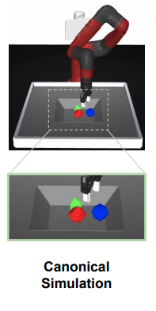
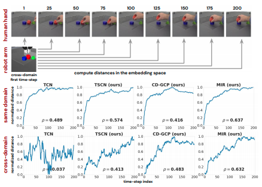

# Manipulator-Independent Representations for Visual Imitation

[Yuxiang Zhou](https://arxiv.org/search/cs?searchtype=author&query=Zhou%2C+Y), [Yusuf Aytar](https://arxiv.org/search/cs?searchtype=author&query=Aytar%2C+Y), [Konstantinos Bousmalis](https://arxiv.org/search/cs?searchtype=author&query=Bousmalis%2C+K)

* [Arxiv 18 Mar 2021](https://arxiv.org/abs/2103.09016)
* [site](https://sites.google.com/view/mir4vi)
* [marketpost](https://www.marktechpost.com/2021/03/24/deepmind-researchers-introduce-manipulation-independent-representations-mir-for-successful-cross-embodiment-visual-imitation/)
* [medium](https://medium.com/syncedreview/deepmind-proposes-manipulation-independent-representations-for-imitation-of-behaviours-6c4db76fde9d)
* [slideshare](https://deeplearning.jp/en/manipulation-independent-representationsmir-for-successful-cross-embodiment-visual-imitation/)

## どんなもの？

人や違う形態を持つロボットのデモンストレーション動画から、エージェントがマニピュレータを操作し同じタスクを解くための方策を強化学習により学ぶ（Cross-embodiment Imitationする）方法を提案する。提案方法はデモンストレーション動画およびエージェントが観測するカメラ画像を、マニピュレータに依存しない空間、つまりどんなマニピュレータのどんなタスクにも使える表現（MIR＝Manipulator-Independent Representations）にエンコードすることで、異なるドメインからの情報を同じように扱えるようにする。そしてその空間上でデモンストレーションをエージェントが到達するべきゴールとして設定し、強化学習を行うことでタスクを解く方策を訓練する。

## 先行研究と比べてどこがすごい？何を解決したか？

強化学習の報酬設計が困難、もしくは環境の探索が困難な場合では、模倣学習は有効な手段である。しかしながらbehavior cloningや逆強化学習などの模倣手法は一人称の行動と状態からなる軌道から方策を求める方法が主であり、これは人間や他の動物が模倣する（動作を真似る）方法とは違う。これを動機づけとして、MIRはどう動いたかの行動にアクセスすることなく異なるドメインの視覚情報のみから模倣する学習方法MIRを提案する。MIRは未知な形態のマニピュレータのデモンストレーションから学ぶことができる。

## 手法は？

### Cross-embodiment Imitation via RL

ロボットのカメラ画像$$o$$およびデモンストレーション動画内から選ばれた１つのフレーム$$\bar{g}$$をマニピュレータに依存しないMIR空間にそれぞれエンコードする。エージェントはエンコードされたカメラ画像$$\phi(o)$$を状態、デモンストレーション画像$$\phi(\bar{g})$$をゴールとして受け取り、５自由度のロボットを操作しゴールに到達する方策を強化学習により学習する。方策の学習にはMaximum a Posteriori Policy Optimization (MPO)を使う。

環境の報酬関数は次のように設定する。

$$\newcommand{\if}{\mathop{\mathrm{if}}\nolimits}
\newcommand{\otherwise}{\mathop{\mathrm{otherwise}}\nolimits}
r(o, \bar{g}) = \left\{
\begin{array}{ll}
1, & \if \exp(-w \| \phi(o) - \phi(\bar{g}) \|^2) > \epsilon\\
0, & \otherwise
\end{array}
\right.$$

$$w$$はデモンストレーションの隣接するフレーム間のユークリッド距離$$d(\phi(o), \phi(\bar{o}))$$の平均である。$$\epsilon$$は[0, 1]の値をとる閾値であり、チューニングした結果0.3である。エージェントが報酬を得るたびに次のゴールがデモンストレーション動画内から選ばれる。ゴールの候補は５または１０フレームごとの画像である。

以下ではMIR空間の学習方法について示す。

### MIR空間の学習

様々なマニピュレータに対応するためマニピュレータに関するドメインランダマイゼーションを行い、MIR空間学習のためのデータを取得する。シミュレーション環境で、あるタスクを行う軌跡を２つの方法で観測し、同一シーンに対する観測のペア$$\mathbf{o} = {o_i}_{i=1}^N$$、$$\bar{\mathbf{o}} = {\bar{o}_i}_{i=1}^N$$、および行動$$\mathbf{a} = {a_i}_{i=1}^N$$を取得する。

この訓練データを用いて画像$$o$$を受け取りMIR空間にマッピングするMIRエンコーダ$$x = \phi(o)$$を次の２つの方法で訓練する。

1. Temporally-Smooth Contrastive Networks (TSCN)
2. Cross-Domain Goal-Conditional Policies (CD-GCP)

これによりマニピュレータの動きを捉えたまま、観測を以下の特性を持つ埋め込み空間（MIR空間）にマッピングすることができる。

1. Cross-Domain Alignment　異なるドメインの同一シーンを同じ場所にマッピングする
2. Temporal Smoothness　時間的に近いシーンを近くにマッピングする
3. Actionable Representations　強化学習に用いるため埋め込みから行動が推論できる

#### Temporally-Smooth Contrastive Networks (TSCN)

TSCN（Temporally-Smooth Contrastive Networks）は収集した同一シーンを示す観測のペア$$(o_i, \bar{o}_i)_{i=1,...,N}$$を使って次のContrastive lossによりの距離学習を行うことにより、埋め込み空間を学習する方法である。

$$\min_{\phi} \left( - \sum_i^{N} \sum_k^{N} p_{ik} \log \frac
{\exp(x_i^{T} \bar{x}_k)}
{\sum_j^N \exp \left(x_i^T \bar{x}_j \right)} \right)$$

ここで$$x = \phi(o)$$、$$\bar{x} = \phi(\bar{o})$$はエンコードされた観測のペアである。$$p_{ik}$$は比べているフレームのインデックスが近いときは小さく、フレームのインデックスが遠いときには大きくなるような重みである。

$$p_{ik} = \frac{\exp (- |i-k|)}{\sum_u^N \exp(-|i-u|)}$$

重み$$p_{ik}$$を用いることで隣接したペア$$(x_i, \bar{x}_{i+1})$$と離れたペア$$(x_i, \bar{x}_{i+50})$$の違いを表現し、時間的な滑らかさを考慮することができる。TSCNはTime-Contrastive Networks: Self-Supervised Learning from Video([arxiv](https://arxiv.org/pdf/1704.06888.pdf))で提案されたTCN（Time-Contrastive Networks）の拡張版である。

#### Cross-Domain Goal-Conditional Policies (CD-GCP)

CD-GCPは観測から行動を出力する方策$$\pi_{\times} (\phi(o_i), \phi(\bar{o}_{i+j}))$$を訓練することにより、行動に関連付けられた埋め込み空間を学習する方法である。損失関数は次のものを用いる。

$$\| \pi_{\times} (x_i, \bar{x}_{i+j}) - a_i \|^2$$

ここで$$1 \le j \le N$$である。実験では$$N=20$$を用いる。

### 具体的なアーキテクチャ

MIRエンコーダは次のようにロボットに取り付けれている２つのカメラ画像をそれぞれCNNにより処理し、２つの128チャンネルの特徴ベクトルをMLPで処理することで、128チャンネルのembeddingを出力する。またCD-GCPで用いる方策は[256, 256, 5]の３層MLPを用いる。

#### 

## どうやって有効だと検証した？

### 環境

模倣エージェントは常に標準のMuJoCoのシミュレーション環境で動作する。標準の環境は次の３つで構成される。

* SawyerアームとRobotiq 2-finger gripperからなる５自由度マニピュレータ
* バスケットの左右からアーム、物体、バスケットを映す128x128の画像を取得する２つのカメラ
* 3つの幾何学的に異なる物体

MIR空間を訓練するための標準の環境から以下の変更を加えた３つの環境は次のとおりである。

1. **Invisible Arm** : マニピュレータはレンダリングから除いた環境
2. **Arm Randomized** : アームの色、テクスチャ、光源、物理特性（質量、摩擦、骨組み、減衰、gear)を変更した環境
3. **Domain Randomized** : すべてのエンティティの色、テクスチャ、光源、物理特性、カメラの位置を変更した環境

cross-embodiment imitationのためのデモンストレーションを生成する環境は次のとおりである。MIR学習には現れない４つのドメインである。

1. **Jaco Hand** : 2-finger Robotiqの代わりに、3-finger Jaco handを使う環境
2. **Real Robot** : 標準のMuJoCoの環境と同等の現実世界の環境
3. **Pick-up Stick** : ロボットアームの代わりに人がスティックをつかって運ぶ現実の環境
4. **Human Hand** : ロボットアームの代わりに人が手で物体を運ぶ現実の環境

### MIR空間の学習データおよびデモンストレーションデータの収集

MIR空間の学習のため、時間的に整列したシークエンスが必要である。アームを物体のところまで運ぶ、物体をつかむ、持ち上げる、積み上げるなどのバスケットにある３つの物体を使ったすべての操作（7194個）の軌道タスクに対してシミュレーション環境を使い、同じ軌道のビジュアル的に異なるペア(14, 388個)を作成した。データ収集に当たって標準の環境でMaximum a Posteriori Policy Optimization(MPO)により訓練した方策を用いた。収集したデータの内10792個をMIR空間の訓練に使用し、残りはハイパーパラメータのチューニングに用いた。

Cross-embodiment Imitationのため、Invisible Arm, Jaco Hand, Real Robot, Pick-up StickそしてHuman Handの５つのドメインから各１０回のデモンストレーションを収集し、方策の訓練に用いた。

### 結果

２つのタスクの成功率を検証した。

* **Lifting** : 画像から見て一番上にある物体を持ち上げる
* **Stacking** : 一番上にある物体を一番下ある物体の上にのせる

特にStackingタスクは３つの物体の内、つかむ物体とそれをのせる物体を選ぶ必要があり、チャレンジなタスクである。Invisible Arm, Jaco Hand, Real Robot, Pick-up StickそしてHuman Handの５つのドメイン上で１００回ずつテストを行い、各ドメインの成功率を検証した。提案するMIRが一番の成功率を示している。

MIRのAblation Studyを行った。MIR（CD-GCPとTSCNの組み合わせ）が最も良いことを示している。

### MIR空間上の距離とタスクの進捗率

現在の観測がタスクのゴールからどれだけ距離があるかreachability distanceを直接測ることは難しい。そこで人間の操作を正解として埋め込まれた特徴空間上の距離を計測した。Stackingタスクを行う人のデモンストレーションの各フレームに対して同様の条件に設定したシミュレーション環境の最初のフレームとの距離をMIR空間上で計測した。図中の$$\rho$$はスピアマンの順依存関係数である。提案手法であるSCNやGD-GCP、MIRは異なるドメインでも距離が滑らかに増加しており、タスクの到達可能性との相関性が比較手法のTCNに比べ向上していること示している。

## 課題は？議論はある？

Coming soon

## 次に読むべき論文は？

Coming soon

## 個人的メモ

なし
