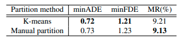
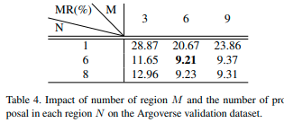

# [日本語まとめ] Multimodal Motion Prediction with Stacked Transformers

[Yicheng Liu](https://arxiv.org/search/cs?searchtype=author&query=Liu%2C+Y), [Jinghuai Zhang](https://arxiv.org/search/cs?searchtype=author&query=Zhang%2C+J), [Liangji Fang](https://arxiv.org/search/cs?searchtype=author&query=Fang%2C+L), [Qinhong Jiang](https://arxiv.org/search/cs?searchtype=author&query=Jiang%2C+Q), [Bolei Zhou](https://arxiv.org/search/cs?searchtype=author&query=Zhou%2C+B)

* [Arxiv](https://arxiv.org/abs/2103.11624)
* [Project site](https://decisionforce.github.io/mmTransformer/)
* [AI-SCHOLAR](https://ai-scholar.tech/articles/transformer/mmTransformer)

## どんなもの？

自動運転車が安全に運転するためには周辺にいる車の複数の可能性のある将来の経路を予測することが非常に重要である。この論文は経路予測を行うモデルmmTransformer（MultiModal Transformer）とマルチモーダルな予測を保証する訓練方法RTS（Region Based Strategy）を提案する。

mmTransformerはシークエンスデータのモデル化に有効なTransformerを使ったモデルである。Transformerによって道路情報や車両の経路間の関係を階層的に集約し、対象の単一の車の経路を複数予測する。Transformerを経路予測に使う方法として過去の経路やレーンの情報などすべての情報をある埋め込み表現に変換し、シークエンスとして連結して、Transformerに入力する方法が考えられる。この方法は次の2つの懸念がある。

* Transformerは固定長の入力を必要とするため、メモリや計算などのリソースを多く消費する。

* 様々な情報がアテンション層で集約されるため、潜在的な特徴の品質が下がる恐れがある。

この懸念からmmTransformerはMotion Extractor、Map Aggregator、そしてSocial Constructorの3つのTransformerを内部に持つ。各Transformerは運動、道路、相互作用をそれぞれ集約する。

RTSはモデルの予測した経路のマルチモーダリティを陽に保証する訓練方法である。RTSは自動運転車の走行領域を分割し、各予測経路がどの領域への予測を行うか事前に割り当てる。そして学習するときにすべての予測経路の内、真の経路が属する領域にに割り当てられた経路のみを損失の計算に使用する。

## 先行研究と比べてどこがすごい？何を解決したか？

* mmTransformerはstacked transformersを経路予測に使った初めてのモデルである。コンテキストを集約してマルチモーダルな経路を予測する。
* マルチモーダルな予測を行うため新しい訓練方法RTSを提案した。RTSは個々の予測経路がある特定のモードを捉えることを保証する。
* mmTransformerとRTSを組み合わせた結果は2020年11月16日時点でArgoverseベンチマーク上1位となった。

## 手法は？

### mmTransformer

mmTransformerは過去の経路と道路や交通情報から対象の車の将来の経路を予測する。処理はStacked TransformersとProposal Feature Decoderで構成される。

1. Stacked Transformersは過去の経路と道路や交通情報で構成されるシーンの情報$$x$$を集約し、対象の車の提案特徴量proposal features $$y$$を$$K$$個計算する。

   $$\mathbf{Y} = \{y_0, y_1, \dots , y_K \}$$

2. Proposal Feature Decoderは提案特徴量$$y$$から予測経路$$s \in \mathbb{R}^{\mathbf{T} \times 2}$$と経路のConfidenceスコア$$c$$を計算する。

   $$\mathbf{S} = \{s_0, s_1, \dots , s_K \}, \mathbf{C} = \{c_0, c_1, \dots , c_K \}$$

#### Stacked Transformers

Stacked transformersはMotion Extractor、Map Aggregator、そしてSocial Constructorの3つのTransformerを持つ。いずれのTransformerもDETR（[arxiv](https://arxiv.org/abs/2005.12872)）で使われるTransformerと同じである。DETRのTransformerはエンコーダとデコーダで構成される。エンコーダはコンテキストの特徴を処理し、デコーダに渡す。デコーダは渡された特徴量とクエリを集約し、新たな特徴量を計算する。

Stacked Transformersで使用されるクエリは提案経路（Trajectory proposals）である。提案経路は予測経路を計算するための特徴量proposal featuresである。DETRと同様に学習可能なパラメータである。提案経路は学習初期にランダムに初期化され、学習を通して更新される。またTransformer (AttentionのKeyとQuery)へ提案経路を入力する前にポジションエンコーディングを提案経路に対して加算する。

Stacked Transformerで使用されるコンテキスト、つまりエンコーダへの入力はそれぞれのモジュールごとに異なる。

* Motion Extractorのエンコーダの入力はすべての車の過去$$T_{obs}$$秒間の2次元位置である。
* Map Aggregatorのエンコーダの入力は道路構造物の特徴量である。道路構造物の特徴量は”VectorNet: Encoding HD Maps and Agent Dynamics from Vectorized Representation”([summary](../VectorNet: Encoding HD Maps and Agent Dynamics from Vectorized Representation/summary.md))で提案された方法と同じ方法を使って計算される。つまり道路の構造物の中心線をベクター表現で表したあと、各ベクター表現をpolyline subgraphで処理する。
* Social Constructorのエンコーダの入力は他の車のproposal featuresである。Motion ExtractorおよびMap Aggregatorを使って経路を予測する対象の車と同じように他の車に対しても特徴量proposal featuresを計算する。他の車のproposal featuresはフィートフォワードネットワークを使って処理された後、エンコーダに入力される。

#### Proposal Feature Decoder

Proposal Feature Decoderは２つの３層MLPで構成される。Stacked Transformersで計算された提案特徴量$$y_i$$から予測経路$$s_i \in \mathbb{R}^{\mathbf{T} \times 2}$$と経路のConfidenceスコア$$c_i$$を計算する。

### Region-based Training Strategy

車の経路を予測する問題を単純に回帰問題として見なしてモデルを訓練する方法がある。この方法の問題点は複数のモードがある場合にモデルがモードの平均を出力することである。この問題をmode average problemと呼ぶ。学習データ内に2つのモード、車が交差点を直進する経路が90％、左折する経路が10％含まれているとする。このデータでモデルを学習すると、モデルは直進と左折の中間を車両が進むような非現実的な経路を出力する。

mode average problemに対処する方法としてモデルが出力した複数の経路の内、最も近い提案経路のみを真の経路との損失計算を使う方法がある。しかしこの方法はデータに最も頻発する一つのモードへモデルの出力経路が偏るという別の問題を持つ。この問題をunimodal effectsと呼ぶ。上述の例ではモデルは殆どの場合直進の経路のみを出力する。

RTS（Region-based Training Strategy）はmode average problemとunimodal effectsを解決するため、真の経路と最も近い提案経路との誤差ではなく、別の方法で誤差を取る経路を選ぶ。図に示すようにRTSはモデルが出力する個々の経路がどの走行領域（R1~R7)へ向かうかを事前に割り当てる。例えばmmTransformerが42個の経路出力を持つとすると、１つの領域に付き6個の経路を割り当てる。そして真の経路が属する領域に割り当てられたすべての提案経路と誤差を計算する。すべての該当する提案領域を誤差計算に利用することでよりマルチモーダルな結果が得られる。次に示す図の場合、真の経路（グリーン）が領域R1に属しているので、R1に割り当てられている経路（ピンク）を使って損失計算を行う。

### Training Objective

次の損失関数を訓練に用いる。

$$\mathcal{L} = \frac{1}{\sigma_1^2} \mathcal{L}_{reg} +
\frac{1}{\sigma_2^2} \mathcal{L}_{conf} +
\frac{1}{\sigma_3^2} \mathcal{L}_{cls} +
\sum_{i=1}^3 \log(\sigma_i + 1)$$

回帰損失$$\mathcal{L}_{reg}$$、Confidence損失$$\mathcal{L}_{conf}$$、領域分類損失$$\mathcal{L}_{cls}$$である。$$\sigma_i$$は自動チューニングされる重みである。

> $$\sigma_i$$の以下の文献の方法で計算する。
>
> * [Multi-Task Learning Using Uncertainty to Weigh Losses for Scene Geometry and Semantics](https://arxiv.org/abs/1705.07115)
> * [Auxiliary Tasks in Multi-task Learning](https://arxiv.org/abs/1805.06334)

#### 回帰損失$$\mathcal{L}_{reg}$$

回帰損失は真の経路と真の経路が属する領域に割り当てられた予測経路の誤差である。

$$\mathcal{L}_{reg} = \frac{1}{N} \sum_{i=1}^{N} \mathcal{L}_{Huber} (s_i, s_{gt})$$

$$\mathcal{L}_{Huber}$$はフーバー損失、$$s_i$$は該当する領域に割り当てられた経路、$$s_{gt}$$は真の経路である。

#### Confidence損失$$\mathcal{L}_{conf}$$

各経路のConfidenceスコアの損失は次のように計算する。

$$\mathcal{L}_{conf} = \frac{1}{N} \sum_{i=1}^{N} \text{D}_{\text{KL}}(\lambda(s_i) \mid\mid \tau(y_i))$$

$$\lambda(s_i)$$はターゲットの分布である。$$\mathcal{D}(s_i, s_{gt})$$は予測経路と真の経路の最終地点のL2距離である。

$$\lambda(s) = \frac{\exp(-\mathcal{D}(s, s_{gt}))}{\sum_{i=1}^{N} \exp (-\mathcal{D}(s_i, s_{gt}))}$$

$$\tau(y)$$は予測スコアの分布である。$$\mathcal{W}$$はProposal Feature Decoderで使われるMLPである。

$$\tau(s) = \frac{\exp(-\mathcal{W}(y))}{\sum_{i=1}^{N} \exp (-\mathcal{W}(y_i))}$$

#### 領域分類損失$$\mathcal{L}_{cls}$$

真の経路の領域に割り当てられた予測経路が他の予測経路に比べて高いスコアになるように、クロスエントロピー損失を使う。

## どうやって有効だと検証した？

Argroverseのmotion prediction benchmarkを用いた。Argoverseのデータに含まれる5秒間の経路の内、最初の2秒間をcontextとして使用し、残りの3秒間を予測した。

### 定量的な結果

メトリックはminADE, minADE, MR(Miss Rate) を用いた。他のstate-of-artの手法と比べた結果は次のとおりである。

mmTransformerもしくはmmTransformer+RTSを使う方法がいずれかのメトリックで最も良い結果である。mmTransfomerは6個の提案、mmTransformer+RTSは36個の提案を用いたときの結果である。この両者を比べるとmmTransformer+RTSはmmTransformerに比べてminADEとminFDEが低いことがわかる。minADEとminFDEが低い理由は精度と多様性のトレードオフが発生していることが原因と思われる。mmTransformer+RTSはRTSで36個の提案から多様性を保持するように6個の経路が真の経路の領域に割り当てられている。すなわち真の経路とのメトリックを計算するために有効な経路はRTSを使わない場合と比べて少なくなる。

###  Ablation Study

#### mmTransformerの各モジュールおよびRTSの重要性

stacked transformersのうちmotion extractorのみを使うモデルをベースラインのモデルとした（1行目）。Map AggregatiotorおよびSocial Constructorを使うことでMRがベースラインの23.3％から10.6%まで減少している（2〜４行目）。コンテキストである道路や過去の軌跡の情報を使ってシナリオのより深い理解が行われていると思われる。

mmTransforとmmTransformer+RTSの結果は５行目と６行目である。RTSを使用することでMRが17.6％から9.2%に減少した。mmTransformerの提案数を６から36個に増やしたときの結果は4行目と5行目である。ただ単純に提案数を増やしてもRTSを用いいない場合性能が上がらないことが示されている。これより一つのモードへの集中を防ぐRTSが有効であることがわかる。

#### RTSの領域の分割方法

RTSの領域の分割方法としてマニュアルで分割する代わりにK-meansを試した。各領域ごとに同じ数のサンプル数が含まれたデータを用意した。領域数を6個とした。各領域に6個の提案経路を割り当てた。Agroverseの結果は次のとおりである。マニュアル分割する方法が若干良い結果となった。

#### RTSの領域の分割数

領域の分割数Mと各領域の提案経路の数Nを変えて性能を検証した。MとNの比率が性能に影響している。MとNの両方が6に等しいときにモデルは最もMR率が低くなる。

#### RTSの可視化

RTSの36個の提案経路を可視化した。左の6つの図は提案経路の最終点を表す。図を簡単にするため提案経路のconfidenceが1/Kよりも低い経路を省略している。黒い点はすべての経路を、色付きの点はある領域に属する経路である。右上のMRマトリックスは1〜6個のある領域に割り当てられた6個の経路のMRを示す。行は領域に割り当てられた経路、列はその経路が実際に属した領域である。低いMRは提案経路が割り当てられた領域への経路であることを示す。右下の図はK-meansで作成した領域を示す。図やマトリックスを見るとほとんどの経路が割り当てられた領域に属する。mmTransformerがマルチモダリティを学習していることがわかる。

### 定性的な結果

mmTransformerおよびmmTransformer+RTSの定性的な結果を示す。様々なシーンでいくつものモードを捉えている。

## 課題は？議論はある？

* RTSはモデルが出力する経路を真の経路が属する領域に割り当てることでマルチモダリティを保証する。しかし他の割当方法を考える必要がある。

## 次に読むべき論文は？

[SPAGNN: Spatially-Aware Graph Neural Networks for Relational Behavior Forecasting from Sensor Data](../SPAGNN Spatially-Aware Graph Neural Networks for Relational Behavior Forecasting from Sensor Data/summary.md)

[VectorNet: Encoding HD Maps and Agent Dynamics from Vectorized Representation](../VectorNet: Encoding HD Maps and Agent Dynamics from Vectorized Representation/summary.md)

[DSDNet: Deep Structured self-Driving Network](../DSDNet: Deep Structured self-Driving Network/summary.md)

[SCENE TRANSFORMER: A UNIFIED ARCHITECTURE FOR PREDICTING MULTIPLE AGENT TRAJECTORIES](../SCENE TRANSFORMER: A UNIFIED ARCHITECTURE FOR PREDICTING MULTIPLE AGENT TRAJECTORIES/summary.md)

## 個人的メモ

なし
