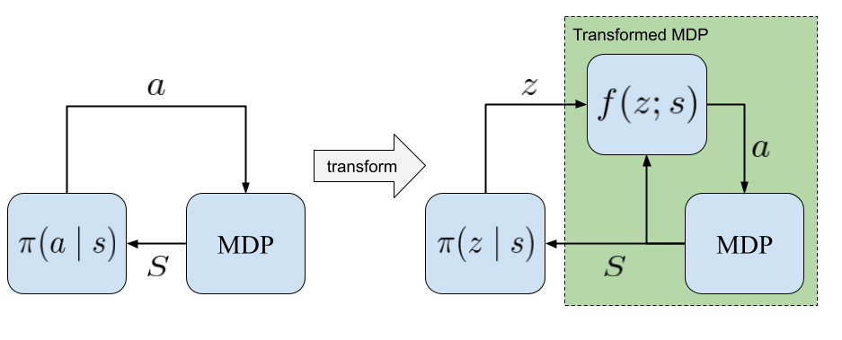
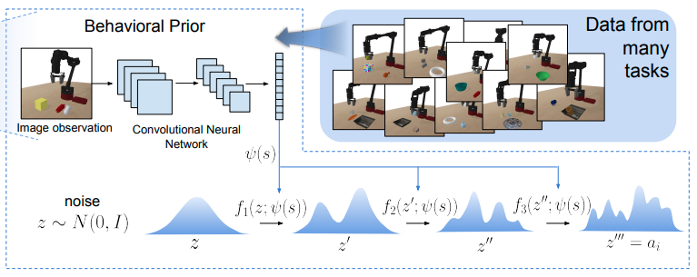
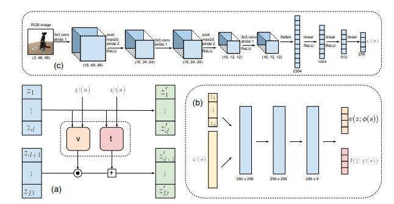
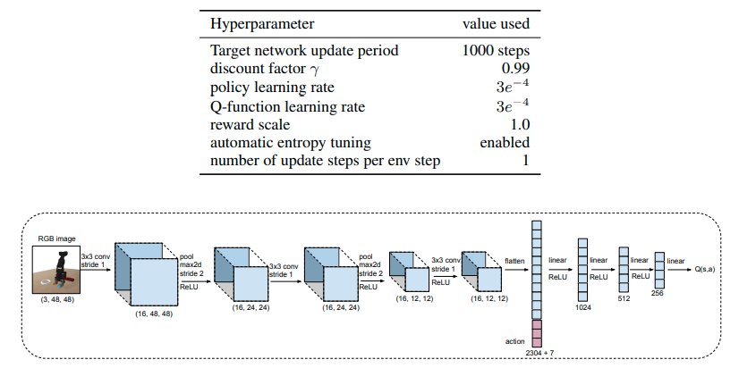
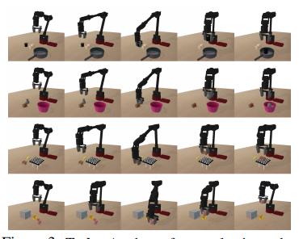
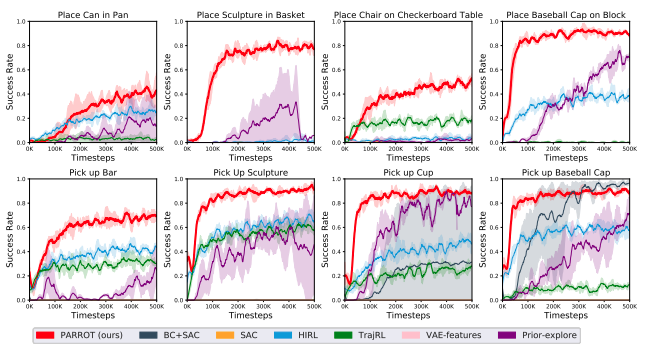
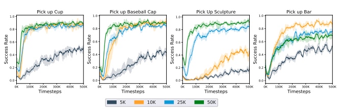
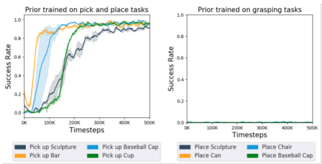

# PARROT: DATA-DRIVEN BEHAVIORAL PRIORS FOR REINFORCEMENT LEARNING

Avi Singh, Huihan Liu, Gaoyue Zhou, Albert Yu, Nicholas Rhinehart, Sergey Levine

* Oral at International Conference on Learning Representations (ICLR), 2021
* [Arxiv 19 Nov 2020](https://arxiv.org/abs/2011.10024)
* [site](https://sites.google.com/view/parrot-rl) まとめ。ここを見れば済む
* [ai scholar](https://ai-scholar.tech/articles/reinforcement-learning/parrot)　日本語１
* [slideshare](https://www.slideshare.net/DeepLearningJP2016/dlparrot-datadriven-behavioral-priors-for-reinforcement-learning)　日本語２

## どんなもの？

様々なタスクの成功経験から複雑な入出力関係を捉え、事前知識(behavioral prior)を構築する。そしてこの事前知識を使用して新しいタスクを素早く学習できる方法PARROT (Prior AcceleRated ReinfOrcemenT)を提案する。PARROTは状態からタスクを行う行動の事前確率分布$$p(a \mid s)$$を事前知識として用いる。事前確率分布は訓練データを使い尤度を最大化することで求める。得られた事前知識は新しいタスクを簡単なタスクに変更するために使われる。そして変更されたタスクに対して強化学習（SAC)を適用する。PARROTをロボットアームの操作問題に適用した。PARROTが今まで見たこと無い物体の操作を行う新しいタスクの学習を行えることを示した。

## 先行研究と比べてどこがすごい？何を解決したか？

自然言語処理や画像処理の分野では新しいタスクを学ぶとき、以前収集したデータを用いた事前学習が可能であり、新しいタスクのためのデータ収集の量を減らすことができる。一方で意思決定と制御のための強化学習は新しいタスクを学ぶために広大なデータ収集を必要とする。

自然言語処理や画像処理などと同じようにロボティクスや強化学習の分野での事前知識の獲得を目指し、PARROTは事前知識活用することで新しいタスクの学習を加速することができる。その速度および学習した方策の性能は今までの方法の性能を上回る。

## 手法は？

マルコフ決定過程(MDP) $$(\mathcal{S}, \mathcal{A}, \mathrm{T}, r,\gamma)$$を考える。状態$$\mathcal{S}$$、行動$$\mathcal{A}$$、遷移$$\mathrm{T}(s' \mid s, a)$$、報酬$$r(s, a)$$、割引率$$\gamma \in (0, 1)$$である。エージェントが解くタスク$$M$$をMDPとする。

PARROTは状態$$S$$を条件として、ある変数$$z$$から行動$$a$$に変換を行う関数$$f_{\phi}: \mathcal{Z} \times \mathcal{S} \rightarrow \mathcal{A}$$を用いてMDPを変更する。そしてその変換したMDPに対してSACを行い方策$$\pi(z \mid s)$$を獲得する。ここで$$\phi$$はパラメータである。

変換関数$$f_{\phi}$$は正規分布など簡単な分布$$p_z$$からサンプルした潜在変数$$z$$を探索に意味のある行動に変えるような関数である。

$$a = f_{\phi}(z;s)$$

そして方策は行動$$a$$の代わりに$$z$$を出力する。

図で示すようにこれがPARROTで行うMDPの変換である。例えば通常ランダムな方策で探索すると多くの試行回数を必要とする、または報酬が疎であるため学習自体うまくいかないようなオリジナルのMDPを簡単なMDPに変換することができる。変換したMDPはランダムな行動を行っても効率に環境を探索することができる。

PARROTではこのような変換を行うための関数$$f(z;s)$$を様々なタスクを行ったデータを元に、状態からそれらのタスクに有用な行動を生成する行動事前分布$$p(a \mid s)$$の尤度を最大化することによって求める。この行動事前分布$$p(a \mid s)$$をbehavioral prior（事前知識）と呼ぶ。

すなわち変換関数$$f(z;s)$$を求めるため、（おそらく）次の最適化問題を解く。

$$min_{\theta} KL(p_{\mathcal{D}} \parallel p_{theta})
= \mathbb{E}_{(s, a) \sim \mathcal{D}} \log p_{\mathcal{D}} -
\mathbb{E}_{(s, a) \sim \mathcal{D}} \log p_{\theta}(a \mid s)$$

第一項は$$\theta$$に関係がないので、第二項を最小化すわなち対数尤度の期待値を最大化するようなパラメータを求める。

$$\max_{\theta} \mathbb{E}_{(a, s) \sim \mathcal{D}} \log p_{\theta}(a \mid s) \cong
\max_{\theta} \frac{1}{N} \sum_{n=1}^{N}  \log p_{\theta}(a_i \mid s_i)$$

ここで変換関数が可逆であるとするとbehavioral priorは潜在変数の分布$$p_z$$と変換関数$$f(z;s)$$を用いて表せる。

$$p_{\theta}(a \mid s) = p_z(f_{\theta}^{-1}(a;s)) | \det (\frac{\partial f^{-1}(a;s)}{\partial a}) |$$

式中に表れる$$\frac{\partial f^{-1}(a;s)}{\partial a}$$はヤコビアンである。一般的にヤコビアンの行列式の計算は次元が大きくなるほど困難になる（$$O(N^3)$$）。このことから、この目的関数を計算するためには変換関数は可逆かつヤコビアンを簡単に計算できるような関数である必要がある。PARROTは変換関数としてフローベース生成モデルの一つであるReal NVP(the real-valued non-volume preserving)([arxiv](https://arxiv.org/abs/1605.08803))を用いる。Real NVPを用いると行列式は対角成分の積となるため、簡単に計算できる。

### Behavioral priorの訓練データの仮定

訓練データは新しいタスクを部分的に含む必要がある。具体的には、新しいタスクがボトルをトレイに入れるタスクとすると、訓練データには物体をつかむ操作やトレイに入れる操作のデータを含む必要がある。

### Behavioral priorの具体的なアーキテクチャ

条件付きrealNVPを使う。

図(c): 64x64のRGB画像はCNNおよびFCNに処理され、特徴量$$\psi$$に変換される。

図(b): この特徴量$$\psi$$と後段(a)で計算された$$z_1,..., z_d$$はFCNによってスケール$$v$$と平行移動$$t$$に変換される。

図(a): (b)から計算された$$v$$と$$t$$を使ってオペレーションを行う。

$$z_{d+1:D}' = z_{d+1:D} \odot \exp(v(z_{1:d}; \psi(s))) + t(z_{1:d}; \psi(s))$$

### 方策の具体的なアーキテクチャ

Soft actor criticを方策として使う。検証に用いた比較手法の強化学習も同様のものを使う。

## どうやって有効だと検証した？

ロボットアームの操作タスクでPARROTを適用し検証した。64x64のRGB画像から６自由度のジョイントと１つのグリッパをもつ７自由度のアームを使って次のようなタスクを行う（扱う物体の種類は変わる可能性がある Appendix C.3）。

1. 缶を拾ってフライパンの上にいれる(1番目の段)
2. 花瓶を拾ってかごの中に入れる(2番目の段)
3. 椅子をチェッカーボードの上に置く(3番目の段)
4. マグカップを持ち上げある一定以上の高さに保持する(4番目の段)

いずれのタスクも完了するためにはロボットは１つ以上の物体を扱う操作を要求する。ロボットアームはランダムな位置でタスクを開始する。タスクを完了したとき＋１の報酬が支払われる。それ以外は０である。テスト時に扱う物体はすべて新しいものとする。

5万個の5~6秒の25ステップからなるロボットアームの軌道のデータを訓練用に収集した。人間によるデモンストレーションや、ある方策によるデモンストレーションを訓練データに使うことも可能であるが、ランダムな方策を用いて作成した。得られたランダムな結果の内、物体をつかむこと、もしくは物体の配置に成功したデータをデータセットに加えた。Appendex C.2にpseudocodeがある。

検証用の比較アルゴリズムは次のとおりである。

| アルゴリズム                                          | 内容                                                         |
| ----------------------------------------------------- | ------------------------------------------------------------ |
| Soft-Actor Critic (SAC)                               | 収集したデータを使わないバニラのSACにより訓練された方策      |
| SAC with demonstrations (BC-SAC)                      | 収集したデータを使いBehavioral Cloningにより学習した後、SACによりファインチューニングした方策 |
| Transfer Learning via Feature Learning (VAE-features) | $$\beta$$-VAEを用いて訓練データの特徴を抽出し、その特徴をもとに訓練した方策　[DARLA: improving zero-shot transfer in reinforcement learning](https://arxiv.org/abs/1707.08475) |
| Trajectory modeling and RL (TrajRL)                   | VAEを使ってタスクに関連した物体の位置の特徴を抽出し、その特徴を使ってロボットの行動をサンプリングする正規分布を出力する。その分布からサンプリングした行動をつかってタスクを完了する軌道を生成する方策　[Deep Predictive Policy Training using Reinforcement Learning](https://arxiv.org/abs/1703.00727) |
| Hierarchical imitation and RL (HIRL)                  | 訓練データから見つかった[Options](https://www.sciencedirect.com/science/article/pii/S0004370299000521)(一連の行動)を使いRLにより訓練された方策　[Learning Robot Skills with Temporal Variational Inference](https://arxiv.org/abs/2006.16232) |
| Exploration via behavioral prior (Prior-explore)      | PARROTからアブレーションのため、学習したBehavior priorをRLの探索に使い、オリジナルのMDPに対してそのまま訓練した方策 |

PARROTおよび比較アルゴリズムをテストした結果は次のとおりである。PARROTはすべてのタスクで成功し、高いスコアを早く達成した。

次に訓練データのサイズを変えたときの影響を調べた。データ量の増加が性能に関連していることがわかる。また5000個などデータセットが小さい場合でも、ゼロから学習するよりもパフォーマンスは優れている。

Behavioral priorの訓練データは新しいタスクの行動を含んでいる必要がある。この仮定を満たさない場合の新しいタスクで学習が行えるかどうかの検証を行った。検証にあたって次の２つのBehavioral priorを作成した。

1. 物体を取り、配置するタスクを含むデータで訓練したBehavioral prior
2. 物体をつかむタスクを含むデータで訓練したBehavioral prior

この２つのBehavioral priorsを使って新しいタスクを学習したときの成功率を調べた。No.1のpriorは新しいタスクを学ぶことはできたが、No.2のpriorは500kステップ経ってもタスクを学ぶことができなかった。No.1の訓練データは新しいタスクの行動を含んでいるが、No.2のデータは新しいタスクの行動を含んでいないことが問題であることを示している。

## 課題は？議論はある？

* PARROTはこれまでの提案方法に比べ早く学習でき、高い性能を持つが、依然として新しいタスクの学習に数千の試行が必要である。さらに早く学習する方法としてメタ学習の方法を用いることが考えられる。
* [Verifiably safe exploration for end-to-end reinforcement learning](https://arxiv.org/abs/2007.01223)のような新しい環境で安全に探索できる方法を組み合わせる必要がある。
* 学習した環境の変換の可逆性から変換した環境での方策が、元の環境で任意の行動を実行することが理論的に保証されているものの、訓練データ内にない行動を実行する可能性は非常に低くなる。これは新しいタスクが学習したタスクと全く違う場合に問題になる。

## 次に読むべき論文は？

Coming soon

## 個人的メモ

* スコープから外れるが、新しいタスクの行動を学んだエージェントは過去のタスクを覚えてはいないと思う。