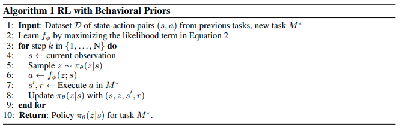

# (WIP) PARROT: DATA-DRIVEN BEHAVIORAL PRIORS FOR REINFORCEMENT LEARNING

Avi Singh, Huihan Liu, Gaoyue Zhou, Albert Yu, Nicholas Rhinehart, Sergey Levine

* Oral at International Conference on Learning Representations (ICLR), 2021
* [Arxiv 19 Nov 2020](https://arxiv.org/abs/2011.10024)
* [site](https://sites.google.com/view/parrot-rl) まとめ。ここを見れば済む
* [ai scholar](https://ai-scholar.tech/articles/reinforcement-learning/parrot)　日本語１
* [slideshare](https://www.slideshare.net/DeepLearningJP2016/dlparrot-datadriven-behavioral-priors-for-reinforcement-learning)　日本語２

## どんなもの？

様々なタスクの成功経験から複雑な入出力関係を捉える事前知識(behavioral prior)を捉え、学習した事前知識を使用して新しいタスクを強化学習により迅速に学習できる方法PARROT (Prior AcceleRated ReinfOrcemenT)を提案する。PARROTは事前知識として状態からタスクを行う行動の事前確率分布を用いる。この分布の尤度を訓練データとして最大化することで新しいタスクを簡単なタスクに変更する。これにより探索が高速化される。PARROTをロボットアームの操作問題に適用し、今まで見たこと無い物体の操作を行う新しいタスクの学習を行えることを示した。

## 先行研究と比べてどこがすごい？何を解決したか？

自然言語処理や画像処理の分野では新しいタスクを学ぶとき、以前収集したデータを用いた事前学習が可能であり、新しいタスクのためのデータ収集の量を減らすことができる。一方で意思決定と制御のための強化学習は新しいタスクを学ぶために広大なデータ収集を必要とする。自然言語処理や画像処理などと同じようにロボティクスやRLの分野での事前知識の獲得を目指し、PARROTは事前知識活用することで新しいタスクの学習を加速することができる。その速度および学習した方策の性能は今までの方法の性能を上回る。

## 手法は？

マルコフ決定過程(MDP) $$(\mathcal{S}, \mathcal{A}, \mathrm{T}, r,\gamma)$$を考える。状態$$\mathcal{S}$$、行動$$\mathcal{A}$$、遷移$$\mathrm{T}(s' \mid s, a)$$、報酬$$r(s, a)$$、割引率$$\gamma \in (0, 1)$$である。エージェントが解くタスク$$M$$をMDPとする。

PARROTは状態$$S$$のもとある変数$$z$$から行動$$a$$に変換を行う関数$$f_{\phi}: \mathcal{Z} \times \mathcal{S} \rightarrow \mathcal{A}$$を用いてMDPを変更する($$\phi$$はパラメータである)。そしてその変換したMDPに対してSACを行い方策$$\pi(z \mid s)$$を獲得する。通常、ランダムな方策で探索すると多くの試行回数を必要とする、また環境によっては報酬が疎であるため学習自体うまくいかないことがある。変換関数$$f_{\phi}$$は正規分布など簡単な分布$$p_z$$からサンプルしたノイズ$$z$$を探索に意味のある行動に変える。

$$a = f_{\phi}(z;s)$$

一方で方策は行動$$a$$の代わりに$$z$$を出力する。この変換は元のタスクを簡単なタスクに変換しているといえる。

PARROTではこのような変換関数$$f(z;s)$$を様々なタスクを行ったデータを元に、状態からそれらのタスクに有用な行動を生成する生成モデル$$p(a \mid s)$$を学習（尤度を最大化）することによって求める。ここで$$p(a \mid s)$$は状態条件付き行動事前分布であり、behavioral priorと呼ぶ。

すなわち次の最適化問題を解く。

$$\max_a \log p(a \mid s)$$

ここで変換関数が可逆であるとすると生成モデルはノイズの分布$$p_z$$と変換関数$$f(z;s)$$を用いて

$$p(a \mid s) = p_z(f^{-1}(a;s)) | \det (\frac{\partial f^{-1}(a;s)}{\partial a}) |$$

と表せる。これを使って

$$\max_a \log p_z(f^{-1}(a;s)) | \det (\frac{\partial f^{-1}(a;s)}{\partial a}) |$$

となる。ここで$$\frac{\partial f^{-1}(a;s)}{\partial a}$$はヤコビアンである。

一般的にヤコビアンの行列式の計算は次元が大きくなるほど困難になる。したがってこの目的関数を計算するためには変換関数は可逆かつヤコビアンを簡単に計算できるような関数である必要がある。PARROTはこのような関数としてフローベース生成モデルの一つであるReal NVP(the real-valued non-volume preserving)([arxiv](https://arxiv.org/abs/1605.08803))を用いる。Real NVPを用いると行列式は対角成分の積となる。

またBehavioral priorsを使った強化学習をまとめると次のアルゴリズムである。

### 訓練データの仮定

また用いているタスクは何らかの意味のある行動をしている必要がある。新しいタスクが部分的にbehavioral priorの学習に用いているタスクに含まれている必要がある。

### Behavioral priorの具体的なアーキテクチャ

Behavioral priorに条件付きrealNVPを使う。

図(a): 64x64のRGB画像はCNNおよびFCNに処理され、特徴量に変換される。

図(b): この特徴量と後段(c)で計算された$$z_1,..., z_d$$はFCNによって$$v$$と$$t$$に変換される。

図(c): (b)から計算された$$v$$と$$t$$を使ってオペレーションを行う。

$$z_{d+1:D}' = z_{d+1:D} \odot \exp(v(z_{1:d}; \phi(s))) + t(z_{1:d}; \phi(s))$$

## どうやって有効だと検証した？

ロボットアームの操作タスクでPARROTを適用し検証した。64x64のRGB画像から６自由度のジョイントと１つのグリッパをもつ７自由度のアームを使って次のようなタスクを行う（扱う物体の種類は変わる可能性がある）。

1. 缶を拾ってフライパンの上にいれる(1番目の段)
2. 花瓶を拾ってかごの中に入れる(2番目の段)
3. 椅子をチェッカーボードの上に置く(3番目の段)
4. マグカップを持ち上げある一定以上の高さに保持する(4番目の段)

いずれのタスクもロボットは１つ以上の物体を扱う必要がある。ロボットのアームはランダムな位置でタスクを開始する。タスクを完了したとき＋１の報酬が支払われる。それ以外は０である。テスト時に扱う物体はすべて新しいものとする。

5万個の５〜６秒25ステップからなるロボットアームの軌道のデータを訓練用に収集した。人間のデモンストレーションやある方策のデモンストレーションを使うことも可能であるが、ランダムな方策を用いた。得られたランダムな結果の内、いずれかのオブジェクトをつかむこと、もしくは再配置に成功したデータをデータセットに加えた。

比較アルゴリズムは次のとおりである。

| アルゴリズム                                          | 内容                                                         |
| ----------------------------------------------------- | ------------------------------------------------------------ |
| Soft-Actor Critic (SAC)                               | バニラのSACにより訓練された方策。収集したデータを使わない。  |
| SAC with demonstrations (BC-SAC)                      | 収集したデータを使いBehavioral Cloningにより学習した後、SACによりファインチューニングした方策 |
| Transfer Learning via Feature Learning (VAE-features) | $$\beta$$-VAEを用いて訓練データの特徴を抽出し、その特徴をもとに訓練した方策　[DARLA: improving zero-shot transfer in reinforcement learning](https://arxiv.org/abs/1707.08475) |
| Trajectory modeling and RL (TrajRL)                   | VAEを使ってタスクに関連した物体の位置の特徴を抽出し、その特徴を使ってロボットの行動をサンプリングする正規分布を出力する。その分布からサンプリングした行動をつかってタスクを完了する軌道を生成する方策　[Deep Predictive Policy Training using Reinforcement Learning](https://arxiv.org/abs/1703.00727) |
| Hierarchical imitation and RL (HIRL)                  | 訓練データから見つかった[Options](https://www.sciencedirect.com/science/article/pii/S0004370299000521)(一連の行動)を使いRLにより訓練された方策　[Learning Robot Skills with Temporal Variational Inference](https://arxiv.org/abs/2006.16232) |
| Exploration via behavioral prior (Prior-explore)      | PARROTからアブレーションのため、学習したBehavior priorをRLの探索に使い訓練した方策 |

PARROTおよび比較アルゴリズムをテストした結果は次のとおりである。PARROTはすべてのタスクで成功し、高いスコアを早く達成した。

次に訓練データのサイズを変えたときの影響を調べた。データ量の増加が性能に関連していることがわかる。また5000個などデータセットが小さい場合でも、ゼロから学習するよりもパフォーマンスは優れている。

Behavioral priorの訓練データは新しいタスクの行動を含んでいる必要がある。これが満たされなかったときの学習の検証を行った。検証のため２つのBehavioral priorを作成した。

1. 物体を取り、配置するタスクを含むデータで訓練したBehavioral prior
2. 物体をつかむタスクを含むデータで訓練したBehavioral prior

この２つのBehavioral priorsを使って新しいタスクを学習したときの成功率を示す。No.1のpirorは新しいタスクを学ぶことはできたが、No.2のpriorは学ぶことができなかった。No.1の訓練データは新しいタスクの行動を含んでいるが、No.2のデータは新しいタスクの行動を含んでいないことが問題であることを示している。

## 課題は？議論はある？

* PARROTはこれまでの提案方法に比べ早く学習でき、高い性能を持つが、新しいタスクの学習に数千の試行が依然として必要である。さらに早く学習する方法としてメタ学習の方法を用いることが考えられる。
* [Verifiably safe exploration for end-to-end reinforcement learning](https://arxiv.org/abs/2007.01223)のような新しい環境で安全に探索できる方法を組み合わせる必要がある。
* 学習した環境の変換の可逆性から変換した環境での方策が元の環境で任意の行動を実行することが理論的に保証されているものの、訓練データ内にない行動を実行する可能性は非常に低くなる。これは新しいタスクが学習したタスクと全く違う場合に問題になる。すなわち訓練データは新しいタスクの行動を含んでいる必要がある。

## 次に読むべき論文は？

Coming soon

## 個人的メモ

* スコープから外れるが、新しいタスクの行動を学んだエージェントは過去のタスクを覚えてはいないと思う。