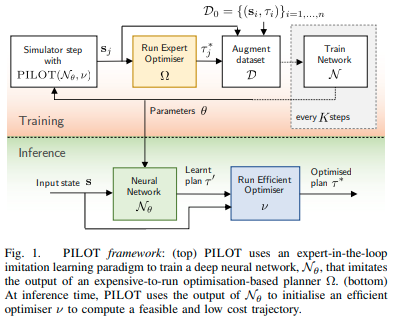
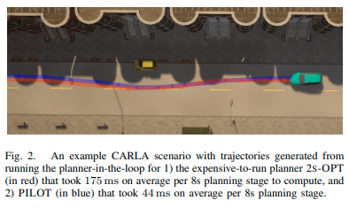
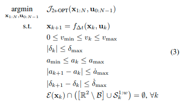
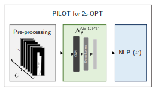
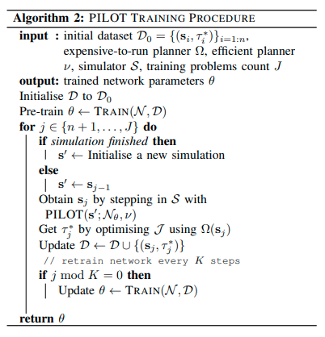
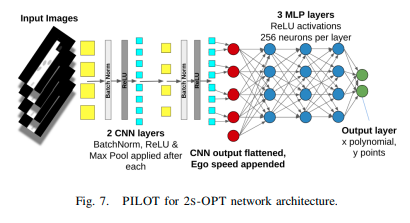
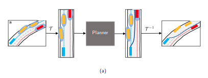
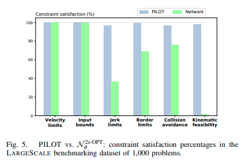
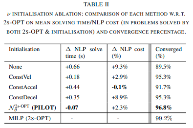
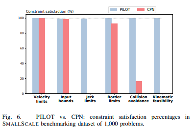

# PILOT: Efficient Planning by Imitation Learning and Optimisation for Safe Autonomous Driving

Henry Pulver , Francisco Eiras†, Ludovico Carozza, Majd Hawasly , Stefano V. Albrecht and Subramanian Ramamoorthy

* [arxiv 8 Mar 2021](https://arxiv.org/pdf/2011.00509.pdf)

## どんなもの？

安全な自動運転のための、模倣ネットワークとネットワークの計画を修正するオプティマイザで構成されるプランニングフレームワーク(PILOT, Planning by Imitation Learning and Optimisation at Training time)を提案する。最適化ベースのモーションプランニングは安全でスムーズかつ快適な計画を計算できる一方で、その計算コストの効率が問題になる。深層模倣学習により得られた素朴な軌跡は効率的な計算である一方で、その安全性を無視する可能性がある。PILOTはこれらのハイブリッドなアプローチである。最適な計画を模倣するネットワークにより効率的に初期の計画を計算する。そしてその計画を下に最適化を行うことにより、安全性や快適性を損なう可能性のあるOut-of-Distributionでの失敗や学習不足からのオンライン保護を行い、安全と快適性の要件を満たすことを保証する。PILOTはプランニングの質を損なうことなく、これまでの手法と比べて、実行時間の大幅な削減を達成する。

## 先行研究と比べてどこがすごい？何を解決したか？

* PILOTは最適な経路計画を模倣するネットワークを最適化問題の初期解として使用することで2s-OPT([Twostage optimization-based motion planner for safe urban driving](https://arxiv.org/abs/2002.02215))の7倍の実行時間の改善ができる。

* 同じく模倣学習を使い最適化を行う手法の[A fast integrated planning and control framework for autonomous driving via imitation learning](https://arxiv.org/abs/1707.02515)は推論時の最適化が短いホライゾンで制限されているが、PILOT内のオプティマイザはネットワークによって生成される長いホライゾンの軌道上で動作することができる。
* オプティマイザの目的関数を直接近似するネットワークを作成するConstrained Policy Nets([Safe and feasible motion generation for autonomous driving via constrained policy net](https://ieeexplore.ieee.org/document/8216790))は拘束条件を考慮した複雑な学習を行うが、PILOTで用いる模倣ネットワークの訓練は簡単である。

## 手法は？

次の３つが経路計画に利用できると仮定する。

1. 自車両、その他の道路上のユーザー（他車両や歩行者など）そして静的な関連する特徴
2. 目的地までのルートプラン
3. 予測モジュールから、その他の道路上のユーザーの予測軌道

この仮定の下、次の最適化問題を解くことで自車両の経路計画を得ることを目的とする。

$$f$$: discrete kinematic bicycle model、 $$x$$: 位置、ヘディングと速度、$$u=(a, \delta)$$: 制御入力、加速度とステアリング角、$$\mathcal{E}(x_k)$$: 時刻kに自車両が有しているエリア（そのコーナー点で近似）、$$\mathcal{B} \subset \mathcal{R}^2$$: 走行可能領域、$$S_k^{1:w}$$: 他のユーザー$$w$$が有している楕円体の領域である。

[Twostage optimization-based motion planner for safe urban driving](https://arxiv.org/abs/2002.02215)で提案された2s-OPTはこの最適化問題を２段階手法で解く方法である。簡単に言えば、2s-OPTはこの最適化問題を線形化しMixed-Integer Linear Programming(MILIP)ソルバーで解いた後、その解を初期解として改めてNonlinear Programing(NLP)オプティマイザで解く方法である。

PILOTはMILIPの代わりに、この最適化問題で得られる経路計画を出力する模倣ネットワーク$$\mathcal{N}_{\theta}^{2s-OPT}$$をNLPの初期解として使用する。

使われるネットワーク$$\mathcal{N}_{\theta}^{2s-OPT}$$は共変量シフトに適応するため、模倣学習の一つである[DAgger(Dataset Aggregation)](https://arxiv.org/abs/1011.0686)アルゴリズムで訓練される(Algorithm 2)。具体的には2s-OPTなどの実行が高価なプランナーで最適な解を作成し、初期データセットのもとでネットワークを訓練する。そして得られたネットワークを用いてPILOTアルゴリズムをシミュレーター環境内で動かし、新しいデータを得る。新しいデータを含めたデータセットでネットワークの重みを逐次更新する。

PILOTで使われるネットワーク$$\mathcal{N}_{\theta}^{2s-OPT}$$のアーキテクチャを示す。CNNへの入力は[ChauffeurNet](https://arxiv.org/pdf/1812.03079.pdf)のような入力であり、現在時刻から未来の時刻Nまでの情報が含まれている。各チャンネルは静的な道路のレイアウト、その時刻の道路上のユーザー、ルートプランである。これらの情報はpath-based座標系で表現されている。初期速度などのパラメータはCNNで抽出された特徴とともに後段のFCNに入力される。ネットワークは経路計画をN個の位置$$p_i^{\theta} = \{ (x_j, y_j) \}_{=1,....,N}$$として出力する。

損失関数は次式である。

$$\mathcal{L}_{\theta}(\mathcal{D}) = \frac{1}{nN} \sum_{i \in \mathcal{D}} \| p_i^{\theta} - p_i^{*} \| + \mu \| \theta \|^2$$

## どうやって有効だと検証した？

CALRA上で現実的な様々な条件を設定し提案手法を検証した。

### PILOTは2s-OPTと比べてどうであるか？

20604個のプランニング問題を生成し、PILOTと2s-OPTを実行した。実行時間および最適化関数のコスト値で比較した結果、PILOTの実行時間が明らかに早く、~86%の時間を短縮することがわかった。コスト値の比較に置いては、2s-OPTが良い結果となったが、大きな劣化はなく5%以内にとどまった。

### PILOT内で用いられる模倣ネットワーク単体$$\mathcal{N}_{\theta}^{2s-OPT}$$で用いたときの性能はどうか？ネットワークのみで十分ではないか？

上限速度を超えていないか、入力加速度は制限範囲内か、物体にぶつかっていないか、キネマティクス的に実行できるかなどの最適化問題の拘束条件をPILOTとネットワーク$$\mathcal{N}_{\theta}^{2s-OPT}$$が満たすかどうかの評価を行った。評価の結果、PILOTがネットワーク単体よりも拘束条件を満たしており、オプティマイザがネットワークの間違いを修正していることがわかる。

### 模倣ネットワーク単体$$\mathcal{N}_{\theta}^{2s-OPT}$$の代わりに簡単なヒューリスティックを使った場合はどうなるか？ネットワークは必要ではないのでは？

簡単なヒューリスティックを用いたときの実行時間およびコストの変動を評価した。その結果ネットワークによる初期軌道が最適化問題を解く実行時間を減らすことがわかる。

None: 軌道の各位置を(0, 0)にする、ConstVel: 車両のヘディングを保ったまま一定速度で走ったときの軌道、ConstAccel/ConstDecell: ConstVelと似ているが、所定の加速度速度を保ったときの軌道。

### PILOTは、目的関数を直接近似するネットワーク手法CPNと比べてどうか？

最適化問題の拘束条件を満たすかどうかを確認した。PILOTの性能が上回っている。

## 課題は？議論はある？

エキスパートを模倣するネットワークに改良の余地がある。よりよい初期化を行うために

* 初期化時にネットワークアンサンブルを使用し、それらのコストが最も低い計画を初期値として用いる
* Conditional imitation learning([Deep imitation learning for autonomous driving in generic urban scenarios with enhanced safety](https://arxiv.org/pdf/1903.00640.pdf))を用いる

ことが考えられる。

## 次に読むべき論文は？

未定

## 個人的メモ

* OODシーン対する明示的な評価（例えば実行時間）がないので、OODシーンに対して実行できるか不明である。[Can autonomous vehicles identify, recover from, and adapt to distribution shifts](../Can autonomous vehicles identify, recover from, and adapt to distribution shifts/summary.md)で提案されたような、OODシーンに明確に含まれているデータを使って評価したほうがいいのではないだろうか？
* 実行時間は減少したがConvergedの値が下がっていることは、影響がないのだろうか？

