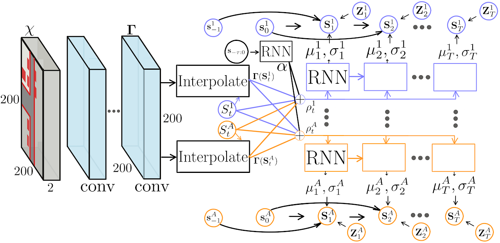
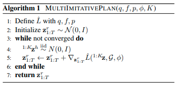
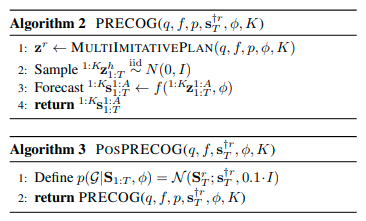
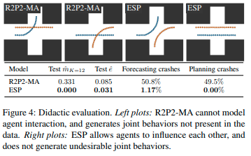
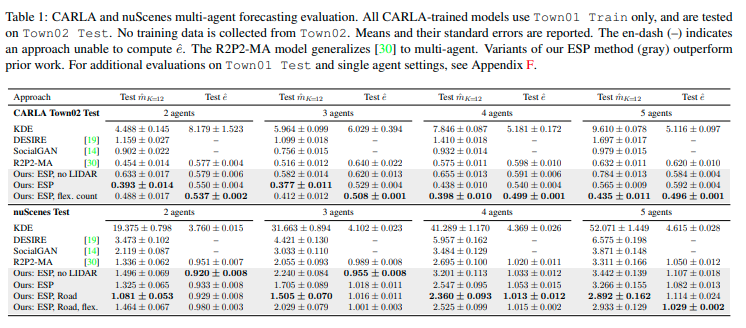
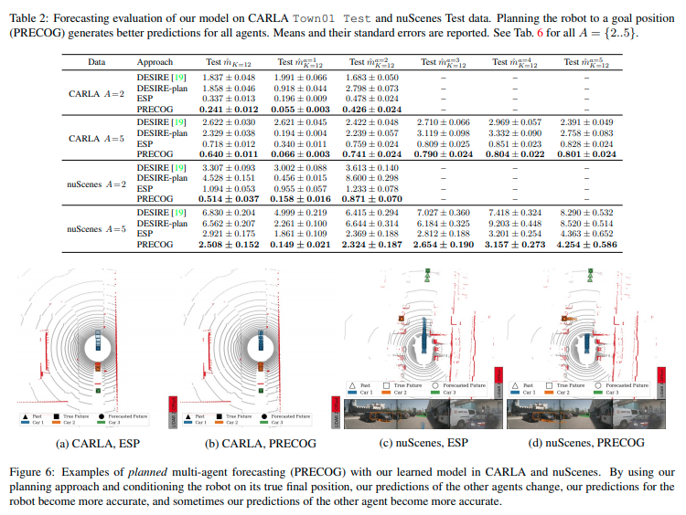

# PRECOG: PREdiction Conditioned On Goals in Visual Multi-Agent Settings

[Nicholas Rhinehart](https://arxiv.org/search/cs?searchtype=author&query=Rhinehart%2C+N), [Rowan McAllister](https://arxiv.org/search/cs?searchtype=author&query=McAllister%2C+R), [Kris Kitani](https://arxiv.org/search/cs?searchtype=author&query=Kitani%2C+K), [Sergey Levine](https://arxiv.org/search/cs?searchtype=author&query=Levine%2C+S)

* [ICCV 2019](https://openaccess.thecvf.com/content_ICCV_2019/html/Rhinehart_PRECOG_PREdiction_Conditioned_on_Goals_in_Visual_Multi-Agent_Settings_ICCV_2019_paper.html)
* [Arxiv 30 Sep 2019](https://arxiv.org/abs/1905.01296)　論文には多くの視覚的な結果がある
* [site](https://sites.google.com/view/precog)
* [github](https://github.com/nrhine1/precog)

## どんなもの？

可変数のエージェント（車両）の確率予測モデルを使った２つの予測方法ESP, PRECOGを提案する。

ESP(Estimating Social-forecast Probabilities)は単一エージェントを予測するR2P2([link](https://people.eecs.berkeley.edu/~nrhinehart/papers/r2p2_cvf.pdf), [summary](../R2P2: A reparameterized pushforward policy for diverse, precise generative path forecasting/summary.md))をマルチエージェント間の相互作用を考慮して一般化したもので、エージェント間の尤もらしい将来の相互作用を確率的に説明する。ESPでは各エージェントの状態をfactorized潜在変数によって表現する。マルチエージェントと時間にまたがる分解により、任意の時間における任意エージェントの状態を独立に変えたときの効果（確率）を調べることができる。つまり潜在変数をサンプリングすることで、マルチエージェントの相互作用を考慮した予測を行うことができる。

PRECOG(PREdition Conditioned On Goal)を提案する。PRECOGは次にエージェントが向かうべきゴールを条件に予測を行う初の生成型のマルチエージェント予測法である。これはまず自車両のエージェントにゴールを条件付け、マルチエージェント環境でのImitative Planning([arxiv](https://arxiv.org/pdf/1810.06544.pdf), [summary](../DEEP IMITATIVE MODELS FOR FLEXIBLE INFERENCE, PLANNING, AND CONTROL/summary.md))を行うことで、自車両がゴールに到達するようなエキスパートらしい軌道を求める。そしてその求めた軌道を使ってESP同様に他車両の予測を行う。これにより相互に作用する他のエージェントの軌道の予測精度を高めることができる。

## 先行研究と比べてどこがすごい？何を解決したか？

* ESPによる予測がエージェント間の相互作用を考慮する予測を実行できることを示した。
* ESPがCALRAおよびnuScenesのデータセットで３つのstate-of-artの方法の性能を上回ることを示した。
* PRECOG　(PREdition Conditioned On Goal)が相互に作用するその他のエージェントの予測性能が改善されることをCALRAおよびnuScenesのデータセットを使い示した。

## 手法は？

連続空間、離散時間、POMDPのマルチエージェントシステムを扱う。時刻$$t$$におけるすべてのエージェントの状態（位置）を$$\mathbf{S}_t \in \mathbb{R}^{A \times D}$$とする。$$A$$はエージェント個数、$$D=2$$である。変数を関数と区別するためにボールドで表す。大文字は確率変数であることを示す。$$\mathbf{S}_t^a$$は時刻$$t$$におけるエージェント$$a$$の2次元位置$$x,y$$を示す。$$t=0$$は現在時刻、$$a$$が$$r$$もしくは$$1$$の場合は自車両、$$h$$もしくは$$2\sim$$の場合は他車両を示す。添字を省略した$$\mathbf{S}$$は$$\mathbf{S}_{1:T}^{1:A} \in \mathbb{R}^{T \times A \times D}$$を示す。すなわちすべてのエージェントの予測である。$$\chi$$はLIDARや道路などの高次元の観測である。実験した例ではLIDARの情報を俯瞰図で表現した観測$$\chi= \mathbb{R}^{200 \times 200 \times 2}$$を使った。各グリッドの面積は$$0.5 m^2$$であり、地面の上と下にあるポイントの2ビンのヒストグラムである。各エージェントは$$\phi \doteq \{\mathbf{s}_{-\tau:0}, \chi \}$$にアクセスできる。

### Estimating Social-forecast Probability (ESP)

ESPはマルチエージェントのTステップ先のダイナミクスを確率的に予測する尤度ベースの生成モデル$$\mathbf{S} \sim q(\mathbf{S} \mid \phi;\mathcal{D})$$である。$$\mathcal{D}$$はデータセットである。複数のエキスパートの軌跡を模倣する確率モデル$$q(\mathbf{S} \mid \phi)$$ は遷移確率の積として表すことができる。

$$q(\mathbf{S} \mid \phi)= \prod_{t=1}^T q(\mathbf{S}_t \mid \mathbf{S}_{1:t-1}, \phi)$$

すべてのエージェントの遷移確率および各エージェントの遷移確率を正規分布と仮定するとエージェント$$a$$の状態遷移は次で表せる。

$$q(\mathbf{S}_t \mid \mathbf{S}_{1:t-1}, \phi)
= \prod_{a=1}^A
\mathcal{N}(\mathbf{S}_t^a ; \mu_t^a, \sigma_t^a{\sigma_t^a}^{\top})$$

$$\mathbf{S}_{t}^{a} = f(\mathbf{Z}_t^a) = \mu_{\theta}^a(\mathbf{S}_{1:t-1}, \phi) + \sigma_{\theta}^a(\mathbf{S}_{1:t-1}, \phi) \cdot \mathbf{Z}_t^a$$

ここで

* $$f(\cdot)$$は観測$$\phi$$および正規分布に従う潜在変数$$\mathbf{Z}_t^a$$から計画$$\mathbf{S}$$にワープする可逆かつ微分可能な関数

  invertible generative modelとしても知られる

* $$\mu_{\theta}^a(\cdot)$$および$$\sigma_{\theta}^a(\cdot)$$は状態$$\mathbf{S}_{t}$$の平均および標準偏差を出力するネットワーク関数

  パラメータ$$\theta$$はエキスパートの軌跡を模倣する確率モデル$$q(S \mid \phi;\mathcal{D})$$ の尤度を最大化して求める

* $$\mathbf{Z}_t$$ : 正規分布に従う潜在変数$$\mathbf{Z} \sim q_0 = \mathcal{N}(0, I)$$

である。ワープ関数$$f(\cdot)$$を用いた予測は次の通りである。

1. K個のすべてのエージェントの潜在変数$$^{1:K}\mathbf{z}$$をサンプリングする

    $$^{1:K}\mathbf{z}_{1:T}^{1:A} \overset{iid}{\sim} \mathcal{N}(0, I)$$

2. 潜在空間から状態へワープする

   $$^{1:K}\mathbf{s}_{1:T}^{1:A} \leftarrow f(^{1:K}\mathbf{z}_{1:T}^{1:A}, \phi) $$

### ESPのネットワークアーキテクチャ

エージェントが２個の場合のESPのアーキテクチャを示す。

観測$$\phi \doteq \{\mathbf{s}_{-\tau:0}, \chi \}$$は

* $$\mathbf{s}_{-\tau:0}$$は過去から現在までの位置
* $$\chi = \mathbb{R}^{200 \times 200 \times 2}$$はLiDARの情報を俯瞰図で表現したもの(各グリッドの面積は$$0.5 m^2$$であり、地面の上と下にあるポイントの2ビンのヒストグラムである)

である。観測$$\mathbf{s}_{-\tau:0}$$と$$\chi$$はそれぞれ空間特徴を抽出するCNNと過去位置をエンコードするRNN(GRU)で処理され、$$\alpha$$と$$\Gamma$$が計算される。その後以下の手順によって時刻$$1:T$$までの予測$$\mathbf{S}_{1:T}^{1:A}$$を行う。

1. 各エージェントの位置$$\mathbf{s}_{t-1}^a$$に対応した$$\Gamma$$サブピクセルにもどづいてbilinear補間された特徴ベクトルを取り出す

   $$\Gamma^{1:A} = \{ \Gamma(\mathbf{s}_{t-1}^1),..., \Gamma(\mathbf{s}_{t-1}^A) \}$$

2. 各エージェントで以下の実行し状態$$\mathbf{s}_{t}^a$$を計算する

   1. $$\alpha$$、$$\mathbf{s}_{t}^{1:A}$$、$$\Gamma^{1:A}$$をConcatenationして特徴$$p_{t-1}$$を作る

   2. 予測用のRNN(GRU)は特徴$$p_{t-1}$$から位置の平均を直接出力する代わりにベレの方法([wiki](https://en.wikipedia.org/wiki/Verlet_integration))のステップ$$m_{\theta}$$と位置の標準偏差$$\sigma_{\theta}$$を出力する

   3. ベレの方法から位置の平均を計算する

      $$\mu = 2 \mathbf{s}_{t-1}^a - \mathbf{s}_{t-2}^a + m_{\theta}$$

   4. 状態$$\mathbf{s}_{t}^a$$を計算する

      $$\mathbf{s}_{t}^a = \mu_{\theta} + \sigma_{\theta} \cdot \mathbf{z}_t^a$$

3. 1.2を時刻Tまで繰り返す。

エージェント数がデータ中に変わるようなデータに対しては、最大エージェント数$$A_{train}$$を決めた上でRNNの入力にマスク$$M \in \{ 0, 1 \} ^{A_{train}}$$を使うことで欠落しているエージェントを表現する。

### PREdiction Conditioned On Goals (PRECOG)

エージェント（自車両）が設定したゴールに止まるような制御変数$$z^{r*}$$を次の最適化問題を解いた(プランニングした)あと、ESPと同様に自車両以外のエージェントの潜在変数をサンプリングし、予測を行う。

$$\DeclareMathOperator*{\argmin}{arg\,min}
\DeclareMathOperator*{\argmax}{arg\,max}
\begin{equation}
z^{r *} = \argmax_{z^r} \mathcal{L}(\mathbf{z}^r, \mathcal{G}, \phi)
\end{equation}$$

ここで$$\mathcal{L}(\mathbf{z}^r, \mathcal{G})$$はマルチエージェントの模倣尤度とゴールの尤度の和の期待値

$$\mathcal{L}(\mathbf{z}^r, \mathcal{G}, \phi) = \mathbb{E}_{\mathbf{Z}^h} \left[ \log q(f(\mathbf{Z}) \mid \phi) + \log q(\mathcal{G} \mid f(\mathbf{Z}), \phi) \right]$$

である。$$q(\mathcal{G} \mid f(\mathbf{Z}), \phi)$$は例えば自車両が向かうべき位置$$\mathbf{b} \in \mathbb{R}^D$$を使って$$\mathcal{N}(\mathbf{w}; \mathbf{S}_T^r, \epsilon \mathbf{I})$$をとすることができる。

実際にこの最適化問題は解くときは他エージェントの潜在変数$$\mathbf{Z}^h$$を正規分布$$\mathcal{N}(0, \mathbf{I})$$からサンプリングしてゴールの尤度による重み付き平均を行うことで期待値の近似を行う。すなわち、近似された期待値は

$$\hat{\mathcal{L}}(^{1:K}\mathbf{z}, \mathcal{G}, \phi)
= \frac{1}{K} \sum_{k=1}^{K}
\log(
p(f(^k\mathbf{z}) \mid \phi)
p(\mathcal{G} \mid f(^k\mathbf{z}), \phi)
)$$

である。だたし$$^{1:K}\mathbf{z}$$はサンプリングされたK個のすべてのエージェントの潜在変数である。$$^{k}\mathbf{z}$$は最適化問題で求める制御変数$$\mathbf{z}^r$$と$$k$$番目のサンプリング$$^k\mathbf{z}^h$$が含まれている。$$^k\mathbf{z}=[\mathbf{z}^r, ^k\mathbf{z}^h]$$。この近似期待値をつかったGradient Ascentによるアルゴリズムは次のとおりである。

またこの制御変数$$z^{r*}$$を使った予測は次のとおりである

## どうやって有効だと検証した？

### ESPの検証

**Didactic Example**：簡素な交差点でのナビゲーションを使い予測性能を検証した。交差点には人間（オレンジ）およびロボット（青）が存在する。人間は常に4ステップ直進し、その後50％の確率で直進もしくは左折のどちらかの行動を行う。ロボットは交差点を直進しようと試みるが、人間が左折した場合には譲歩する。このナビゲーションシミュレーションを行い、データセットを作成し、ESPおよびベースラインR2P2-MAの訓練を行った。学習したそれぞれの方法の予測結果を次に示す。R2P2-MAはエージェント間の相互作用を考慮していないので、50％の確率で人間とロボットがぶつかる予測を行った。これに対してESPは人間の決定に対して反応していることを示している。

**CARLAおよびnuScenes**：CALRAおよびnuScenesから10個のデータセットを作成し、予測性能を検証した。すべてのデータセットでESPの性能がベースラインを上回った。ESP, no LIDARは観測からLIDARを除いたESPである。ESP, RoadはnuScenesの道路領域をバイナリマスクで表現した入力を追加したESPである。ESP, flexは、可変数のエージェントに対応するESPである。

### PRECOGの検証

CALRAおよびnuScenesを使い、PRECOGの予測性能を検証した。Planingを行うエージェントは自車両のみとした。各データの最後の位置をゴールとして設定した。ゴールの尤度は正規分布を用いた。[DESIRE](https://arxiv.org/abs/1704.04394)およびESPと比較した結果は次のとおりである。ゴールを設定して予測することにより、自車両$$\hat{m}_K^1$$だけでなく、その他の予測が向上することを示している。エージェントは近い順からソーティングされており、一番近い車両$$\hat{m}_K^2$$が最も影響を受けていることも示している。

## 課題は？議論はある？

将来の方向としては、自車両だけでなく他車両のゴールを条件付けた予測がある。

## 次に読むべき論文は？

[Contingencies from Observations: Tractable Contingency Planning with Learned Behavior Models](../Contingencies from Observations: Tractable Contingency Planning with Learned Behavior Models/summary.md)

## 個人的メモ

* アーキテクチャ詳細はAppendix Cに紹介されており大きなアーキテクチャの構造の変化はないものの、MLPの追加などいくつかの変更点がある。
* Didactic Exampleの行動パターン数を増やして検証したい。。例えば自車両は人間が左折したとき、人間もしくはロボットが交差点前に止まるパターン
* 上に書かれているとおり、PRECOGの検証で、自車両だけでなく、観測範囲内の道路の構造上到達しうる点も加えて検証をしたい。