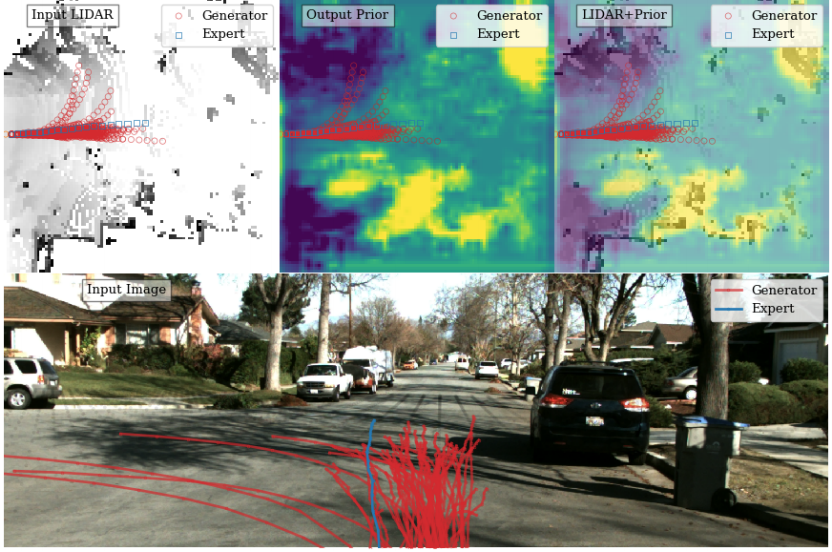

# [日本語まとめ] R2P2: A reparameterized pushforward policy for diverse, precise generative path forecasting

[Nicholas Rhinehart](https://people.eecs.berkeley.edu/~nrhinehart/), Kris M. Kitani, and Paul Vernaza

* [ECCV 2018](https://link.springer.com/chapter/10.1007/978-3-030-01261-8_47)
* [link 1](https://people.eecs.berkeley.edu/~nrhinehart/papers/r2p2_cvf.pdf)
* [supplementary](https://people.eecs.berkeley.edu/~nrhinehart/papers/r2p2-supp-camera-ready.pdf)
* [site](https://people.eecs.berkeley.edu/~nrhinehart/R2P2.html#:~:text=R2P2%3A%20A%20ReparameteRized%20Pushforward%20Policy%20for%20Diverse%2C%20Precise%20Generative%20Path%20Forecasting,-Nicholas%20Rhinehart%2C%20Kris&text=The%20method%20learns%20a%20policy,paths%20likely%20under%20the%20data)
* [blog post (third-party)](https://medium.com/analytics-vidhya/game-of-modes-diverse-trajectory-forecasting-with-pushforward-distributions-315b1b30d5e6)
* [summarized](http://cvrr.ucsd.edu/ece285sp20/files/r2p2.pdf)

## どんなもの？

LIDARの点群や道路の情報が埋め込まれた俯瞰図から自動運転車両の将来の軌道を予測する方法R2P2 (ReRarameterized Pushforward Policy)を提案する。R2P2は予測の多様性と精度の両立を目的とし、生成モデルを対称クロスエントロピーによって訓練を行う。しかし、対称クロスエントロピーはそのままでは評価できないため、訓練データの分布の近似と基本分布の押し出し（pushforward)による将来軌道の分布のモデル化を行う。具体的にはある時刻における車両の状態への遷移確率を正規分布として仮定し、正規分布からサンプルされる潜在変数と前時刻までの状態から次の時刻の状態への変換を自己回帰型の微分可能かつ可逆なReparametrization Trickの形式で定義する。

## 先行研究と比べてどこがすごい？何を解決したか？

これまで車両の軌道$$x$$を予測する生成モデル$$q_{\pi}$$の学習に、生成モデル$$q_{\pi}$$の訓練データ$$p$$に対するクロスエントロピーが使われてきた。

$$H(p, q_{\pi})= \mathbb{E}_{x \sim p} - \log q_{\pi} (x \mid \phi)$$

しかし、次の図の一番右図に示すように$$H(p, q_{\pi})$$は訓練データの分布のいくつかのモードを生成モデルがカバーしなかった場合には高い値を示すが、中央の図に示すように低品質のサンプルの生成には低い値を示す損失である。したがって$$H(p, q_{\pi})$$を使って学習を行ったモデルは低品質のサンプルを生成してしまう。

この問題を解決する方法として、$$H(p, q_{\pi})$$と逆の性質を持つ訓練データ$$p$$のモデル$$q_{\pi}$$に対するクロスエントロピー$$H(q_{\pi}, p)$$を組み合わせた対称クロスエントロピーを学習に使う方法がある。しかし、$$H(q_{\pi}, p)$$は微分不可能であるため、そのままでは評価することができないという別の問題がある。

$$\displaystyle \underset{\pi}{\min}
\underbrace{\mathbb{E}_{x \sim p} - \log q_{\pi} (x \mid \phi)}_{H(p, q_{\pi})} +
\beta \underbrace{\mathbb{E}_{x \sim q_{\pi}} - \log \tilde{p} (x \mid \phi)}_{H(q_{\pi}, \tilde{p})} \\$$

本論文は$$H(q_{\pi}, p)$$の評価を可能にする将来軌道の分布の新しいモデリング方法を提案し、実験でその有効性を示した。また他の$$H(q_{\pi}, p)$$を評価する方法であるREINFORCEより低分散の勾配推定値を計算することができることを示した。

## 手法は？

### Pushforward distribution modeling

基本分布$$q_0 = \mathcal{N}(0, I)$$に従う潜在変数$$z \sim q_0$$から将来軌道の分布のサンプルに変換する微分可能かつ可逆なシミュレーター$$g_{\pi}(z; \phi) : \mathbb{R}^{T \times 2} \rightarrow \mathbb{R}^{T \times 2}$$を定義すると、基本分布$$q_0$$とシミュレータ$$g_{\pi}(z; \phi)$$、$$q_{\pi}(x \mid \phi)$$の間に次のことが成り立つ。

$$q_{\pi}(x \mid \phi) = q_0(g_{\pi}^{-1}(z; \phi)) |\det J_{g_{\pi}}(g_{\pi}^{-1}(z; \phi))|^{-1} $$

ただし$$J_{g_{\pi}}(g_{\pi}^{-1}(z; \phi))$$はヤコビアンである。この式を使うと対称クロスエントロピーは基本分布$$q_0$$とシミュレータ$$g_{\pi}(z; \phi)$$を用いた計算可能な式に変形できる。

$$\begin{eqnarray}
H(p, q_{\pi}) + H(q_{\pi}, \tilde{p})
 &=& \mathbb{E}_{x \sim p} - \log q_{\pi} (x \mid \phi) +
\beta \mathbb{E}_{x \sim q_{\pi}} - \log \tilde{p} (x \mid \phi) \\
  &=& \mathbb{E}_{x \sim p} - \log \frac{q_0(g_{\pi}^{-1}(z; \phi))}{|\det J_{g_{\pi}}(g_{\pi}^{-1}(z; \phi))|} +
\mathbb{E}_{x \sim q_{\pi}} - \log \tilde{p} (q_0(g_{\pi}^{-1}(z; \phi)))
\end{eqnarray}$$

ただし、$$\tilde{p}$$は訓練データ分布を近似したネットワークである。都合上、後のセクションで説明する。

### シミュレーターの設計

本論文は初期時刻から前時刻$$t-1$$までの車両の位置$$x_{t-1}$$および観測$$\phi$$から次の時刻の車両の位置$$x_t$$への遷移確率を正規分布として仮定する。

$$q(x \mid \phi) = \prod_{i=1}^{N} q(x_t \mid \psi_t)$$

$$q_{\pi}(x_t \mid \psi_t) = \mathcal{N}(x_t; \mu = \mu_t^{\pi}(\psi;\theta), \sigma = \sigma_t^{\pi}(\psi;\theta) )$$

ただし$$\psi_t = [x_{1:t-1}, \phi]$$、$$\mu_t^{\pi}(\psi_t; \theta)$$および$$\sigma_t^{\pi}(\psi_t; \theta)$$は状態$$x_t$$の平均および標準偏差を出力する微分可能な方策(policy)、$$\theta$$は方策のパラメータである。

この仮定を使うと、微分可能かつ$$\sigma_t^{\pi} = 0$$を除き可逆な自己回帰型シミュレーターが次式で定義できる。

$$x_t \triangleq  \mu_t^{\pi}(\psi_t; \theta) + \sigma_t^{\pi}(\psi_t; \theta)z_t$$

$$\left[ g_{\pi}^{-1}(x) \right]_t = z_t = \sigma_t^{\pi}(\psi_t; \theta)^{-1}(x_t - \mu_t^{\pi}(\psi_t; \theta))$$

また通常高次元のヤコビアン行列式の計算量は多い（$$O(N^3)$$）が、自己回帰型の特性によりこのシミュレーターのヤコビアンは非常に簡素な次の式で表される。

$$\log |\det J_{g_{\pi}}(g_{\pi}^{-1}(z; \phi))| = \sum_t \log | \det(\sigma_t^{\pi}(\psi_t; \theta)) |$$

したがってクロスエントロピー$$H(p, q_{\pi})$$は最終的に次の式に変形できる。

$$\begin{eqnarray}H(p, q_{\pi}) &=&  \mathbb{E}_{x \sim p} - \log \frac{q_0(g_{\pi}^{-1}(z; \phi))}{|\det J_{g_{\pi}}(g_{\pi}^{-1}(z; \phi))|} \\  &=& \mathbb{E}_{x \sim p} - \log q_0(g_{\pi}^{-1}(z; \phi)) + \sum_t \log | \det(\sigma_t^{\pi}(\psi_t; \theta)) |\end{eqnarray}$$

### シミュレーターのネットワークアーキテクチャ

本論文では３つのネットワークアーキテクチャを提案する。

#### R2P2 Linear

R2P2 Linearは１層の線形レイヤで構成されるネットワークである。

$$\hat{\mu}_t^{\pi}(\psi_t) = A h_t + b_0,\qquad S_t^{\pi}(\psi_t) = B h_t + b_1$$

$$\newcommand{\expm}{\mathop{\mathrm{expm}}\nolimits}
\mu_t^{\pi}(\psi_t) = 2 x_t - x_{t-1} + \hat{\mu}_t^{\pi}(\psi_t), \qquad
\sigma_t^t = \expm(S_t + S_t^{\top})$$

$$A,B, b_0, b_1$$はパラメータ、$$h_t = [ x_{t-H:t-1} ] \in \mathbb{R}^{2H}$$はH個の過去の位置からなるベクトルである。また位置の平均$$\mu_t^{\pi}(\psi_t)$$はベレの方法を用いて計算する。位置の標準偏差$$\sigma_t^t$$は標準偏差が正定行列となるように$$S_t \in \mathbb{R}^{2 \times 2}$$に行列指数関数expmを適用して求める。

#### R2P2 Field

R2P2 FieldはCNNで構成されるネットワークである。ボクセル化されたLIDARの点群および各セルの道路のクラス情報$$M \in \mathbb{R}^{H_{map} \times W_{H_{map}} \times C}$$を受け取り、特徴マップ$$O \in \mathbb{R}^{H_{map} \times W_{H_{map}} \times 6}$$を計算する。計算される特徴マップの各グリッドは$$\hat{\mu}_t^{\pi}(\psi_t)$$および$$S_t$$の６つの値を出力する。この特徴マップから車両の位置に対応する特徴ベクトルをbilinear補間することで位置の平均および標準偏差を求める。

#### R2P2 RNN

R2P2 RNNはLinearとFieldを組み合わせた構造を持つ。センサー情報を入力とするCNNと過去の経路を入力とするGRU-RNNを使って、特徴マップと自動運転行動の特徴量を計算する。そして計算された特徴マップと行動の特徴量を予測用のGRU-RNNで再帰的に受け取り、位置の平均および標準偏差を出力する。

### 訓練データの分布の近似

各時間における自車両の位置を図に示すようなL個のセルで構成される有限領域内で離散化することで訓練データの分布の近似を行う。

近似した訓練データの分布は次式で表すことができる。

$$\tilde{p} = \prod_t \tilde{p}_c(x_t \mid \phi)$$

ただし$$\tilde{p}_c$$は時刻$$t$$におけるL個の位置に対応するカテゴリカルな分布を出力するネットワークである。３層のCNNで構成される。ボクセル化されたLIDARの点群俯瞰図および道路のクラス情報$$M \in \mathbb{R}^{H_{map} \times W_{H_{map}} \times C}$$を入力として、各グリッドの確率を出力する。ロジスティクス回帰を使って$$\tilde{p}_c$$の訓練を行う。

$$\min_{\tilde{p}} \mathbb{E}_{x \sim p} - \log \tilde{p} (x \mid \phi)
= \max_{\theta} \mathbb{E}_{x \sim p}
\sum_t - C_{\theta}(x_t, \phi)
-\log \sum_{y=1}^{L}\exp -C_{\theta}(y, \phi)$$

## どうやって有効だと検証した？

### シンプルなシミュレーション

交差点上で自動車がランダムに直進、右折、左折するシミュレーター上でR2P2 RNNを訓練し、検証を行った。検証結果が次のとおりである。図よりR2P2 RNNは他の手法の性能を上回っていることが確認できる。

### CaliForecastingとKITTIデータセット

作成したデータセットCaliForecastingおよびKITTI上でR2P2を検証した。検証結果が次の図である。検証結果より比較手法と比べてR2P2の結果が良いことがわかる。これはR2P2のアプローチが有効性であることを示す。また$$\beta=0$$のR2P2に対して$$\beta>0$$のR2P2の性能が良いことから、$$H(q_{\pi}, \tilde{p})$$を使った学習がサンプルの質をあげること示している。

## 課題は？議論はある？

なし

## 次に読むべき論文は？

[N. Rhinehart, R. McAllister, K. Kitani, and S. Levine, “PRECOG: prediction conditioned on goals in visual multi-agent settings,” in Proceedings of the IEEE International Conference on Computer Vision, 2019, pp. 2821–2830.](../PRECOG: PREdiction Conditioned On Goals in Visual Multi-Agent Settings/summary.md)

[Nicholas Rhinehart, Rowan McAllister, and Sergey Levine. Deep imitative models for flexible inference, planning, and control. arXiv preprint arXiv:1810.06544, 2018. 2, 4, 13](../DEEP IMITATIVE MODELS FOR FLEXIBLE INFERENCE, PLANNING, AND CONTROL/summary.md)

[Casas, S., Gulino, C., Suo, S., Urtasun, R.: The importance of prior knowledge in precise multimodal prediction. In: IROS (2020)](../The Importance of Prior Knowledge in Precise Multimodal Prediction/summary.md)

## 補足

なし

## 個人的メモ

なし