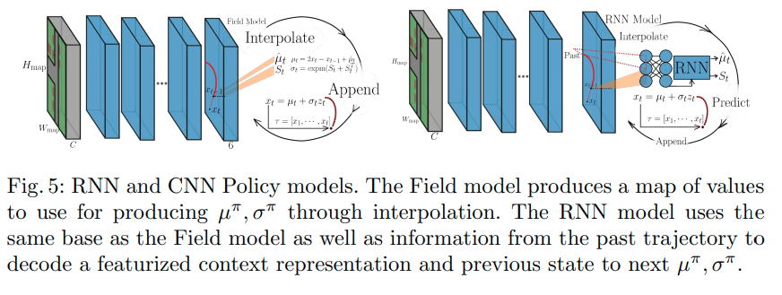

# (WIP)R2P2: A reparameterized pushforward policy for diverse, precise generative path forecasting

[Nicholas Rhinehart](https://people.eecs.berkeley.edu/~nrhinehart/), Kris M. Kitani, and Paul Vernaza

* [ECCV 2018](https://link.springer.com/chapter/10.1007/978-3-030-01261-8_47)
* [link 1](https://people.eecs.berkeley.edu/~nrhinehart/papers/r2p2_cvf.pdf)
* [supplementary](https://people.eecs.berkeley.edu/~nrhinehart/papers/r2p2-supp-camera-ready.pdf)
* [site](https://people.eecs.berkeley.edu/~nrhinehart/R2P2.html#:~:text=R2P2%3A%20A%20ReparameteRized%20Pushforward%20Policy%20for%20Diverse%2C%20Precise%20Generative%20Path%20Forecasting,-Nicholas%20Rhinehart%2C%20Kris&text=The%20method%20learns%20a%20policy,paths%20likely%20under%20the%20data)
* [blog post (third-party)](https://medium.com/analytics-vidhya/game-of-modes-diverse-trajectory-forecasting-with-pushforward-distributions-315b1b30d5e6)
* [summarized](http://cvrr.ucsd.edu/ece285sp20/files/r2p2.pdf)

## どんなもの？

LIDARや画像などの情報が埋め込まれた俯瞰図から自車両の運動を時空空間上のパスの分布として予測する方法R2P2を提案する。確率的軌道予測において以前から過小評価されていた多様性(データ分布のすべてのモードを含む)と精度(データに有り得そうな)のバランスに関する問題を提起し、その問題を対称化されたクロスエントロピーを最適化することで多様性と精度と確保した予測を行えることを示す。対称化されたクロスエントロピーを計算するために、単純な基本分布の押し出し（pushforward)としてモデル分布をパラメータ化する。この最適化を行うことで既存の模倣学習の性能を強化することを示した。またKITTIおよび提案する現実世界のデータセットCaliForecasting上でstate-of-artの手法と比較して提案手法の優位性を示した。

## 先行研究と比べてどこがすごい？何を解決したか？

これまで車両の軌道$$x$$を予測する生成モデル$$q_{\pi}$$の学習に単一のモデル$$q_{\pi}$$の訓練データ$$p$$に対するクロスエントロピー$$H(p, q_{\pi})$$が使われてきた（図の上の段）。

$$H(p, q_{\pi})= \mathbb{E}_{x \sim p} - \log q_{\pi} (x \mid \phi)$$

このクロスエントロピーは訓練データの分布のいくつかのモードを生成モデルがカバーしなかった場合に高い損失を与える（上の段の一番右）が、一方で低品質のサンプルの生成には低い損失を与える（上の段の真ん中）。つまり$$H(p, q_{\pi})$$はモードを学習することはできるが、低品質のサンプルを生成してしまう問題がある。そこで逆の性質をもつ訓練データ$$p$$のモデル$$q_{\pi}$$に対するクロスエントロピー$$H(q_{\pi}, p)$$と同時に使うことで低品質のサンプルを生成を抑制することができる。しかし訓練データ$$p$$のモデル$$q_{\pi}$$に対する$$H(q_{\pi}, p)$$は評価することでできない。

* この論文では以前から使用されてる軌道予測メトリックの欠陥を明らかにし、予測における生成モデルの訓練データに対するクロスエントロピーの多様性と精度の問題について言及した。

* 多様性と精度の両方を目指して対称クロスエントロピーを使った学習を行うための予測生成モデリング方法および訓練データ分布の近似方法 R2P2 (ReRarameterized Pushforward Policy)を提案する。

* 提案したR2P2はstart-of-artの模倣学習による方法の性能を凌駕した。

## 手法は？

自車両の２次元位置で構成された予測する軌跡を$$x \in \mathbb{R}^{T \times 2}$$とする。観測はLIDARの俯瞰図および各グリッドのセマンティクスセグメンテーションのクラス情報から得られる特徴量であり、$$\phi$$とする。

対称クロスエントロピーを使った学習を行うための予測生成モデルおよび訓練データ分布の近似$$\tilde{p}$$から以下の対称クロスエントロピーを最小化することでモデルの学習を行う。

$$\displaystyle min_{\pi}
\underbrace{\mathbb{E}_{x \sim p} - \log q_{\pi} (x \mid \phi)}_{H(p, q_{\pi})} +
\beta \underbrace{\mathbb{E}_{x \sim q_{\pi}} - \log \tilde{p} (x \mid \phi)}_{H(q_{\pi}, \tilde{p})} \\$$

$$\beta$$は多様性と精度のトレードオフを調整するための重みである。

以下は生成モデルと訓練データ分布の近似について示す。

### Pushforward distribution modeling

軌道予測モデル$$q(x \mid \phi)$$ はchain ruleにより遷移確率$$q_{\pi}(x_t \mid \psi_t)$$の積として表すことができる。$$\psi_t = [x_{1:t-1}, \phi]$$は時刻1からt-1までの位置および観測$$\phi$$である。$$q_0$$を正規分布と仮定すると遷移確率は

$$q_{\pi}(x_t \mid \psi_t) = \mathcal{N}(x_t; \mu = \mu_t^{\pi}(\psi;\theta), \sigma = \sigma_t^{\pi}(\psi;\theta) )$$

となる。$$\mu_t^{\pi}(\psi_t; \theta)$$、$$\sigma_t^{\pi}(\psi_t; \theta)$$は状態$$x_t$$の平均および標準偏差を出力する微分可能な方策(policy)、$$\theta$$は方策のパラメータである。ここでReparameterization Trickを使うと

$$x_t \triangleq f(z_t; \psi_t, \theta) = \mu_t^{\pi}(\psi_t; \theta) + \sigma_t^{\pi}(\psi_t; \theta)z_t$$

と表せる。$$z$$は基本分布$$q_0$$に従うノイズ$$z \sim q_0$$である。$$\sigma_t^{\pi} = 0$$を除き、関数$$f(\cdot)$$は可逆かつ微分可能である。関数$$f(\cdot)$$を繰り返して適用することで軌道を予測することができる。すなわちノイズ$$z \sim q_0$$および観測$$\phi$$から予測軌道$$x$$へマップするような微分可能かつ可逆なシミュレータ

$$g_{\pi}(z; \phi) : \mathbb{R}^{T \times 2} \rightarrow \mathbb{R}^{T \times 2}$$

として表現できる。これは$$g_{\pi}$$の$$q_0$$による押し出し(pushforward)として知られる。

$$q_{\pi}(x \mid \phi) = q_0(g_{\pi}^{-1}(z; \phi)) |\det J_{g_{\pi}}(g_{\pi}^{-1}(z; \phi))|^{-1} $$

$$J_{g_{\pi}}(g_{\pi}^{-1}(z; \phi))$$はヤコビアンである。

シミュレータ$$g_{\pi}$$を使って訓練データ$$p$$に対するクロスエントロピーは以下のように変形できる。

$$\begin{eqnarray}
H(p, q_{\pi}) &=& \mathbb{E}_{x \sim p} - \log q_{\pi} (x \mid \phi) \\
  &=& \mathbb{E}_{x \sim p} - \log \frac{q_0(g_{\pi}^{-1}(z; \phi))}{|\det J_{g_{\pi}}(g_{\pi}^{-1}(z; \phi))|}
\end{eqnarray}$$

ここでシミュレータ$$g_{\pi}$$は可逆であるのでヤコビアンは三角行列となる。すなわちヤコビアンの行列式は対角成分の積となるので簡単に計算できる。

$$\left[ g_{\pi}^{-1}(x) \right]_t = z_t = \sigma_t^{\pi}(\psi_t; \theta)^{-1}(x_t - \mu_t^{\pi}(\psi_t; \theta))$$

$$\log |\det J_{g_{\pi}}(g_{\pi}^{-1}(z; \phi))| = \sum_t \log | \det(\sigma_t^{\pi}(\psi_t; \theta)) |$$

つまり

$$\begin{eqnarray}
H(p, q_{\pi}) &=&  \mathbb{E}_{x \sim p} - \log \frac{q_0(g_{\pi}^{-1}(z; \phi))}{|\det J_{g_{\pi}}(g_{\pi}^{-1}(z; \phi))|} \\
  &=& \mathbb{E}_{x \sim p} - \log q_0(g_{\pi}^{-1}(z; \phi)) + \sum_t \log | \det(\sigma_t^{\pi}(\psi_t; \theta)) |
\end{eqnarray}$$

### 方策モデリング　ネットワークアーキテクチャ

具体的な方策のネットワークアーキテクチャを示す。

### 訓練データの分布の近似

In progress

## どうやって有効だと検証した？

In progress

## 課題は？議論はある？

In progress

## 次に読むべき論文は？

[N. Rhinehart, R. McAllister, K. Kitani, and S. Levine, “PRECOG: prediction conditioned on goals in visual multi-agent settings,” in Proceedings of the IEEE International Conference on Computer Vision, 2019, pp. 2821–2830.](../PRECOG: PREdiction Conditioned On Goals in Visual Multi-Agent Settings/summary.md)

[Nicholas Rhinehart, Rowan McAllister, and Sergey Levine. Deep imitative models for flexible inference, planning, and control. arXiv preprint arXiv:1810.06544, 2018. 2, 4, 13](../DEEP IMITATIVE MODELS FOR FLEXIBLE INFERENCE, PLANNING, AND CONTROL/summary.md)

## 個人的メモ

なし