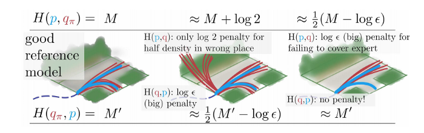
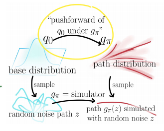
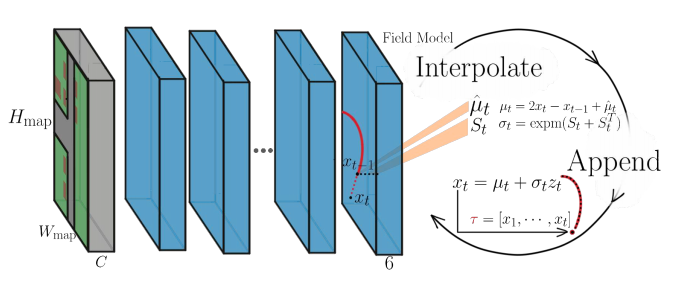
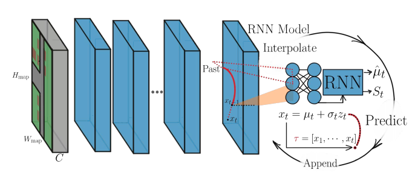
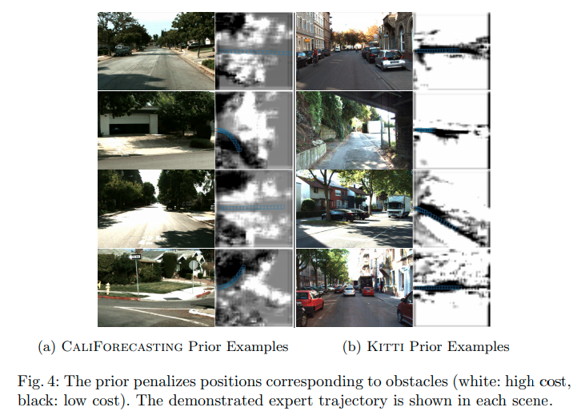
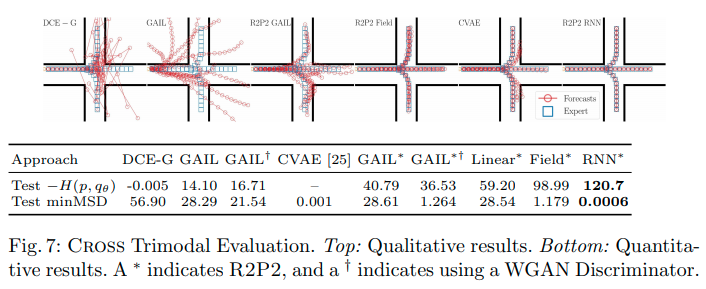
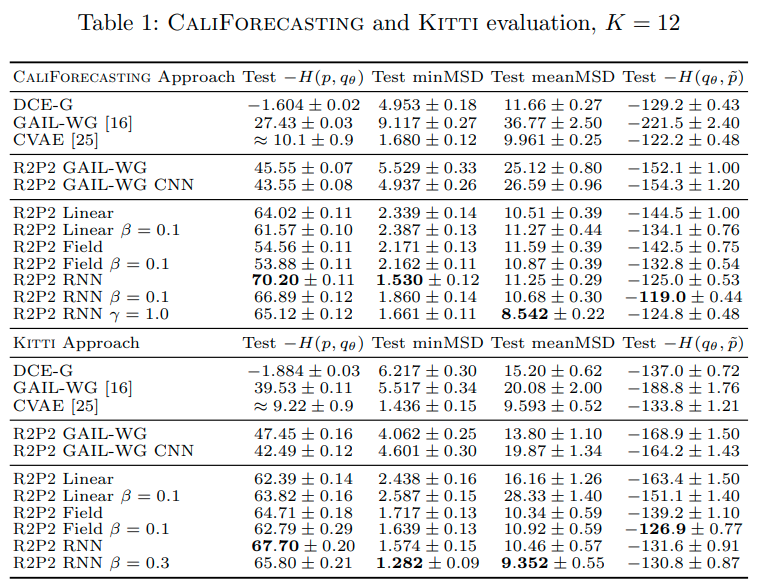

# R2P2: A reparameterized pushforward policy for diverse, precise generative path forecasting

[Nicholas Rhinehart](https://people.eecs.berkeley.edu/~nrhinehart/), Kris M. Kitani, and Paul Vernaza

* [ECCV 2018](https://link.springer.com/chapter/10.1007/978-3-030-01261-8_47)
* [link 1](https://people.eecs.berkeley.edu/~nrhinehart/papers/r2p2_cvf.pdf)
* [supplementary](https://people.eecs.berkeley.edu/~nrhinehart/papers/r2p2-supp-camera-ready.pdf)
* [site](https://people.eecs.berkeley.edu/~nrhinehart/R2P2.html#:~:text=R2P2%3A%20A%20ReparameteRized%20Pushforward%20Policy%20for%20Diverse%2C%20Precise%20Generative%20Path%20Forecasting,-Nicholas%20Rhinehart%2C%20Kris&text=The%20method%20learns%20a%20policy,paths%20likely%20under%20the%20data)
* [blog post (third-party)](https://medium.com/analytics-vidhya/game-of-modes-diverse-trajectory-forecasting-with-pushforward-distributions-315b1b30d5e6)
* [summarized](http://cvrr.ucsd.edu/ece285sp20/files/r2p2.pdf)

## どんなもの？

LIDARや画像などの情報が埋め込まれた俯瞰図から自車両の運動を時空空間上のパスの分布として予測する方法R2P2 (ReRarameterized Pushforward Policy)を提案する。確率的軌道予測において以前から過小評価されていた多様性(データ分布のすべてのモードを含むこと)と精度(データに有り得そうななこと)のバランスに関する問題を提起する。その問題を対称化されたクロスエントロピーを最適化することで解決できること（多様性と精度と確保した予測を行えること）を示す。対称化されたクロスエントロピーを計算するために単純な基本分布の押し出し（pushforward)としてモデル分布をパラメータ化する。R2P2は既存の模倣学習による軌道予測の性能を上回ることを示す。

## 先行研究と比べてどこがすごい？何を解決したか？

これまで車両の軌道$$x$$を予測する生成モデル$$q_{\pi}$$の学習にモデル$$q_{\pi}$$の訓練データ$$p$$に対するクロスエントロピー$$H(p, q_{\pi})$$が使われてきた（図の上の段）。

$$H(p, q_{\pi})= \mathbb{E}_{x \sim p} - \log q_{\pi} (x \mid \phi)$$

このクロスエントロピーは訓練データの分布のいくつかのモードを生成モデルがカバーしなかった場合に高い損失を与える（上の段の一番右）。一方で低品質のサンプルの生成には低い損失を与える（上の段の真ん中）。つまり$$H(p, q_{\pi})$$はデータ分布のモードを学習することはできるが、低品質のサンプルを生成してしまう問題がある。そこで逆の性質をもつ訓練データ$$p$$のモデル$$q_{\pi}$$に対するクロスエントロピー$$H(q_{\pi}, p)$$と同時に使うことで低品質のサンプルを生成を抑制することができる。しかし訓練データ$$p$$のモデル$$q_{\pi}$$に対する$$H(q_{\pi}, p)$$は直接評価することでできない。

* この論文では以前から使用されてる軌道予測メトリックの欠陥を明らかにし、予測における生成モデルの訓練データに対するクロスエントロピーの多様性と精度の問題について言及した。

* 多様性と精度の両方を目指して対称クロスエントロピーを使った学習を行うための予測生成モデリング方法および訓練データ分布の近似方法 R2P2を提案する。

* 提案したR2P2はstart-of-artの模倣学習による方法の性能を凌駕した。

## 手法は？

自車両の２次元位置で構成された予測する軌道を$$x \in \mathbb{R}^{T \times 2}$$とする。軌道の予測のためLIDARの俯瞰図およびセマンティクスセグメンテーションのクラス情報$$M \in \mathbb{R}^{H_{map} \times W_{H_{map}} \times C}$$が得られるとする。提案するR2P2は予測生成モデルおよび訓練データ分布の近似$$\tilde{p}$$から次の対称クロスエントロピーを最小化することでモデルの学習を行う。

$$\displaystyle min_{\pi}
\underbrace{\mathbb{E}_{x \sim p} - \log q_{\pi} (x \mid \phi)}_{H(p, q_{\pi})} +
\beta \underbrace{\mathbb{E}_{x \sim q_{\pi}} - \log \tilde{p} (x \mid \phi)}_{H(q_{\pi}, \tilde{p})} \\$$

$$\phi = (x_{-H+1:0}, M)$$は観測であり、$$\beta$$は多様性と精度のトレードオフを調整するための重みである。以下は生成モデルのモデリングと訓練データ分布の近似方法について示す。

### Pushforward distribution modeling

軌道予測モデル$$q(x \mid \phi)$$ はchain ruleにより遷移確率$$q_{\pi}(x_t \mid \psi_t)$$の積として表すことができる。遷移確率を正規分布と仮定すると

$$q_{\pi}(x_t \mid \psi_t) = \mathcal{N}(x_t; \mu = \mu_t^{\pi}(\psi;\theta), \sigma = \sigma_t^{\pi}(\psi;\theta) )$$

と表せる。$$\psi_t = [x_{1:t-1}, \phi]$$は時刻1からt-1までの位置および観測$$\phi$$である。$$\mu_t^{\pi}(\psi_t; \theta)$$、$$\sigma_t^{\pi}(\psi_t; \theta)$$は状態$$x_t$$の平均および標準偏差を出力する微分可能な方策(policy)、$$\theta$$は方策のパラメータである。ここでReparameterization Trickを使うと

$$x_t \triangleq f(z_t; \psi_t, \theta) = \mu_t^{\pi}(\psi_t; \theta) + \sigma_t^{\pi}(\psi_t; \theta)z_t$$

と表せる。$$z$$は基本分布$$q_0$$に従うノイズ$$z \sim q_0 = \mathcal{N}(0, I)$$である。$$\sigma_t^{\pi} = 0$$を除き、関数$$f(\cdot)$$は可逆かつ微分可能である。ノイズから関数$$f(\cdot)$$を繰り返して適用することでマルチモーダルな軌道を予測することができる。すなわちノイズ$$z \sim q_0$$および観測$$\phi$$から予測軌道$$x$$へマップするような微分可能かつ可逆なシミュレータ

$$g_{\pi}(z; \phi) : \mathbb{R}^{T \times 2} \rightarrow \mathbb{R}^{T \times 2}, \qquad
\left[ g_{\pi}^{-1}(x) \right]_t = z_t = \sigma_t^{\pi}(\psi_t; \theta)^{-1}(x_t - \mu_t^{\pi}(\psi_t; \theta))$$

を定義することができる。これは$$g_{\pi}$$の$$q_0$$による押し出し(pushforward)として知られる。このシミュレータを使って生成モデルは次のように表せる。

$$q_{\pi}(x \mid \phi) = q_0(g_{\pi}^{-1}(z; \phi)) |\det J_{g_{\pi}}(g_{\pi}^{-1}(z; \phi))|^{-1} $$

ここで$$J_{g_{\pi}}(g_{\pi}^{-1}(z; \phi))$$はヤコビアンである。

#### クロスエントロピーの変形

シミュレータ$$g_{\pi}$$を使って訓練データ$$p$$に対するクロスエントロピーは以下のように変形できる。

$$\begin{eqnarray}
H(p, q_{\pi}) &=& \mathbb{E}_{x \sim p} - \log q_{\pi} (x \mid \phi) \\
  &=& \mathbb{E}_{x \sim p} - \log \frac{q_0(g_{\pi}^{-1}(z; \phi))}{|\det J_{g_{\pi}}(g_{\pi}^{-1}(z; \phi))|}
\end{eqnarray}$$

ここでシミュレータ$$g_{\pi}$$は可逆であるのでヤコビアンは三角行列となる。すなわちヤコビアンの行列式は対角成分の積となるので簡単に計算できる。

$$\log |\det J_{g_{\pi}}(g_{\pi}^{-1}(z; \phi))| = \sum_t \log | \det(\sigma_t^{\pi}(\psi_t; \theta)) |$$

すなわちクロスエントロピーは

$$\begin{eqnarray}
H(p, q_{\pi}) &=&  \mathbb{E}_{x \sim p} - \log \frac{q_0(g_{\pi}^{-1}(z; \phi))}{|\det J_{g_{\pi}}(g_{\pi}^{-1}(z; \phi))|} \\
  &=& \mathbb{E}_{x \sim p} - \log q_0(g_{\pi}^{-1}(z; \phi)) + \sum_t \log | \det(\sigma_t^{\pi}(\psi_t; \theta)) |
\end{eqnarray}$$

となる。すなわちシミュレータを設定することである軌跡の尤度を推定することやその推定した尤度を最大化することで生成モデルの学習が可能になる。

### 方策モデリング　ネットワークアーキテクチャ

具体的な方策のネットワークアーキテクチャを３つ示す。

### R2P2 Linear

R2P2 Linearは１層の線形レイヤで構成されるネットワークである。

$$\hat{\mu}_t^{\pi}(\psi_t) = A h_t + b_0,\qquad S_t^{\pi}(\psi_t) = B h_t + b_1$$

$$\newcommand{\expm}{\mathop{\mathrm{expm}}\nolimits}
\mu_t^{\pi}(\psi_t) = 2 x_t - x_{t-1} + \hat{\mu}_t^{\pi}(\psi_t), \qquad
\sigma_t^t = \expm(S_t + S_t^{\top})$$

$$A,B, b_0, b_1$$はパラメータ、$$h_t = [ x_{t-H:t-1} ] \in \mathbb{R}^{2H}$$はH個の過去の位置からなるベクトルである。位置の平均$$\mu_t^{\pi}(\psi_t)$$はベレの方法を用いて計算される。位置の標準偏差$$\sigma_t^t$$は標準偏差が正定行列となるように$$S_t \in \mathbb{R}^{2 \times 2}$$に行列指数関数expmを適用して求める。

### R2P2 Field

R2P2 FieldはCNNで構成される。CNNはLIDARおよびセマンティクスセグメンテーションのクラス情報$$M \in \mathbb{R}^{H_{map} \times W_{H_{map}} \times C}$$を受け取り、特徴マップ$$O \in \mathbb{R}^{H_{map} \times W_{H_{map}} \times 6}$$を出力する。特徴マップの各グリッドは$$\hat{\mu}_t^{\pi}(\psi_t)$$および$$S_t$$の６つの値を出力する。この特徴マップから車両の位置に対応する特徴ベクトルをbilinear補間することで位置の平均および標準偏差を求める。

### R2P2 RNN

R2P2 RNNはLinearとFieldを組み合わせた構造を持つ。LIDARおよびセマンティクスセグメンテーションのクラス情報はCNNとbilnear補間、過去の位置は過去の位置の特徴を求めるGRU-RNNによってそれぞれ処理される。予測用のGRU-RNNは両方の特徴ベクトルを受け取り、位置の平均および標準偏差を出力する。

### 訓練データの分布の近似

訓練データに含まれる自車両の各軌道の時間tにおける位置をL個のセルで構成される有限領域内で離散化することでデータ分布の近似を行う。このとき訓練データ分布の近似$$\tilde{p}$$は

$$\tilde{p} = \prod_t \tilde{p}_c(x_t \mid \phi)$$

と表せる。$$\tilde{p}_c$$はL個の位置に対応するカテゴリカルな分布である。$$\tilde{p}$$は３層のCNNで構成され、LIDARの俯瞰図およびセマンティクスセグメンテーションのクラス情報$$M \in \mathbb{R}^{H_{map} \times W_{H_{map}} \times C}$$を取得し、各グリッドの確率を出力する。$$\tilde{p}_c$$は生成モデルの訓練前にロジスティクス回帰を使って独立に訓練を行う。

$$\min_{\tilde{p}} \mathbb{E}_{x \sim p} - \log \tilde{p} (x \mid \phi)
= \max_{\theta} \mathbb{E}_{x \sim p}
\sum_t - C_{\theta}(x_t, \phi)
-\log \sum_{y=1}^{L}\exp -C_{\theta}(y, \phi)$$

$$C_{\theta} = -\log \tilde{p}_c$$はパラメータ$$\theta$$に関する空間的なコストと考えることができる。$$\tilde{p}$$の出力は以下のようになる。

## どうやって有効だと検証した？

### シンプルな例

簡単な交差点における自車両の予測問題を使って検証した。自車両は交差点に向かって走行した後、直進、右折、左折のいずれか一つの行動を行う。R2P2 RNNは他の手法の性能を上回った。

### CaliForecastingとKITTIデータセット

作成したデータセットCaliForecastingおよびKITTIで検証した。R2P2 Linear、R2P2 Field、R2P2 RNNは$$\beta=0$$である。R2P2のアプローチが有効なことを示している。また$$\beta=0$$のR2P2に対して$$\beta>0$$のR2P2の性能が良いことから、訓練データ分布の近似$$\tilde{p}$$をつかったモデル$$q_{\pi}$$に対する$$H(q_{\pi}, \tilde{p})$$を使った学習がサンプルの質をあげること示している。

## 課題は？議論はある？

なし

## 次に読むべき論文は？

[N. Rhinehart, R. McAllister, K. Kitani, and S. Levine, “PRECOG: prediction conditioned on goals in visual multi-agent settings,” in Proceedings of the IEEE International Conference on Computer Vision, 2019, pp. 2821–2830.](../PRECOG: PREdiction Conditioned On Goals in Visual Multi-Agent Settings/summary.md)

[Nicholas Rhinehart, Rowan McAllister, and Sergey Levine. Deep imitative models for flexible inference, planning, and control. arXiv preprint arXiv:1810.06544, 2018. 2, 4, 13](../DEEP IMITATIVE MODELS FOR FLEXIBLE INFERENCE, PLANNING, AND CONTROL/summary.md)

## 補足

なし

## 個人的メモ

なし