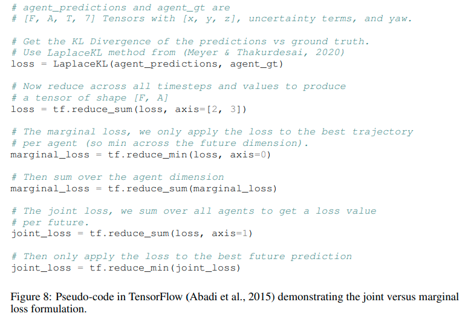

# SCENE TRANSFORMER: A UNIFIED ARCHITECTURE FOR PREDICTING MULTIPLE AGENT TRAJECTORIES

[Jiquan Ngiam](https://arxiv.org/search/cs?searchtype=author&query=Ngiam%2C+J), [Benjamin Caine](https://arxiv.org/search/cs?searchtype=author&query=Caine%2C+B), [Vijay Vasudevan](https://arxiv.org/search/cs?searchtype=author&query=Vasudevan%2C+V), [Zhengdong Zhang](https://arxiv.org/search/cs?searchtype=author&query=Zhang%2C+Z), [Hao-Tien Lewis Chiang](https://arxiv.org/search/cs?searchtype=author&query=Chiang%2C+H+L), [Jeffrey Ling](https://arxiv.org/search/cs?searchtype=author&query=Ling%2C+J), [Rebecca Roelofs](https://arxiv.org/search/cs?searchtype=author&query=Roelofs%2C+R), [Alex Bewley](https://arxiv.org/search/cs?searchtype=author&query=Bewley%2C+A), [Chenxi Liu](https://arxiv.org/search/cs?searchtype=author&query=Liu%2C+C), [Ashish Venugopal](https://arxiv.org/search/cs?searchtype=author&query=Venugopal%2C+A), [David Weiss](https://arxiv.org/search/cs?searchtype=author&query=Weiss%2C+D), [Ben Sapp](https://arxiv.org/search/cs?searchtype=author&query=Sapp%2C+B), [Zhifeng Chen](https://arxiv.org/search/cs?searchtype=author&query=Chen%2C+Z), [Jonathon Shlens](https://arxiv.org/search/cs?searchtype=author&query=Shlens%2C+J)

* [arxiv](https://arxiv.org/abs/2106.08417)

## どんなもの？

自動運転の運動計画の分野では、自動運転のタスクが1つの学習システムで達成することは難しいと考えられてきた。そのため過去の行動から運動の予測をエージェントごとに行い、その結果を使って自動運転の運動計画を行う方法が多く研究されている。しかし予測と計画は独立することは適切ではない。現実世界では車や歩行者などの様々なエージェントが互いに影響し合い、多様に行動しているからである。独立した予測に基づく計画は将来起こるエージェント間の相互作用を表現できないことが問題である。そのため予測と計画を同時に行うことが必要となってきている。

動的な環境でマルチエージェントの運動を予測することは自動運転を行うために必須である。運動予測タスクは大きく分けてMarginal PredictionとJoint Predictionの２つに分類される。Marginal Predictionはエージェントごとに独立した運動を予測する方法である。したがってエージェント同士が衝突するなど競合が発生する。Joint Predictionは相互作用を含めたマルチエージェントの行動を同時に予測する方法である。Marginal predictionのスコアは他の車両の経路とは独立した経路の尤度を示すのに対してJoint Predictionのスコアはすべての車の経路で構成されるシーン全体の尤度を示す。Joint Predictionのタスクは最近Waymoのデータセットに追加された。

この論文は自動運転システムにおける運動予測と運動計画を統合を目的として、マルチエージェントの運動予測を行うモデルScene Transformerを提案する。Scene Transformerはマルチエージェントの時系列データをシークエンスとして扱い、Transformerで処理するモデルである。Scene TransformerはBERTで使われたMasked Language Modelと同様に入力された時系列データのマスクされた部分を予測する。このマスキング戦略によってScene Transformerにマスクをどう与えるかで様々な予測タスクを行うことができる。たとえば次のタスクである。

* ある時刻から時刻Tまでの運動を予測するMP(Motion Prediction）
* 自動運転車両（AV）の運動を既知としてその他のエージェントの運動を予測するCMP(Conditional Motion Prediction)
* 自動運転車両の時刻Tにおける状態を条件として運動を予測する GCP(Goal Conditioned Prediction)

Scene Transformerの入力および出力では、すべてのエージェントの位置を関心のあるエージェントを中心とした座標系で表現する。このScene-centric表現によりモデルを変更せず損失を変更するだけでMarginal PredictionとJoint Predictionの異なる運動予測を行うように訓練することができる。またScene TransformerはTransformerベースのモデルであるためエージェントの順序に対してpermutation equivariantの性質を持つ。

## 先行研究と比べてどこがすごい？何を解決したか？

Scene-centric表現、エージェントに対するpermutation equivariantなモデル、シークエンスのマスキング戦略を組み合わせたモデルScene Transformerを提案し、様々なエージェントの行動予測タスクを統合できることを示した。Agroverse, Waymoのデータセット上でMarginal PredictionとJoint Predictionの両方のタスクでstate-of-artを達成した。

## 手法は？

Scene Transformerは大半のレイヤーはTransformerからなるencoder-decoderベースのアーキテクチャのモデルである。Scene Transformerの処理は次の3つのステージで構成される。

1. エージェントの時系列データおよび道路データを高次元空間に埋め込む
2. エージェントや道路データの間の相互作用をエンコードする
3. 複数の将来シーンをデコードし、またその確率スコアを計算する

### 高次元空間への埋め込み

エージェントの時系列データを$(A, T, D_a)$の３次元のテンソルで表現し、2層のMLPをつかって後段のTransformerで扱う$(A, T, D)$の特徴量に変換する。$A$はエージェント数、$T$はタイムステップ数、$D_a$はエージェントの位置、ヘディング、幅、長さ、高さ、速度、およびOnehotエンコードされたエージェントの人や車などのタイプを連結した特徴量の数である。

道路のデータはレーンや停止線などの静的なものと、信号機などの物理的な位置は静的であるが、その状態が時間で変化する動的なものを別々に埋め込みを行う。静的な道路データは最大２０個のノードからなるポリラインの集まり、つまり道路グラフで表した後、小さなPointNetを使ってポリラインごとの特徴量を計算する。入力する特徴量はノード位置やOnehotエンコードされたノードのタイプを含む。動的な道路データは物体ごとに位置やOnehotエンコードされたノードのタイプ、Onehotエンコードされた動的な状態を特徴量として$(G_d, T, D_d)$の３次元のテンソルで表現し、2層のMLPを使い高次元への埋め込みを行う。$G_d$は動的データの物体の数である。

エージェントの時系列データおよび道路データの埋め込みの際、その物体の位置およびヘディングは関心のエージェントを中心とした座標系で表現する。エージェントの時系列データおよび道路のデータが存在しない場合、０埋めを行う。またSinusoidal positional embeddingsを時系列データに適用する。

### Transformerによるエンコード

$(A, T, D)$のエージェントの特徴量をAttentionする率直な方法としてエージェントと時間をまとめてATの次元でSelf-Attentionする方法があるが、Scene Transformerはエージェントと時間の軸に分けてSelf-Attentionを行う。このFactorized Agents Self-Attentionを行うことで計算負荷を減らし、ポジションエンコーディングなしでまったく同じ特徴量を持つエージェントを区別することができる。時間とエージェントの間で交互にSelf-Attentionを繰り返し、時間的な運動の滑らかさとエージェントの依存関係の両方を捉える。その後、道路データとCross Attentionを行い、運動の予測に関連のある道路データを抽出する。

### 複数の将来のデコード

$F$個の異なる将来を出力するため、エンコーダーで計算した$(A+1, T+1, D)$の特徴量をF回コピーし、$(F, A+1, T+1, D)$の特徴量を作成する。そして個々の将来を識別するため、F次元のOnehotエンコーディングを連結し、$(F, A+1, T+1, D+F)$の特徴量を作成する。その後、MLPを適用して特徴量の次元を$(F, A+1, T+1, D)$に削減する。この特徴量に対してエンコーダー同様に時間とエージェントの間で交互にAttentionを繰り返す。その後、MLPを適用し、F個の将来をデコードする。

デコードした$F$個の将来は$(F, A, T, 7)$のテンソルとなる。最初の3個の出力は、関心のエージェントを中心とした座標系で表されるエージェントの3次元位置である。次の３個の出力は各エージェントの各タイムステップのグランドトゥルースを中心とした座標系でのLaplace分布の不確かさである。つまりエージェントの縦方向、横方向、高さ方向に対しる不確かさである。最後の１個の出力はエージェントのヘディングである。

### 各経路の確率スコアの予測

各経路の確率スコアを計算するため、エンコーダーの最初のSelf-Attentionを行った後、特徴量の平均値を計算する。そしてその特徴量$(F, 1, 1, D)$を元の特徴量$(F, A, T, D)$に連結し、特徴量$(F, A+1, T+1, D)$を作成する。その後、デコーダーにて連結した特徴量をスライスし、２層のMLPを使ってF個の将来に対するlogitを出力する。

### JointおよびMarginal損失関数

$(F, A, T, 7)$のテンソルで表される$F$個の将来に対して各エージェントの位置のKLダイバージェンスとヘディングの損失$(F, A, T)$を計算する。

Joint Predictionを行うようにモデルを訓練するためは、計算した損失をエージェント及び時間の軸で損失を集約し、最も損失が低い将来に対してバックプロパゲーションを行う。一方、Marginal Predictionを行うように訓練するためには、時間の軸で損失を集約し、各エージェントの最も損失が低い将来に対してバックプロパゲーションを行う。

## どうやって有効だと検証した？

### Marginal Predictionの検証

Marginal Prediction用に訓練したScene TransformerはArgoverseとWaymo Open Motion Dataset(WOMD)の両方でstate-of-the-artの結果を達成した。WOMDではminADE, minFDEおよびMissRateの評価項目で最も良い結果が得られた。Argoverseのデータセットで訓練する際、最低６m以上移動したエージェントのみを対象とした。また確率スコアの損失にlabel smoothingを用いた。

### Joint Predictionの検証

Joint Prediction用に訓練したScene TransformerがWOMDのbaselineを簡単に上回ることを確認した。またMarginal Prediction用に訓練されたものよりJoint Prediction用に訓練されたものが良い結果を示した。MP、CMP、GCPの３つタスクをそれぞれ３分の一ずつの割合で訓練したモデルがMPのみ訓練したモデルと比較して性能が急激に落ちないことを確認した。

### Factorized Agents Self-Attentionの検証

Factorized Agents Self-Attentionのありなしで性能を比較した。Argoverse上で、Factorized Agents Self-Attentionのありモデルが、エージェントと時間に対して一度にAttentionを行ったモデルより、minADEの性能が良いことを確認した。

### GCPの定性的な結果

GCP（Goal Conditioned Prediction）をWOND上のいくつかのシナリオで行った結果を示す。図のカラーボックスは車両、線は道路グラフ、丸は予測した経路、スターは設定したゴールである。図では各シナリオの上下で異なるゴールを設定したときの予測経路を示している。

## 課題は？議論はある？

Coming soon

## 次に読むべき論文は？

Coming soon

## 補足

データアギュメンテーションとして、Scene−Centric表現した後、ランダムに$[-\pi/2, \pi/2]$の範囲で回転を行う。

