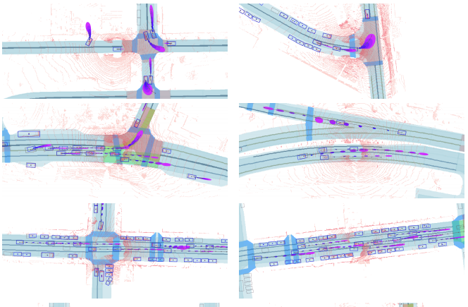
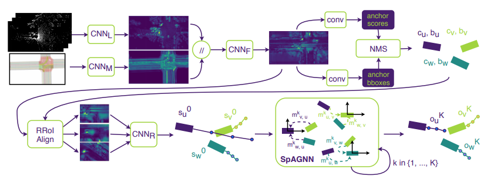
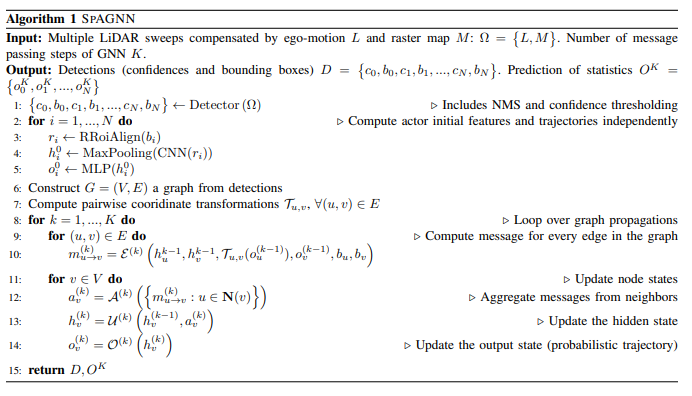
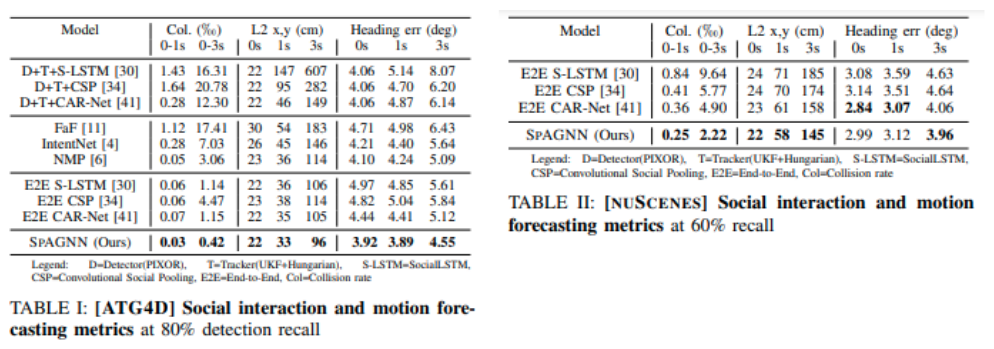
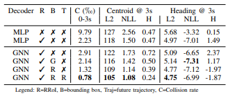

# [日本語まとめ] SPAGNN: Spatially-Aware Graph Neural Networks for Relational Behavior Forecasting from Sensor Data

[Sergio Casas](https://arxiv.org/search/cs?searchtype=author&query=Casas%2C+S), [Cole Gulino](https://arxiv.org/search/cs?searchtype=author&query=Gulino%2C+C), [Renjie Liao](https://arxiv.org/search/cs?searchtype=author&query=Liao%2C+R), [Raquel Urtasun](https://arxiv.org/search/cs?searchtype=author&query=Urtasun%2C+R)

* [arxiv](https://arxiv.org/pdf/1910.08233.pdf)
* [ieee](https://ieeexplore.ieee.org/document/9196697)

## どんなもの？

自動運転車の課題の一つは自動運転車が人間と同じ空間で動作することである。人間は他のドライバーと協調し多様な一連の行動を実行できるが、他のドライバーの運転の意図を推測することは難しいタスクである。このタスクを行うためには、過去の運転の行動や現在の道路構造や他のドライバーとの空間的関係、つまり相互作用を理解し予測する必要がある。

この論文は車などのアクターの行動を予測するモデルSpAGNN (spatially-aware graph neural network)を提案する。SpAGNNはアクター間の相互作用と空間上の関係を捉えたグラフニューラルネットワーク（GNN）である。各アクターをノードとしてノード間のメッセージ伝達によって、ノードの状態を更新することで予測経路を計算する。SpAGNNのノードは通常のGNNと異なり、アクターの特徴量だけでなく予測経路を陽に持つ。またノードの状態更新に用いるメッセージが状態に含まれる予測経路を使って計算される。この２つの点を行うこと（Spatial Awarenessを行うこと）で隣接したアクターの行動を考慮した合理的な予測が行うことができる。予測した経路は正規分布とフォンミーゼス分布のパラメータで表現される。

## 先行研究と比べてどこがすごい？何を解決したか？

SpAGNNはATG4DおよびnuScenceの検出も含めた予測タスクでstate-of-the-artの性能を上回った。またSpatial Awarenessを行うことで性能向上が行えることをAblation Studyを使って示した。

## 手法は？

図に示すように全体のシステムはバックボーン(図の上段左半分)、物体検出(図の上段右半分)、Rotated ROI Align(図の下段左半分、[arxiv](https://arxiv.org/abs/1703.01086))、SpAGNN(図の下段右半分)の４つのネットワークで構成される。各ネットワークの役割は次のとおりである。

| ネットワーク      | 役割                                                         |
| ----------------- | ------------------------------------------------------------ |
| バックボーン      | センサー情報から特徴マップを計算する                         |
| 物体検出          | 特徴マップからシーン中のアクターをバウンディングボックスとして検出する |
| Rotated ROI Align | 検出したアクターと特徴マップから41m×25mの領域に相当する特徴マップを取り出し、アクターの特徴量とする。またその特徴量から$$\text{CNN}_{\text{R}}$$を使い、初期の予測経路を計算する。 |
| SpAGNN            | 初期の予測経路とRotated ROI Alignで抽出した特徴量をノードの初期値としてSpAGNNにより最終的な予測経路を計算する。 |

全体の処理時間は0.1秒であり、予測経路は現在から３秒後までの経路を示す。

### バックボーンと物体検出

バックボーンおよび物体検出はPIXOR([arxiv](https://arxiv.org/abs/1902.06326))と同じものを使う。バックボーンは$$\text{CNN}_L$$、$$\text{CNN}_M$$、$$\text{CNN}_F$$の3つCNNで構成されるネットワークである。レーン、交差点、横断歩道、標識、信号の状態など様々な情報を17チャンネルに渡ってラスタライズされた道路データとボクセル化された過去１０回分のLIDARの点群が入力である。

物体検出は２つのCNNヘッダーで構成されるネットワークである。物体検出ではConfidence map (背景 or アクター) $$c_i$$とバウンディングボックス$$b_i = (x, y, w, h, \sin(\theta), \cos(\theta))$$を計算する。No maximum suppressionを適用して信頼できるボックスをアクターとして検出する。

### Rotated ROI AlignとSpAGNN

経路予測アルゴリズムは大きく分けて初期化と更新の2つのステップで構成される。

* 2〜5行目：各アクターをノードとしてグラフのノードの状態を初期化する
* 8~14行目：ノードの状態を更新する（k回繰り返す）

#### ノードの状態初期化(2〜5行目)

前段の物体検出で検出したアクターの位置およびヘディングを中心にアクターの前31m、後ろ10m、左右12.5mの41m×25mに対応する範囲をRotated ROI Alignにより特徴マップから取り出す。抽出された特徴マップから4層のCNNとmaxpoolingを使って隠れ状態$$h_v^{(0)}$$を計算する。隠れ状態から2層のMLPを使い出力状態$$o_v^{(0)}$$を計算する。計算した隠れ状態および出力状態をグラフのノードの初期状態として用いる。

隠れ状態は512次元の特徴量、出力状態はウェイポイントで構成される予測経路である。予測経路のそれぞれのウェイポイントは2次元位置用の正規分布のパラメーター$$\mu_{x_v}^{(0)}, \mu_{y_v}^{(0)},\sigma_{x_v}^{(0)},\sigma_{y_v}^{(0)}$$、ヘディング用のフォンミーゼス分布のパラメータ$$\eta_v^{0},\kappa_v^{0}$$をもつ。これらのパラメーターはグローバル座標系ではなく、学習を簡単にするため最新の時刻におけるそのエージェントの座標系で表される。

#### ノードの状態更新(8~14行目)

グラフのすべてのエッジ間$$u \rightarrow v$$のメッセージ$$m_{u \rightarrow v}^{(k)}$$を3層MLP$$\mathcal{E}^{(k)}$$を使って計算する。3層MLP$$\mathcal{E}^{(k)}$$の入力として２つのノード$$u, v$$の隠れ状態と出力状態（予測経路）、バウンディングボックスの情報を用いる。この際、ネットワークが空間的な情報を効率的に学習するために、メッセージ先の座標系に変換してから入力する。その後、計算したメッセージからmax pooling$$\mathcal{A}^{(k)}$$を行いノードの特徴量$$a_v^{(k)}$$を計算する。また計算したノードの特徴量$$a_v^{(k)}$$からそれぞれGRU cell$$\mathcal{U}^{(k)}$$と2層のMLP$$\mathcal{O}^{(k)}$$を使い、隠れ状態$$h_v^{(k)}$$と出力状態$$o_v^{(k)}$$を更新する。実験では状態更新回数はK=3として固定し、計算効率を向上させる。

### 学習

SpAGNNを含むすべてのモデルをend-to-endで学習するための損失は物体検出損失と経路予測損失で構成される。検出に関する損失は次の２つの損失で構成される。

* 物体検出の分類ヘッドに対して正しいラベルとのバイナリークロスエントロピー損失
* 物体検出の回帰ヘッドに対して正しい物体の状態とのL1損失

バイナリークロスエントロピー損失を計算する際、hard negative mining（[reddit](https://www.reddit.com/r/computervision/comments/2ggc5l/what_is_hard_negative_mining_and_how_is_it/), [qiita](https://qiita.com/mshinoda88/items/9770ee671ea27f2c81a9#%E3%83%8F%E3%83%BC%E3%83%89%E3%83%8D%E3%82%AC%E3%83%86%E3%82%A3%E3%83%96%E3%83%9E%E3%82%A4%E3%83%8B%E3%83%B3%E3%82%B0hard-negative-mining)）を適用して、正負のデータの不均衡を改善する。また経路予測に関する損失は次に示すように予測経路に対する負の対数尤度を使う。

$$\begin{align}
\mathcal{L}_{nll} &=
\sum_{i=1}^{N} \sum_{t=1}^{T} \frac{1}{2} \log \left| \Sigma_{i,t} \right| +
\frac{1}{2} (x_{i,t} - \mu_{i,t})^{\text{T}} \Sigma_{i,t}^{-1} (x_{i,t} - \mu_{i,t}) \\ &-
\kappa_{i,t} \cos(\theta_{i,t} - \eta_{i,t}) +
\log (2 \pi I_0 (\kappa_{i,t}))
\end{align}$$

第１行目は２次元位置に対する２次元正規分布のNLLである。第２行目はヘディングに対する1次元のフォン・ミーゼス分布のNLLである。$$I_0$$は零次の変形ベッセル関数である。最適化手法はAdamを使う。

SpAGNNは前段の物体検出器の結果を元に予測を行う。学習初期は検出が良くないので、検出結果を元に予測ネットワークを学習すると、ネットワークのパラメータが悪い方向に導かれる可能性がある。そこで学習初期である10000回までは予測ネットワークの学習に真のエージェントのバウンディングボックスの情報を使う。

## どうやって有効だと検証した？

### 予測性能の比較

センサデータから環境中にいるアクターの検出を行い、検出したアクターの経路を予測するタスクでSpAGNNの性能を検証した。検証に当たって他の予測手法Social LSTM、Convolutional Social Pooling、CAR-Net、FaF、IntentNet、NMPと比較した。比較手法の内、検出器を持たない手法Social LSTM、Convolutional Social Pooling、CAR-Netに関してはSpAGNNと同じ検出器を使用した。

予測性能の評価方法としてcummative collision rate over timeおよび経路のセントロイドのL2距離、ヘディング誤差を使用した。特にcummative collision rate over timeは予測手法がエージェント間の相互作用を捉えているかかどうかを示す指標として有用である。またこれらのメトリックは検出した物体が正しい場合にのみ有効となる。つまり検出器のリコール率が予測の評価に関わってくる。比較手法およびSpAGNNで用いる検出器で検出された物体に対してコンフィデンススコアの閾値を設定し、閾値以下のコンフィデンススコアを持つ検出を省くことで、異なる検出器が同じリコール値で動作するようにすることで公平性を確保した。

ATG4DおよびnuScenes上での比較結果は次のとおりである。SPAGNNがほとんどのメトリックで最も良い性能を示した。この結果より検出と予測を一緒に行うこと、予測で相互作用を捉える利点を示している。

### Ablation Study

##### Study 1 Rotated ROI Alignの有効性

Rotated ROI Alignの代わりにFeature Indexingによる特徴マップからの抽出方法と比較することでRotated ROI Alignの有効性を評価した。またこの評価に当たって抽出方法のみを比べるため、提案モデルからSpAGNNを除いたモデルを使った。上記の表の１行目がFeature Indexingによる方法（R✗）、２行目がRotated ROI Alignを用いる方法（R✔）による結果である。Rotated ROI Alignを用いた方法が明らかに良いことがわかる。バックボーンが計算した特徴マップから車の位置に対応する１点の特徴ベクトルのみを抽出するFeature Indexingに比べてROIで抽出する利点があることがわかる。

##### Study 2 Spatial Awarenessの有効性

Spatial Awarenessを使った提案手法と以下の手法を比べることでSpatial Awarenessの有効性を調べた。

* Spatial Awarenessを全く行わず、SpAGNNの代わりに通常のGNNを使用したときのモデル(表の3行目)
* 3行目のモデルに対してメッセージ計算の際、隣接するアクターのバウンディングボックスの情報をつかったモデル。バウンディングはグローバル座標系で表現される。(表の4行目)
* 3行目のモデルに対してメッセージ計算の際、隣接するアクターのバウンディングボックスの情報をつかったモデル。バウンディングはそのアクターの座標系で表現される。(表の5行目)
* 5行目のモデルに対してメッセージ計算に経路を加えたモデル。提案しているSpAGNNである(表の6行目)

表より次のことがわかる。

* 3行目のモデルはGNN自体をもたない2行目のモデルと比較して性能の優劣がない。単なるGNNでは性能改善には繋がらないことを示している。
* 4行目のモデルは2,3行目のモデルと比較して性能が改善されている。メッセージ計算ににバウンディングボックスという空間の情報を加えることの有効性を示している。
* 5行目のモデルは4行目のモデルと比較してさらに性能が改善されている。グローバル座標系から局所座標系にすることの有効性を示している。
* 6行目は1~5行目のどのモデルよりも性能が良いことがわかる。メッセージ計算に相対的な座標系で表される経路を加えることの有効性を示している。

## 課題は？議論はある？

SpAGNNのモデルを次の点で拡張することが考えられる

* ひとつだけでなく複数の将来の結果を生成する
* 画像やレーダーなどの他のセンサーを使用する
* 車だけでなく歩行者や自転車などのエージェントの経路も含めて推論する

またモデル化の際に無視した時間方向の依存性を考慮することが考えられる。

## 次に読むべき論文は？

[Deep Structured Reactive Planning](../Deep Structured Reactive Planning/summary.md)

[Implicit Latent Variable Model for Scene-Consistent Motion Forecasting](../Implicit Latent Variable Model for Scene-Consistent Motion Forecasting/summary.md)

## 補足

### Gaussian MRFとGraph Neural Network

アクターの行動の確率的な予測方法としてGaussian MRFを用いる方法がある。この方法はあるシーン$$\Omega$$の条件のもとのマルチエージェントの将来の経路$$\{ s_1, \dots, s_N \}$$の同時確率多変量正規分布であると仮定して次のようにモデル化する。

$$p(s_1, \dots, s_N \mid \Omega) \propto \exp( \mathbf{s} ^\intercal \mathbf{A} \mathbf{s} + \mathbf{b} ^\intercal \mathbf{s})$$

各エージェントが相互に関係しあっている仮定すると同時確率は単項ポテンシャルエネルギー$$\phi_i (s_i, \Omega)$$とペアごとのポテンシャルエネルギー$$\psi_{ij} (s_i, s_j \Omega)$$を使って次のように変形できる。つまり各予測経路の確率変数をノードとした無向グラフで表現する。

$$p(s_1, \dots, s_N \mid \Omega) \propto
\prod_i \phi_i (s_i, \Omega) \prod_{ij} \psi_{ij} (s_i, s_j \Omega)$$

このモデルからエージェントが将来ある経路を実行する周辺確率$$p(s_i \mid \Omega)$$はGaussian Belief Propagation、つまりメッセージ伝達法で求めることができる。

一方でGNNはグラフを処理できる強力なモデルである。入力のグラフのサイズにモデルサイズが影響せず、ノード単体およびグラフレベルの両方でよい表現を学ぶ能力がある。GNNは与えられた初期グラフとノードの状態からのメッセージを伝達してノードの状態を更新する。仮にGNNのノードが正規分布の平均と精度行列であるとすると、GNNの処理はGaussian BPアルゴリズムに非常に近い処理となる。もっと言えばニューラルネットワークの持つ近似能力により、GNNはGaussian BPの一般系とみなすことができる。GNNはGausiann BPのように計算の収束を保証しないものの、GNNはバックプロパゲーションで訓練でき、例えば車のヘディング角など正規分布に従わないデータを処理できる。

## 個人的メモ

なし
