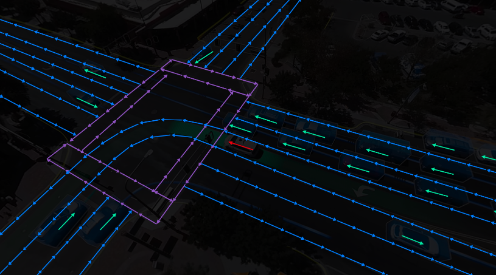
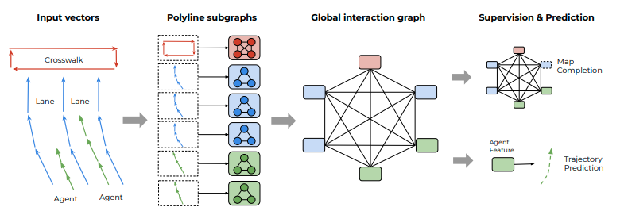
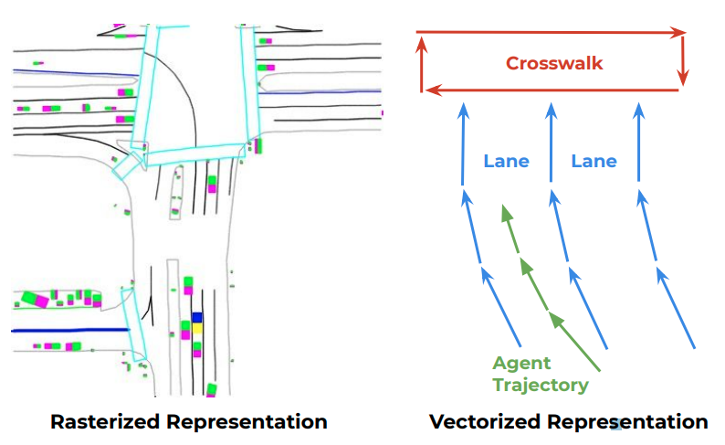
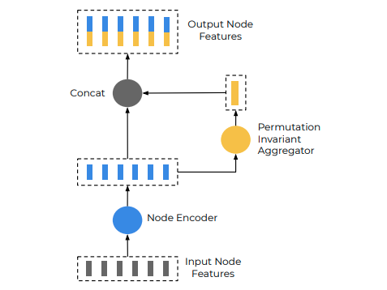

# [日本語まとめ] VectorNet: Encoding HD Maps and Agent Dynamics from Vectorized Representation

[Jiyang Gao](https://arxiv.org/search/cs?searchtype=author&query=Gao%2C+J), [Chen Sun](https://arxiv.org/search/cs?searchtype=author&query=Sun%2C+C), [Hang Zhao](https://arxiv.org/search/cs?searchtype=author&query=Zhao%2C+H), [Yi Shen](https://arxiv.org/search/cs?searchtype=author&query=Shen%2C+Y), [Dragomir Anguelov](https://arxiv.org/search/cs?searchtype=author&query=Anguelov%2C+D), [Congcong Li](https://arxiv.org/search/cs?searchtype=author&query=Li%2C+C), [Cordelia Schmid](https://arxiv.org/search/cs?searchtype=author&query=Schmid%2C+C)

* [Arxiv](https://arxiv.org/abs/2005.04259)
* [Blog "Predicting behavior to help the Waymo Driver make better decisions"](https://blog.waymo.com/2020/05/vectornet.html)
* [YouTube](https://www.youtube.com/watch?v=fM_exYBSWlA&t=2s)
* [VectorNet: Encoding HD Maps and Agent Dynamics from Vectorized Representation [Paper Explained]](https://www.youtube.com/watch?v=yJFtf-fz3WA)

## どんなもの？

道路上では車がレーンチェンジして、走行している前のスペースに入ってきたり、目の前に走っている自転車が突然曲がり、目の前のスペースを横切るようなシーンで溢れている。車や自転車、歩行者などの道路の利用者の意図を理解することが、Waymo Driverが安全な運転を行うために必要である。しかしながら道路の利用者の行動を予測することは難しい。精度の高い予測を行うためには道路の幅や形状、信号、標識など様々な道路の情報、交通ルールを理解する必要があるからである。加えて、他の利用者はいつも交通ルールを守るとは限らないことも要因のひとつである。

車や人などの道路上の利用者の行動を経路として予測するVectorNetを提案する。VecotrNetは利用者の過去の経路や道路情報をpolylineで表現する。Polylineは始点と終点、その属性を持つベクトルの集まりである。各利用者および各道路構造物は一つのpolylineで表される。

VectorNetは階層的なグラフニューラルネットワークである。各polylineごとにpolylineを構成するベクトルをノードと見なしてサブグラフを構成する。構成したサブグラフからpolylineの局所的な特徴量を計算する。その後、polyline特徴量間の大域的な関係をGlobal Interaction Graphで計算する。このようにして得られた特徴量からターゲットの予測経路をデコードする。

またVectorNetの提案に加えて不完全なグラフを補完する補助タスク（auxiliary graph completion task）を提案する。グラフ補完タスクは訓練時に経路を予測する目的に加えて使用する。以下の成功を得た論文に習った補助タスクである。

* BERT: Pre-training of deep bidirectional transformers for language understanding([arxiv](https://arxiv.org/abs/1810.04805))

* VideoBERT: A joint model for video and language representation learning([arxiv](https://arxiv.org/abs/1904.01766))

グラフ補完タスクはGlobal Interaction GraphのノードであるPolyline特徴量をランダムにマスクする。そしてその他のPolyline特徴量からマスクしたPolyline特徴量を追加のネットワークにより再構成する。不完全なグラフを補完することで、VectorNetが道路の利用者のダイナミクスや道路構造物の相互作用を捉えるのを促進させる。

## 先行研究と比べてどこがすごい？何を解決したか？

VectorNetは従来の方法と比べて計算量が低く、また精度が高い。

道路情報を経路予測に利用するため、ネットワークで道路情報を処理する方法として、ラスタライズアプローチがある。ラスタライズアプローチは従来の最も有名な方法である。ラスタライズアプローチは車の頭上から地面を見下ろした俯瞰図として道路情報を表現する。具体的にはレーンや停止線などの形状を俯瞰図に描画する。描画した俯瞰図をCNNで処理し、コンテキストを抽出する。ラスタライズアプローチの欠点は多く計算量、時間を必要とすることである。道路構造物がない空のピクセルが多く存在する、また構造物を正しく描画するためには大きな俯瞰図が必要であることが原因である。VectorNetで用いる表現および処理はレンダリングによる無駄なスペースがないため、計算量が削減できる。

社内の行動予測データセットとArgoverseデータセットで提案された方法を評価した。他のベースラインと比較して、70％のモデルサイズおよびFLOPSが桁レベルで小さい場合でもVectorNetが同等もしくは最高の予測パフォーマンスを達成することを示した。

## 手法は？

VectorNetのパイプラインは次のとおりである。

1. 各道路の利用者および各道路構造物は一つのpolylineで表現する
2. 各polylineに対してPolyline Subgraphs Networkを使い、polylineの局所的な特徴量を計算する
3. polylineの局所的な特徴量をノードとしてGlobal Interaction Graphを使いpolyline間の大域的な特徴量を計算する
4. 経路を予測するターゲットのpolyline特徴量から経路をデコードする
5. 訓練時のみ、Global Interaction Graphのマスクされていないノードからマスクされたノードを推定する

### Polyline表現

各道路の利用者および各道路構造物を一つのpolylineで表現する。Polyline $$\mathcal{P}_j$$はベクトル$$\{ \mathbf{v}_1, \mathbf{v}_2, \dots \}$$で構成される。Polylineに含まれるベクトル$$\mathbf{v}_i$$は次の情報を持つ。

$$\mathbf{v}_i = [\mathbf{d}_i^s, \mathbf{d}_i^e, \mathbf{a}_i, j ]$$

* $$\mathbf{d}_i^s$$および$$\mathbf{d}_i^e$$はベクトルの始点と終点である。2次元または3次元点である。
* $$\mathbf{a}_i$$はベクトルとして表されている物体の種類（車、人などの利用車または道路構造物）や経路のタイムスタンプ、制限速度である。
* $$j$$は$$\mathbf{v}_i$$が含まれているpolyline $$\mathcal{P}_j$$のIDである。

Polyline $$\mathcal{P}_j$$に属するベクトル$$\mathbf{v}_i$$はPolyline Subgraphs Networkの入力ノードの特徴量として使用する。経路を予測するターゲットの利用者の位置がグローバル座標系で表されると、ターゲットの場所がネットワークの出力に影響する。経路を予測するターゲットの利用者の位置に対してネットワークの出力を不変にするために、すべてのベクトルを最後に観測されたターゲットの場所を中心とする座標系で正規化する。

### Polyline Subgraphs Network

Polyline Subgraphs Networkはpolylineの特徴量を計算する。各pollylineごとに次の計算を行う。

1. サブグラフの伝播

   Polyline $$\mathcal{P}_j$$に属するすべてのベクトル$$\{ \mathbf{v}_1, \mathbf{v}_2, \dots, \mathbf{v}_P \}$$をサブグラフの入力ノードの特徴量$$\{ \mathbf{v}_1^{(0)}, \mathbf{v}_2^{(0)}, \dots, \mathbf{v}_P^{(0)} \}$$として伝播操作を繰り返す。

   $$\mathbf{v}_i^{(l+1)} = \psi_{\text{rel}} \left(
   g_{\text{enc}}(\mathbf{v}_i^{(l)}),
   \psi_{\text{agg}} \left( \{
   g_{\text{enc}}(\mathbf{v}_j^{(l)}) \}
   \right) \right)$$

   この式は$$l$$層のすべての特徴量$$\{ \mathbf{v}_1^{(l)}, \mathbf{v}_2^{(l)}, \dots, \mathbf{v}_P^{(l)} \}$$から$$l+1$$層の特徴量$$\mathbf{v}_i^{(l+1)}$$を計算する。$$g_{\text{enc}}$$は入力されたノード特徴量をエンコードする関数、$$\psi_{\text{agg}}$$は$$\mathbf{v}_i^{(l)}$$の周辺のノードを集約する関数、$$\psi_{\text{rel}}$$は$$\mathbf{v}_i^{(l)}$$とその周辺ノード$$\{ \mathbf{v}_j^{(l)} \}$$の関係演算子である。$$g_{\text{enc}}$$はfully connected layer, layer normalization, ReLUからなるMLP、$$\psi_{\text{agg}}$$はmaxpooling、$$\psi_{\text{rel}}$$はconcatenationを使う。

   

2. polyline $$\mathcal{P}_j$$の特徴量を計算する。

   $$\mathbf{p} = \psi_{\text{agg}} \left( \{
   \mathbf{v}_i^{(L_p)} \}
   \right)$$

Polyline Subgraphs NetworkはPoinNet（[arxiv](https://arxiv.org/abs/1612.00593)）の一般系とみなすことができる。ベクトルの開始地点と最終地点を同じに$$\mathbf{d}^s = \mathbf{d}^e$$および$$\mathbf{a} = 1$$としたとき、PointNetと同様になる。ただし道路の利用者の経路や道路構造物の成り立ちからpolyline表現へ埋め込みやサブグラフのノード接続を行っている。この制限によって経路や構造物をエンコードするのに特化した構造である。

### Global Interaction Graph

Global Interaction Graphはpolylineの特徴量をノードとして、グラフニューラルネットワークGNNにより次の伝播操作を繰り返して大域的な特徴量を計算する。

$$\{ \mathbf{p}_i^{(l+1)} \} = \text{GNN} \left( \{ \mathbf{p}_i^{(l)} \}, \mathcal{A} \right)$$

$$\{ \mathbf{p}_i^{(l)} \}$$は$$l$$層のノード特徴量のセットである。$$\mathcal{A}$$はノード動詞の接続を示す隣接行列である。隣接行列$$\mathcal{A}$$は設定可能な行列である。例えば”Social LSTM: Human Trajectory Prediction in Crowded Space”では空間上の距離をつかったheuristicにより隣接行列を計算している。VectorNetでは簡単のため全結合グラフを使う。またGNNをself-attentionを使って実装する。

$$\text{GNN}(\mathbf{P}) = \text{softmax} (\mathbf{P}_Q \mathbf{P}_K^{T}) \mathbf{P}_V$$

$$\mathbf{P}$$はノード特徴行列であり、$$\mathbf{P}_Q, \mathbf{P}_K, \mathbf{P}_V$$は線形投影である。また実験では伝播操作の回数$$L_t$$を1回とした。

### 将来の経路のデコード

Global Interaction Graphにより計算された特徴量$$\{ \mathbf{p}_i^{(L_t)} \}$$の内、ターゲットの道路の利用者のpolyline特徴量$$\mathbf{p}_i^{(L_t)}$$から将来の経路$$\mathbf{v}_i^{\text{future}}$$をデコードする。

$$\mathbf{v}_i^{\text{future}} = \psi_{\text{traj}} \left( \mathbf{p}_i^{(L_t)} \right)$$

$$\psi_{\text{traj}}$$は経路のデコーダである。デコーダとしてMLPを使う。

### Auxiliary graph completion task

マスクされていないpolyline特徴量からマスクされたpolyline特徴量を推定するデコーダ$$\psi_{\text{node}}$$を訓練時に追加する。$$\psi_{\text{node}}$$はMLPで実装を行う。

$$\hat{\mathbf{p}}_i = \psi_{\text{node}}(\mathbf{p}_i^{(L_t)})$$

Global Interaction Graphはpolylineの特徴量をノードに持つ全結合で順序がないグラフである。あるpolylineの特徴量がマスクされているとき、個々のpolylineノードを識別する必要がある。そこで識別子の埋め込み(Identifier embedding) $$\hat{\mathbf{p}}_i^{id}$$をGlobal Interaction Graphの入力ノードに加える。

$$\mathbf{p}_i^{(0)} = [\mathbf{p}_i ; \mathbf{p}_i^{id} ]$$

識別子の埋め込み$$\hat{\mathbf{p}}_i^{id}$$は特徴量$$\mathbf{p}_i$$に対応するpolylineを構成するすべてのベクトルの開始地点$$\mathbf{d}_i^s$$の最小値である。

### 目的関数

次のマルチタスク目的関数を使ってVectorNetを訓練する。

$$\mathcal{L} = \mathcal{L}_{\text{traj}} + \alpha \mathcal{L}_{\text{node}}$$

$$\mathcal{L}_{\text{traj}}$$は真の経路に対する負のガウシアン対数尤度である。$$\mathcal{L}_{\text{node}}$$はマスクされた特徴量と推定した特徴量とのHuber損失である。$$\alpha$$は2つの損失のバランスを取るための係数である。$$\mathcal{L}_{\text{node}}$$を低くする自明な解法として特徴量の大きさを小さくする方法がある。ネットワークがこの自明な解法に陥るのを回避するため、Global Interaction Graphに入力する前に特徴量を正規化する。

## どうやって有効だと検証した？

### Ablation Study

まだ

### 計算コスト

### 性能検証

## 課題は？議論はある？

### 複数経路予測のためのPolyline表現

Polyline表現においてターゲットの利用者の位置に対してネットワークの出力を不変にするために、すべてのベクトルを最後に観測されたターゲットの場所を中心とする座標系で正規化した。一つのターゲットだけでなく相互作用するすべてのエージェントの予測を並列に行うためには、すべてのエージェントの座標中心を共有することが考えられる。

### 多様な経路を出力するVectorNetの経路デコーダ

より多様な経路を出力するため、以下の論文で提案されたデコーダをMLPの代わりに使うことが考えられる。

* Multipath: Multiple probabilistic anchor trajectory hypotheses for behavior prediction([arxiv](https://arxiv.org/abs/1910.05449))
* Multiple futures prediction([arxiv](https://arxiv.org/abs/1911.00997))

## 次に読むべき論文は？

[Multimodal Motion Prediction with Stacked Transformers](../Multimodal Motion Prediction with Stacked Transformers/summary.md)

## 個人的メモ

なし
